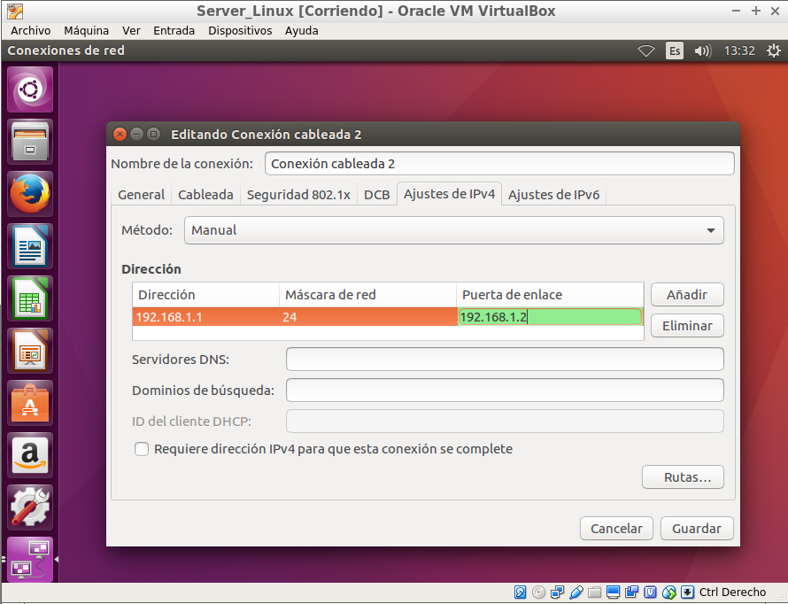
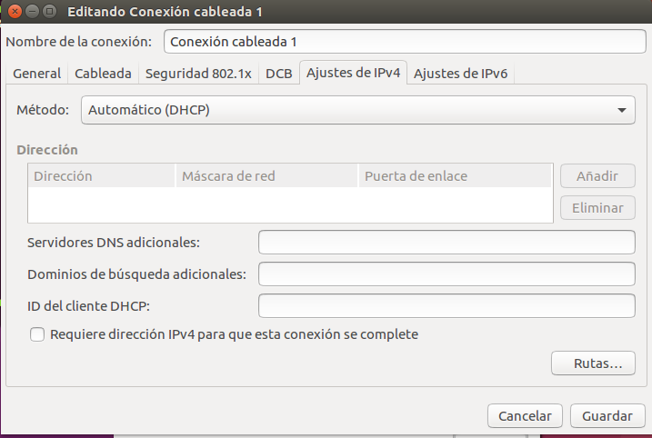
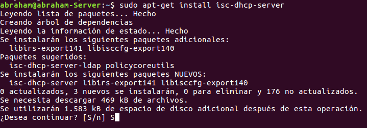
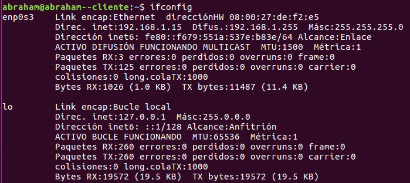

### Preparación de la maquinas

* Servidor: Dos tarjetas de red una con acceso exterior y una interna.

> Configuramos la interna para que reparta IP a nuestro dominio.

* Cliente: Con una sola tarjeta que la pondremos en modo dhcp

### Instalación de servicio DHCP en ubuntu

Abrimos un terminal y intrducimos el comando:

>sudo apt-get install isc-dhcp-server

### Creación de Rangos de Cesión

En el terminal vamos a la ruta "/etc/dhcp/dhcp.conf" y modificamod el archivo

Leventamos el servicio y hacemos na pequeña comprobación para ver si funciona.

Vamos a la maquina cliente y ejecutamos el comando ifconfig para ver si esta repartiendo bien el rango establecido.

Incluimos dentro de nuestro rango, el router y dominio.

Hacemos una reverva para nuestra maquina cliente.

Y unas configuracion globales.

> Configuramos el tiempo de la reverva de la cesión.

Ya que levantamos el servicio antes , para que carguen las nuevas opciones hacemos un reset del servidor.

Comprobamos que el servicio esta activo

### Comprobación en maquina cliente

Vamos al terminal introducimos el comando "ifconfig" y vemos si reparte la ip reservada.

Tambien podemos comprobarlo mediante entorno grafico.

