# Instalación del DHCP FailOver

  * Preparación de la maquina "**DHCP FailOver**".
    * Sistema Windows 2012 Server
    * IP estatica:
    

    * Unión al dominio
    

  * Instalación del servicio **DHCP**.

    * Vamos al apartado agregar roles y carateristicas y elgimos el dhcp.
    

    * Le damos siguiente y sleccionamos la "**Instalación basada en roles**".
    

    * Seleccionamos el servidor.
    

    * Agregamos el servicio "**DHCP**"
    

    * Y le damos a instalar
    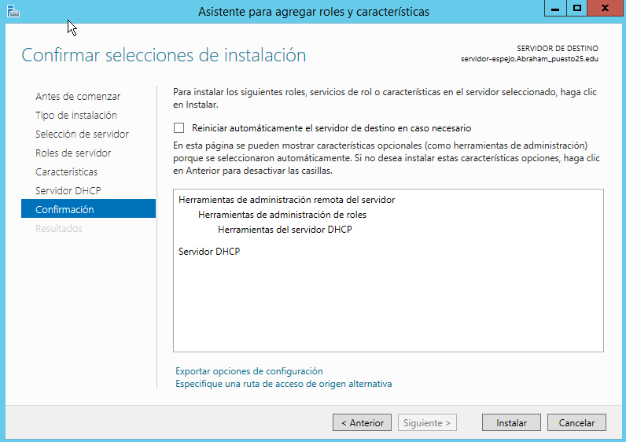

    * Una vez terminada la instalación vamos a la configuración.
    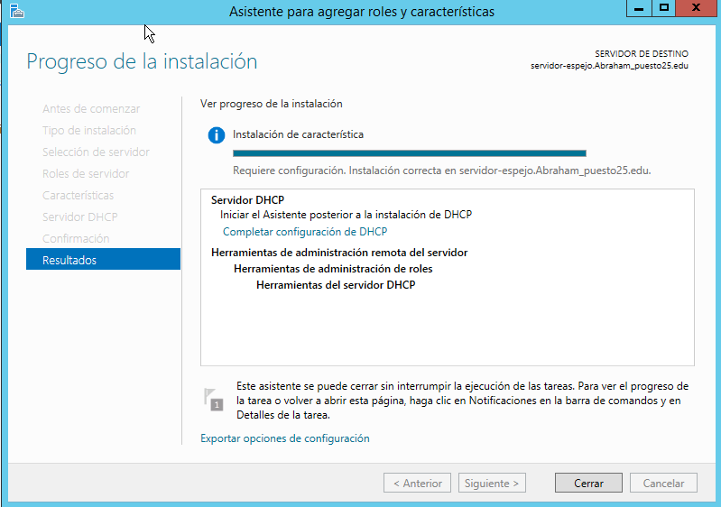

    * Le damos a siguiente.
    

    * Y autorizamos el servidor.

    * Una vez terminado tendria que quedar asi.
    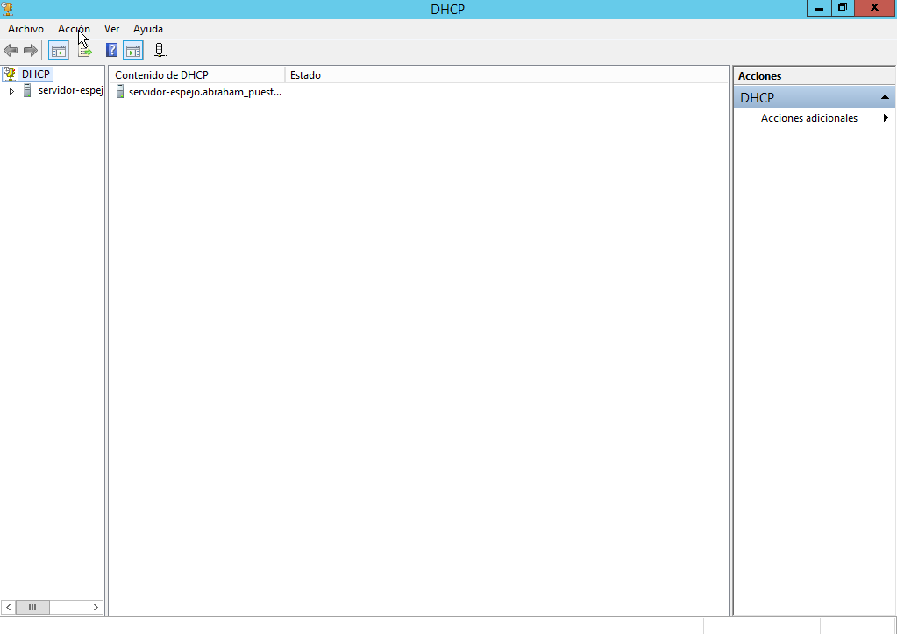

  * Servicio DHCP FailOver

    * Vamos a nuestro servidor **DHCP Principal** creamos un ambito nuevo.
    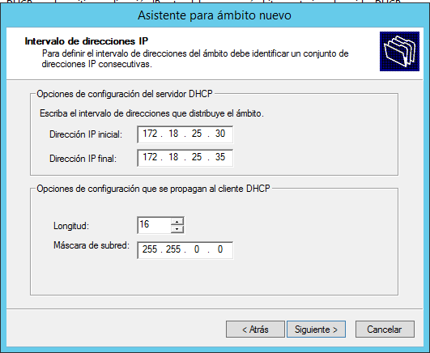

    * Le damos a siguiente y elegimos el tiempo de concesión por IP.
    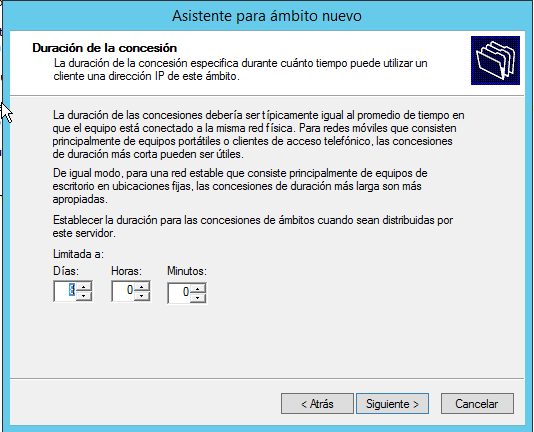

    * Siguimos y elegimos el dominio.
    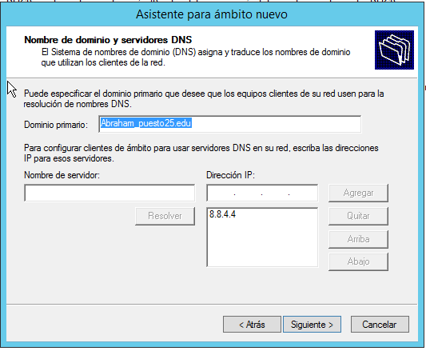

    * Colocamos la puerta de enlace.
    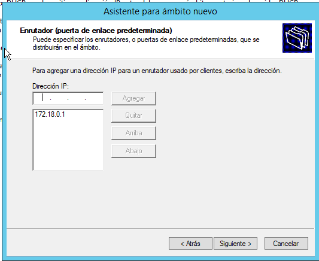

    * Y finalizamos.
    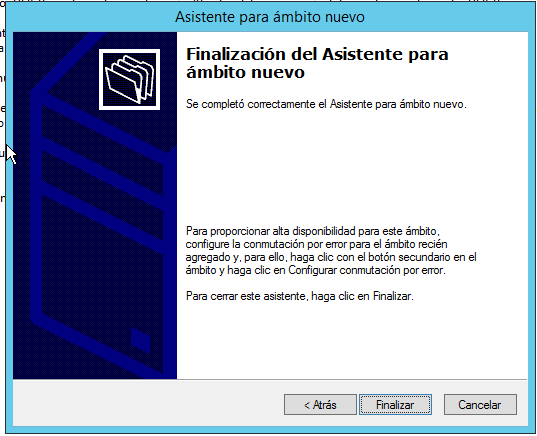

    * Ahora vamos a añadir nuestro servidor "**DHCP FailOver**" para que replique el ambito que acabamos de crear."Vamos al apartado "**Elegimos el servidor**"
    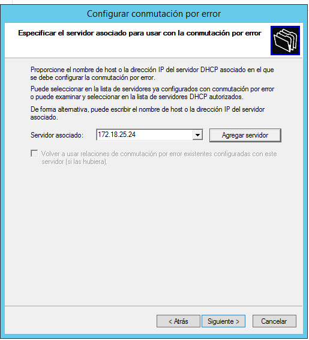

    * Modificamos los parametros.
    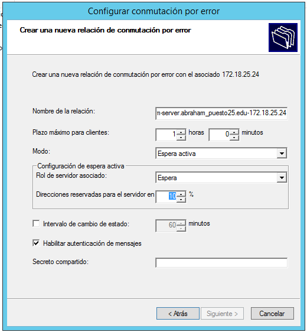

    * Y le damos a finalizar.
    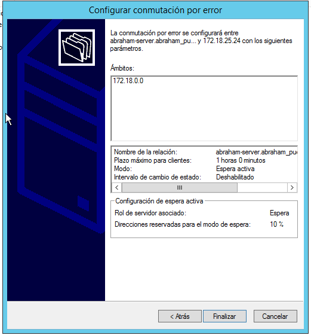

    * Vamos al servidor FailOver y comprobamos que el ambito se replico.
  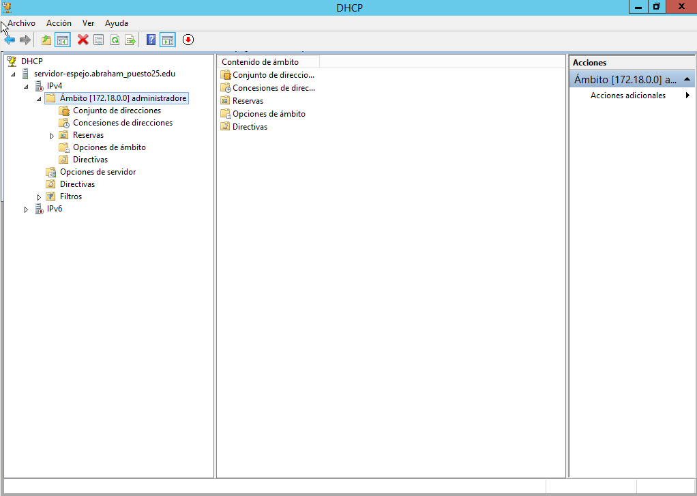

    * Activamos el ambito en el servidor espejo.
    

---

# Comprobación en equicos clientes.

  * Bajamos el ambito en el servidor principal y comprobamos si funciona el "**DHCP FailOver**"

  * Vamos a un equipo cliente y con el comando ``ipconfig /release`` dejamos libre la tarjeta de red.

  

  * Ahora con el comando ``ipconfig /renew`` vamos a pedir una IP.

  

  > Vemos que se le asigno una IP del servidor DHCPFailOver.
