# Instalación y Configuración DNS Windows 2012 Server

### Preparación:

  * Servidor

    * Windows 2012 Server
    * IP Fija:

    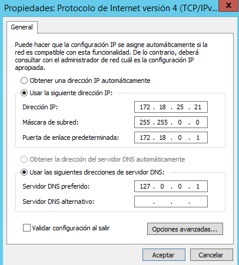

  * Cliente

    * Windows 10 Cliente
    * IP Fija:
    
    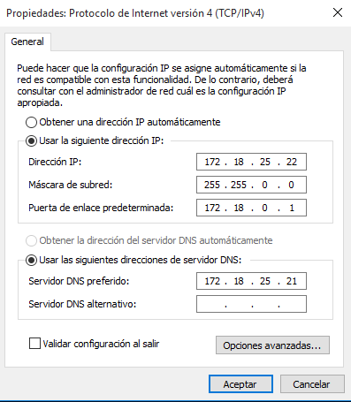

### Instalación de DNS:

  * Vamos al panel de agregar roles y carateristicas y buscamos el Servicio DNS.

    

    > En mi caso ya lo tengo instalado, por que el sevidor esta como controlador de dominio y automaticamente se instala.

### Configuración de DNS

  * Creación de Zona de busqueda Directa

    * Vamos al panel de Administador de Servicio, Herramientas DNS y elegimos crear una nueva zona.

      

    * Le damos a siguiente.

      

    * Elegimos zona principal.

      

    * Elegimos la segunda opción.

      

    * Le damos un nombre.

      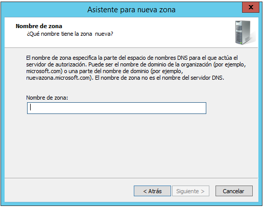

    * Dejamos esta opción por defecto y finalizamos.

      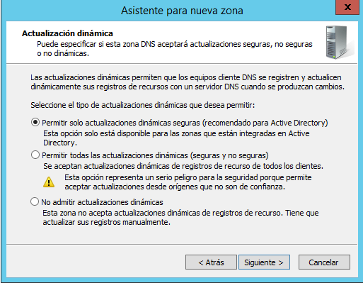

      

  * Creacion de Zona de busqueda Inversa

    * En el panel de configuración del DNS, vamos a "**Zonas de Busqueda Inversa y agregamos una nueva zona**".
    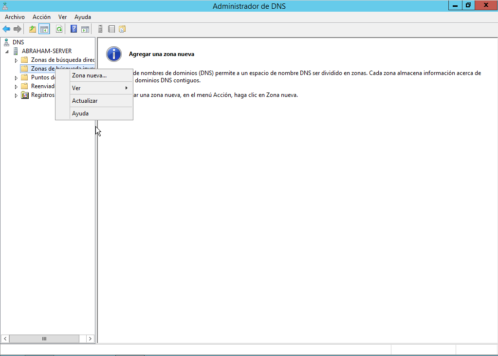

    *  Le damos a siguiente.

      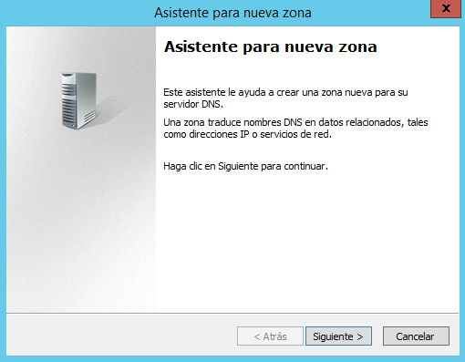

    * Seleccionamos zona principal.

      

    * Elegimos la segunda opción.

      

    * Zona Inversa IPv4 .

      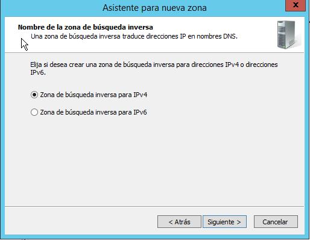

    * Colocamos nuestra IP de Red.

      

    * Dejamos esta opción por defecto y finalizamos.

      

      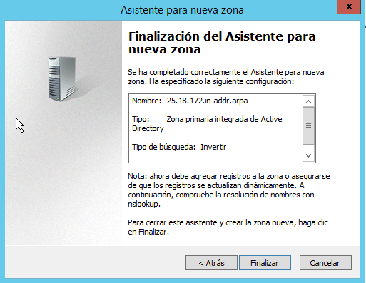

### Configurar Reenviadores

  * Abrimos el panel DNS y vamos al servidor y editamos el archivo reenviadores.

    

  * Modificamos el archivo y dejamos el DNS de google.

    

  * Tenemos ahora el servidor DNS en modo cache, vamos a un cliente y hacemos un nslookup para ver si resuelve los nombres de dominio, por nuestro servidor.

    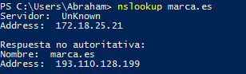

  > Resuelve el nombre de dominio y sale por nuestro servidor.

### Configuración de DNS Maestro

  * Creamos un "**CNAME**"(alias) llamado "Server" que apunta a la ip del servidor.

    

    

  * Un "**Host A**" nuevo llamado "**Printer**"(Impresora).

    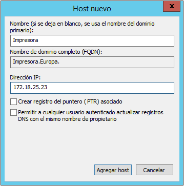

  * Un nuevo "**Host A**" llamado correo.

    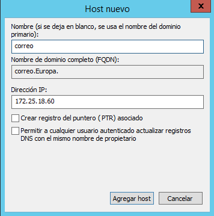

  * Y ahora creamos un "**MX**"(Intercambiador de correo), apuntando las "**Host A**"" denominado "**correo**"

    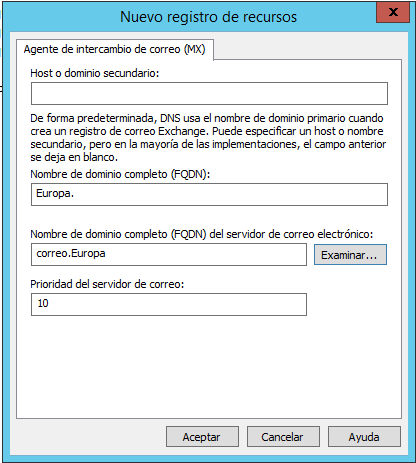

  * Vamos a crear una subzona (dominio nuevo).

    

  * Le damos un nombre al nuevo dominio.

    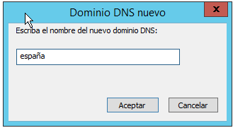

  *  Ahora creamos "**CNAME**" (Alias) apuntando al servidor llamado "**FTP**".

    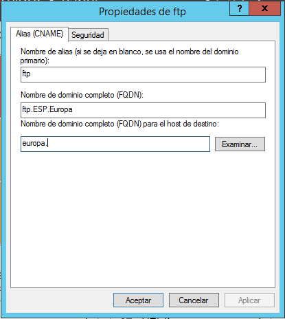

    

  * Un nuevo "**Host A**" (Impresora).

    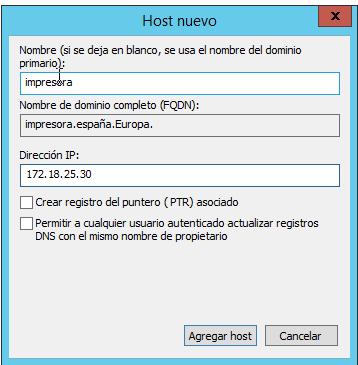

### Comprobación

  * Servidor:

    * Abrimos un terminal y ejecutamos comandos con nslookup.

      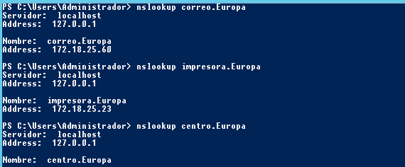

      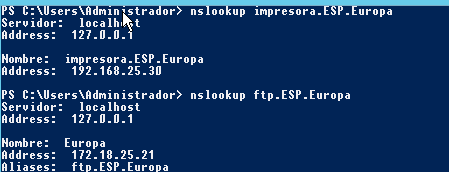

  * Cliente

    * Abrimos el terminal y ejecutamos nslookup.

      

      
