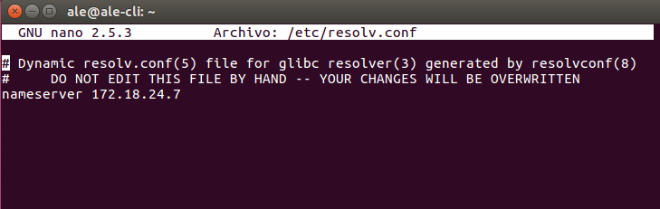
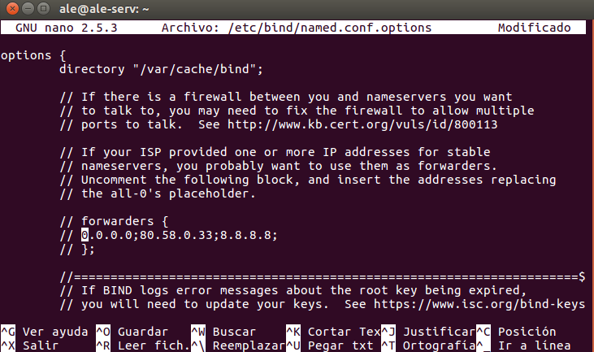
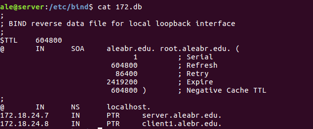
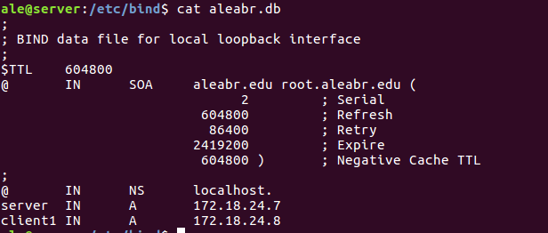
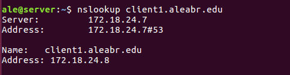
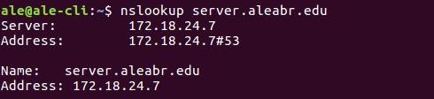

# Servidor DNS Linux Bind9

## Preparacion:

  * Server:
    * S.O: Ubuntu 17.10
    * IP Fija :

    

    * DNS:

    

    > Colocamos el IP del servidor para que se autoapunte. IP_Servidor o 127.0.0.1

  * Cliente:

    * S.O: Ubuntu 17.10
    * IP Fija:

    

    * DNS

    

## Instalación Bind9

* DNS Cache:

  * Abrimos un terminal, instalamos Bind9 ```apt - get install Bind9```

  

  * Vamos al archivo "**named.conf.options**"" paea configurar los renviadores.

  

  * La descomentamos.

  

  * Vamos al Cliente y comprobamos que resuelve los nombres por nuestro Servidor.

  

  

* DNS Master:

  * Vamos al archivo "**named.conf.local**" aqui configuramos las "**Zona Busqueda Directa y Inversa**".

  

  * Ahora creamos el archivo de Zona de Busqueda Directa.

  

  * Creamos el archivo Zona de Busqueda Inversa.

  

## Comprobación

  * Server

    * Ejecutamos el comando "**Nslookup**" para comprobar que resuelve los nombres.

    

    

  * Cliente

    * Abrimos terminal y ejecutamos "**Nslookup**" desde el cliente para comprobar que resulve bien lo nombres.

    

    
