# Instalación y Configuración de un Servidor Web Avanzado

## Carpetas Seguras

* Crea una nueva zona de búsqueda directa en los servicios DNS asociado al dominio
miEmpresa.

  * Vamos al servidor, Herramintas -> DNS -> Crear una nuva zona directa.

  * Lo dejamos en Zona principal.

    

  * La segunda opcion

    

  * Le damos un nomnre a la nueva zona.

    

  * Dejamos la opcion recomendada.

    

  * Le damos a finalizar.

    

  * Comprobacion y creamos dentro de nuestra nueva zona , "**CNAME, HOST A**"

    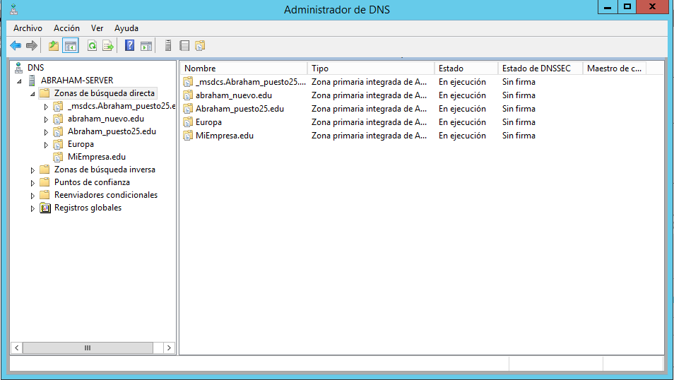

    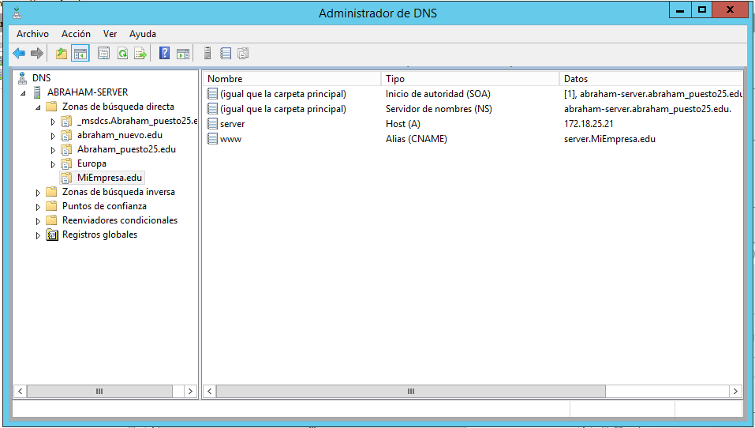

* Crea también una carpeta miEmpresa en C:\ y una subcarpeta ‘principal’.

    

* Crea  un  nuevo  sitio  web  denominado miEmpresa en  IIS  asociado  a  la  subcarpeta  anterior  y  con  
acceso a través de la dirección www.miEmpresa.com , Actualiza DNS adecuadamente.

  * Vamos a Herramientas -> Servidor ISS -> Sitios -> Nuevo sitio WEB.

    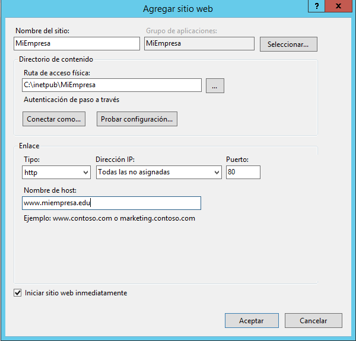

* Crea  un  nuevo  sitio web (denominado ‘pagos’) como subdominio de miEmpresa (pagos.miEmpresa.com) y configura este último para ser accedido de forma segura, vía ‘https’.

  

    * Crea el sitio web, asociado a una carpeta (miEmpresa\pagos) y con la configuración adecuada en IIS y en los servicios DNS.

      

    * Vamos al DNS y creamos Subdominio llamado "**Pagos**"

      

    * Dentro de la carpeta C:\miEmpresa\pagos, colocamos el Index.html.

      

      

    * Comprueba el acceso (aún vía ‘http’) con un navegador desde el propio servidor y desde un cliente W7.

      

    * Configuración  A:  
      Configura  el  nuevo  sitio  para  que se pueda acceder (sólo) como sitio web seguro (https) con un Certificado Autofirmado.

    * Creamos el Certificado Autofirmado.

      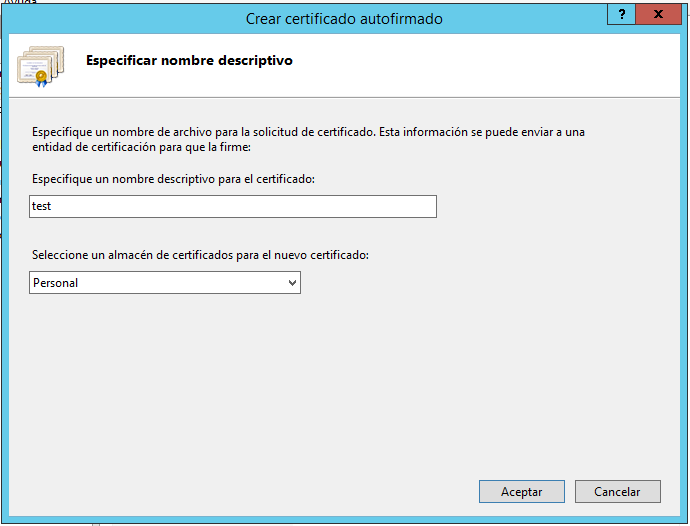

      > Lo dejamos en Personal.

      

    * Creamos el sitio web con el certificado autofirmado.

      

    * Comprobamos desde el servidor.

      

      > Tenemos un error, no somos una empresa certificadora.

    * Configuración B:
    Crearemos un nuevo sitio seguro (tienda.miempresa.com) con la generación de un  Certificado  Digital a  través  de  la  aplicación  OpenSSL.  Para  empezar,  realizaremos  la  solicitud  de un nuevo certificado de servidor para nuestro sitio seguro (crear fichero certreq.txt).

      * Creamos una carpeta en C:\miempresa\tienda donde vamos a colocar nuestra pagina web.

        

      * Creamos en el DNS un subdominio llamado tienda.

        

      * Creamos una solicitud de certificado.

        

      * Rellenamos los campos a solicitar para el cerificado.

        

      * Elegimos una longitud de 2048 bits.

        

      * Le expecificamos la ruta donde va a estar la solicitud.

        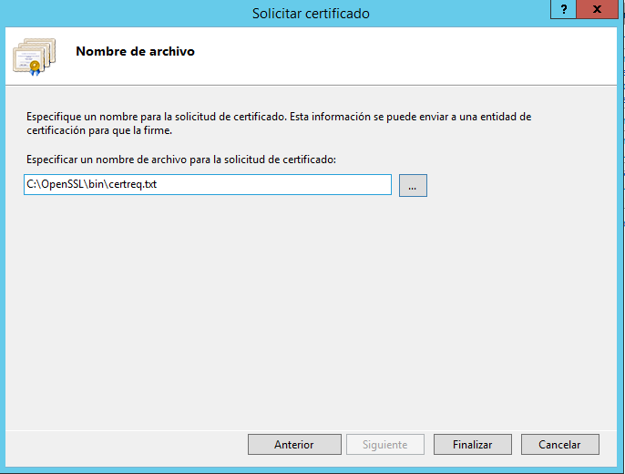

    * Descargar e instalar OpenSSL para Windows.

      * Instalamos OpenSSL.

        

    * A través de OpenSSl genera un nuevo certificado de servidor.

      * Generar una clave privada de  la  entidad  certificadora.

        

      * Crear  un  certificado  digital  de  la  entidad  certificadora  y,  finalmente.

        

      * Crear un certificado digital de nuestra web.

        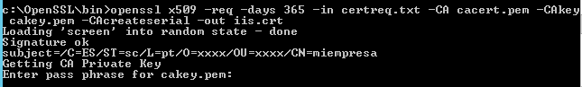

    * Importar  el  nuevo  certificado  de  servidor  creado  para  completar  la  petición  pendiente  en  nuestro sitio seguro "tienda".

      

    * Requerir  que  nuestros  sitio  seguros  sólo  se  pueda  acceder  mediante  una  conexión  segura  y  reiniciar los sitios web.

    * Creamos el sitio web tienda que solo se podra acceder solo por https, con el certificado creado anteriormente.

      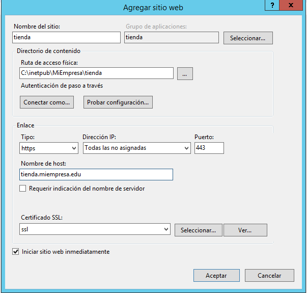

    * Finalmente, acceder mediante http y mediante https a los sitios seguros desde el propio servidor y desde un cliente W7, aceptando los posibles problemas con la entidad certificadora.

      * Pagos certificado autofirmado.

        

      * Pagos sin certificado

        

      * Tienda

        

## Carpetas Privadas.

* Vamos  a  crear  un  nuevo  sitio  web  (empleados.miEmpresa.com) destinado a almacenar información privada de los empleados, con las siguientes características:

    * Necesitamos  crear  una  carpeta  empleados  (dentro  de  miEmpresa)  y,  dentro  de  esta,  tres  o  cuatro subcarpetas personales con nombres de empleados y una, denominada común, a la que tendrán acceso todos los empleados, pero no otros usuarios sin identificar.

      * Crear la carpeta empleado.

        

      * SubCarpetas.

        

    * Crearemos  el  nuevo  sitio  web,  como  subdominio  de  nuestro  dominio  principal,  asociado  a  la  carpeta genérica empleados.

      * Creamos el subdominio llamado empleados.

        

      * Creamos el nuevo sitio web para empleados.

        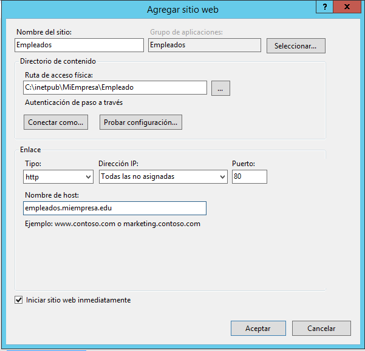

    * Colocar un fichero index.html diferente en cada una de las carpetas creadas, con el objetivo de poder comprobar el acceso desde un  navegador.

      

      * Comprobamos.

        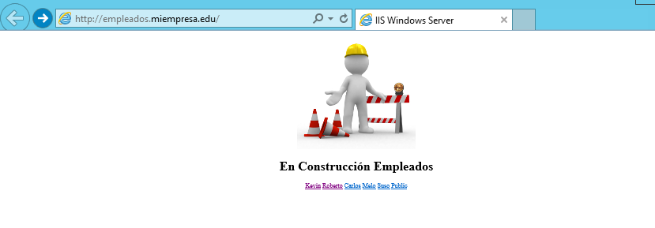
        
        
        
        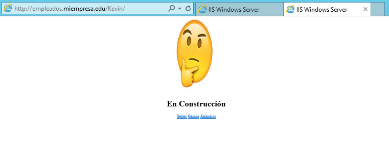
        
        

    * Para el sitio web creado y para cada una de sus carpetas, deshabilitamos el acceso anónimo.

      

    * Agregar función de Autenticación Básica a nuestro Servicio de IIS a través de la Administración
    del Servidor.

      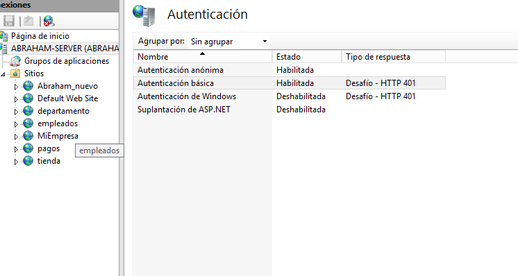

    * En   Active   Directory,   crearemos   un   usuario   para   cada   empleado   (tantos   como   carpetas   personales) y un grupo Empleados que los incluya a todos.

      * Ususarios
        
      * Grupo
        

        

    * Desactivamos, para la carpeta empleados, los permisos heredables a través de las opciones avanzadas en la ficha de seguridad.

      

    * Añadimos grupo de Administradores con Control Total y grupo Empleados con Lectura y Ejecución+ Mostrar Carpeta+Leer.

      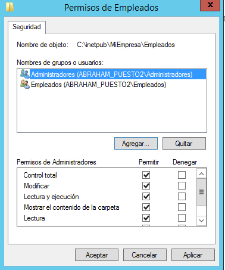

      

    * Realizamos   el   mismo   procedimiento   para   cada   una   de   las   carpetas   personales   de   los empleados, colocando como usuarios autorizados el Grupo de Administradores (Control Total) y el empleado propietario de cada carpeta (con los permisos que creas convenientes).

      * Ususarios

      

      

      

      

      

  * Realizamos   el   mismo   procedimiento   para   la   carpeta ‘comun’, colocando como usuarios autorizados  el  Grupo  de  Administradores (Control_Total) y el grupo Empleados (con los permisos que creas convenientes).

      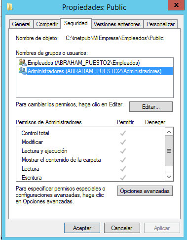

  * Comprobamos  el  acceso,  tanto  desde  el  servidor  como  desde cliente  W7,  a  las  diferentes  carpetas con distintos usuarios.

  * Servidor

    
    

    
    

    
    

    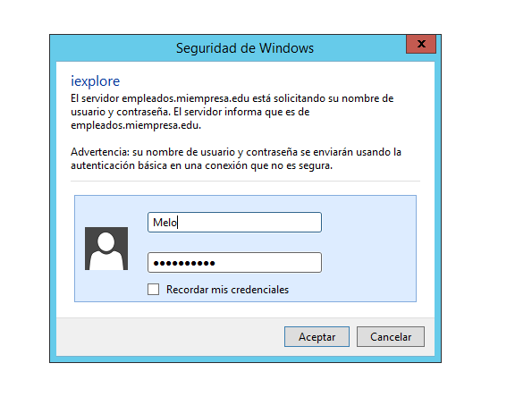
    

    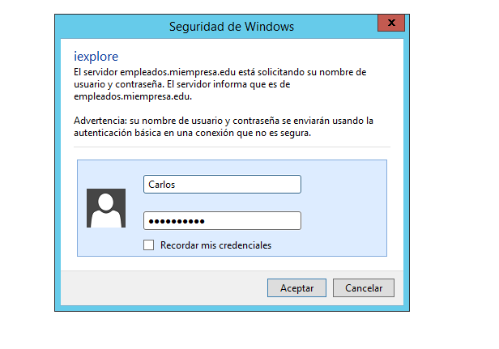
    

  * Cliente

    
    

    
    

    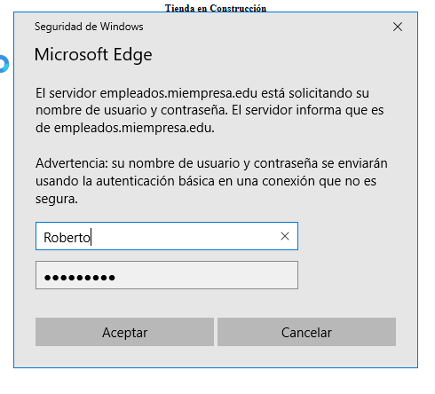
    

    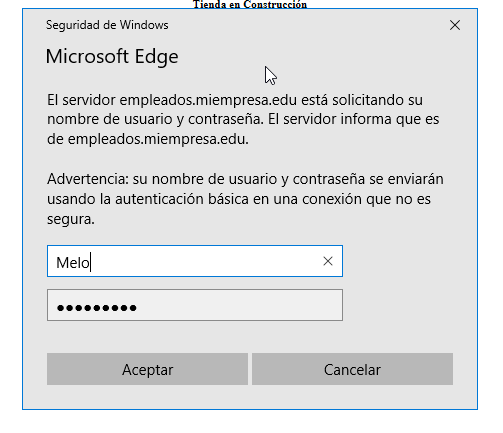
    

    
    
