# Instalación y Configuración de un Servidor Web Avanzado Parte II

* 1.Instalación de PHP, MySQL y PHPMyAdmin

* 1.1 Instalación de PHP

*    Lo primero que debemos hacer es acceder a la web http://windows.php.net/downloads/releases/archives, donde figuran las diferentes versiones de PHP. Nosotros elegimos la versión 5.3.9 con formato msi.

  *  Una vez descargado el instalador, comenzamos la instalación guiada.

  *  Seleccionamos la carpeta en la que se instalará los ficheros del programa.

  *  Aquí seleccionamos que sea gestionado por IIS FastCGI, el cual tenemos que instalar desde el administrador del servidor

  *  Una vez realizado esto, lo que hacemos es seguir con la instalación

  *  Una vez instalado PHP, vamos al administrador del servidor IIS para activar el uso de ficheros con extensión .php

  *  Aquí vemos que está puesta por defecto, por lo que no debemos preocuparnos por este paso.

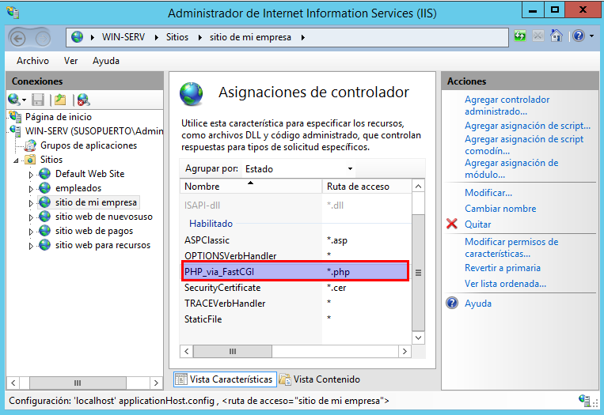

  *  El último paso para comprobar que la instalación de PHP ha sido realizada satisfactoriamente es colocar un fichero index.php dentro del directorio miempresa con el siguiente contenido en su interior:

> <?php phpinfo(); ?>

  *  Por último accedemos a www.miempresa.edu y comprobamos que el fichero de información PHP se ve correctamente.

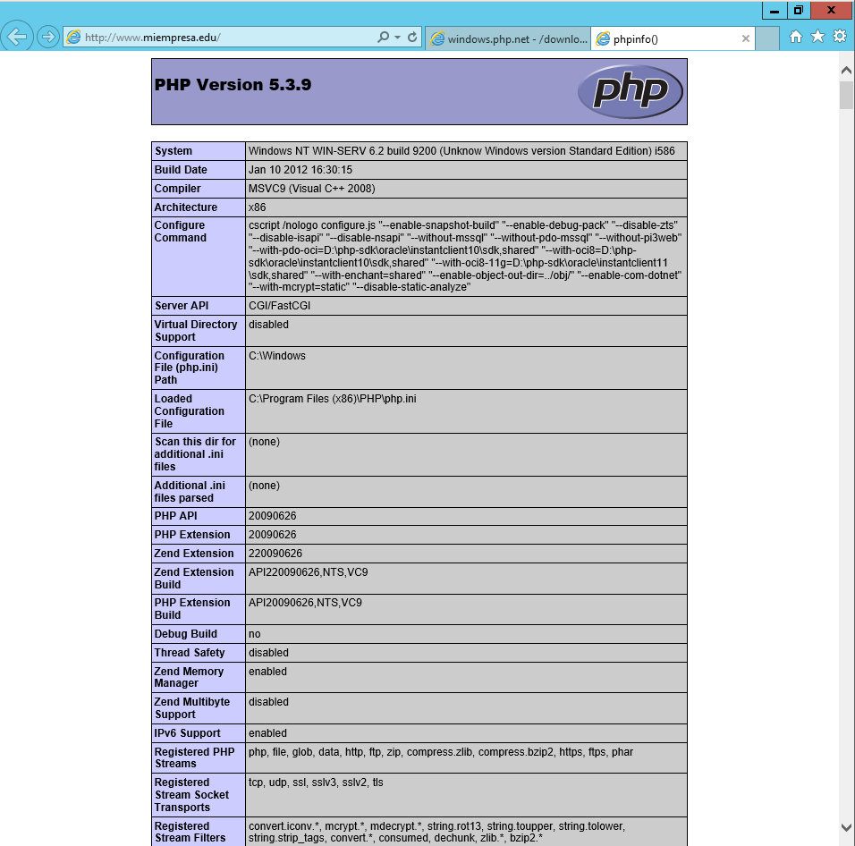

 * Instala el servidor de bases de datos
relacionales MySQL para tus sitios Web gestionados por IIS.

* Descargamos el paquete msi.

* Lo ejecutamos y empezamos la instalación de MySql.

* Elegimos la opción Developer.

* Le damos a ejecutar y esperamos a que termine de descargar e instalar.

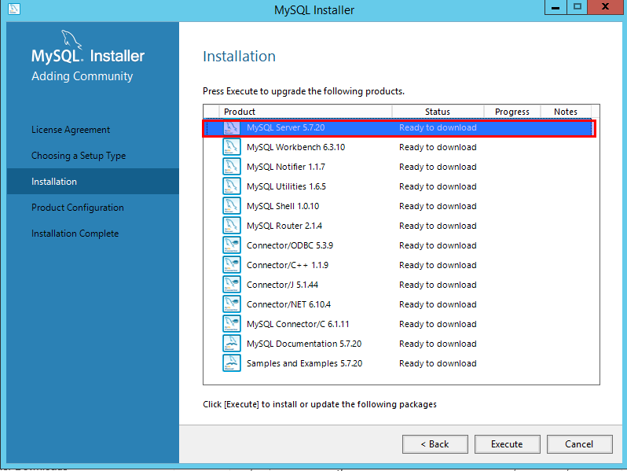

* Una vez finalizado pasamos a la configuración.

* Dejamos el puerto y el firewall por defecto.

* Le damos una contraseña a el usuario root de MySql.

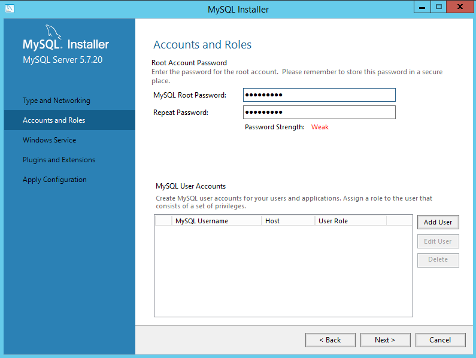

* Le damos un nombre al servicio.

* Dejamos estos valores por defecto.

* Finalizar.

* Comprobamos la conexion con el servidor usando el usuario root.

* Aplicamos la configuración dando finalizar.

* Instala PHPMyAdmin para tus sitios Web
gestionados   por   IIS.

* Descargamos el phpMyAdmin.

* Descomprime el contenido en la carpeta de miempresa.

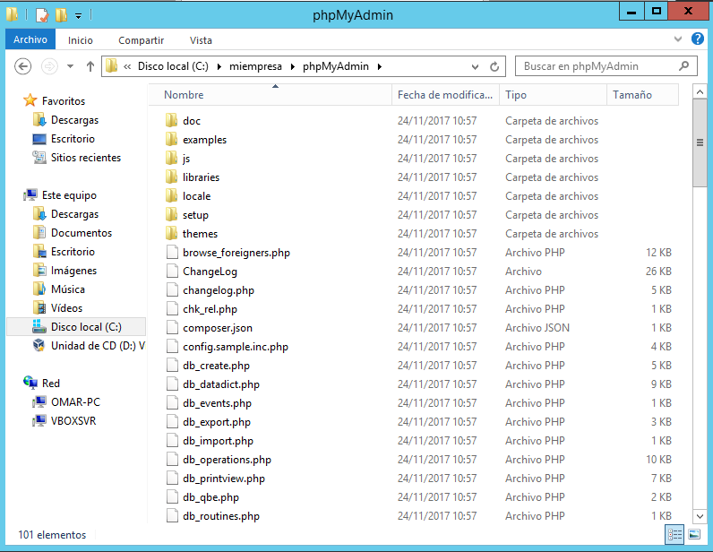

* Para   esto   debes   crear   un   nuevo   sitio   web   asociado a phpmyadmin.miEmpresa.com, y actualizar DNS.

* Vamos a nuestro DNS y creamos un nuevo registro llamado "**phpmyadmin.miEmpresa.com**" en el dominio miempresa.edu.

* Ahora vamos a crear nuestro sitio web de "**phpmyadmin.miEmpresa.com**", para ello vamos a nuestro servidor ISS y añadimos nuevo sitio web.

# Parte II: Instalación de Servidor FTP y CMS Drupal

* Servidor y cliente FTP

  * Instalamos el servidor FTP Filezilla dentro de la máquina con W2012 Server.

  *  Una vez finalizada la instalación, creamos al usuario ftpuser y le damos privilegios totales para controlar la carpeta miempresa.

  *  Hecho esto, ahora instalamos el cliente FTP de Filezilla en la máquina cliente.

  *  Antes de hacer la conexión FTP debemos asegurarnos de que el Firewall no bloqueará la petición, de lo contrario, no se producirá la conexión.

  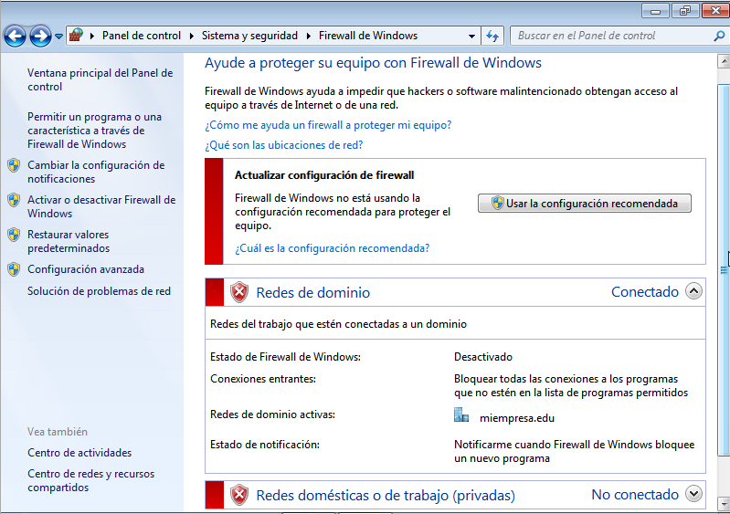

  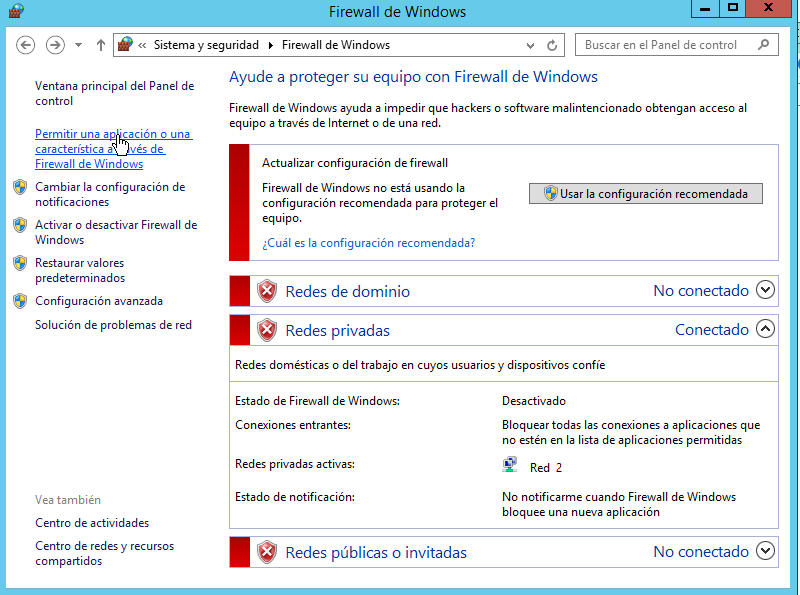

  *  Ahora es cuando nos logueamos desde el cliente con el usuario ftpuser.

  *  Buscamos el instalador de Drupal en la web oficial, en nuestro caso usamos la versión 7.56.

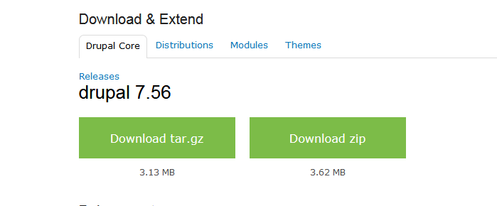

  *  Una vez descargado, desde el cliente pasamos por FTP el contenido de Drupal a la carpeta Principal dentro del directorio Miempresa

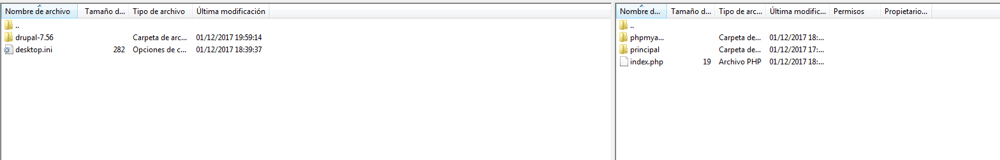

## Drupal

  *  Creamos una base de datos en phpmyadmin llamada cms

  *  Por algún motivo, la pestaña usuarios de phpmyadmin no funciona, por lo que una opción sería crear al usuario que controlará la base de datos recién creada, cmsuser, desde workbench.

  *  Una vez hecho esto, le damos permisos totales a cmsuser desde phpmyadmin

  *  Al ejecutar ahora el contenido de /principal no nos muestra el contenido de manera deseada. Todo es culpa de un fichero denominado web.config, al que le cambiaremos su extensión por .old.

  *  Una vez solucionado este problema, ya se nos mostrará el instalador web de Drupal correctamente.

  *  Lo primero que tenemos que hacer es instalar el paquete del idioma español, por lo que lo buscaremos en la web y lo instalaremos en la ruta que nos indica.

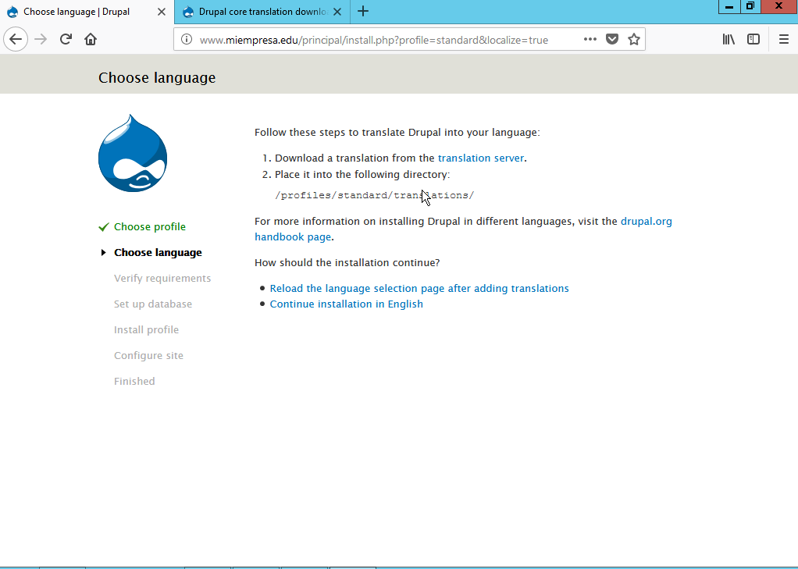

  *  Ahora refrescamos y nos aparecerá el idioma español como opción.

  *  Ahora nos enfrentamos a otro "problema", y es que nos dice que no tenemos un fichero de configuración y que tenemos que crearlo manualmente. Es tan sencillo como ir al directorio que nos indica y arreglarlo copiando el fichero default.settings.php y modificar la extenxión.

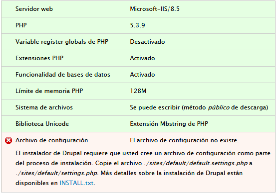

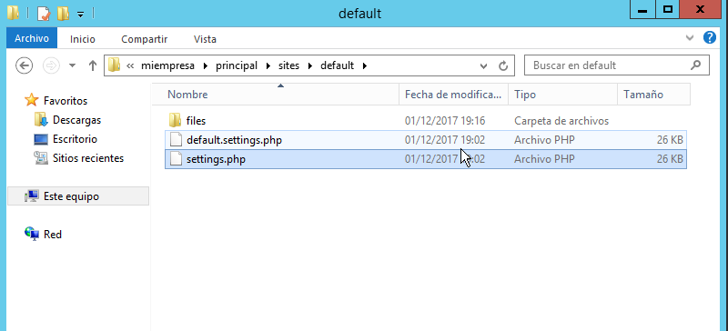

  *  Pero ahora nos dirá que hay problemas con los permisos, por lo que una opción rápida (pero no muy eficiente) sera darle permisos a "**todos**".

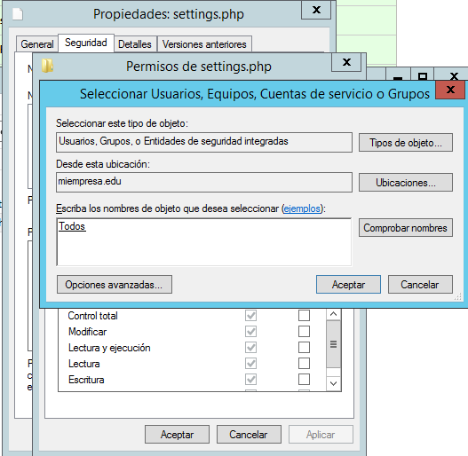

  *  Segimos con el proceso de instalación.

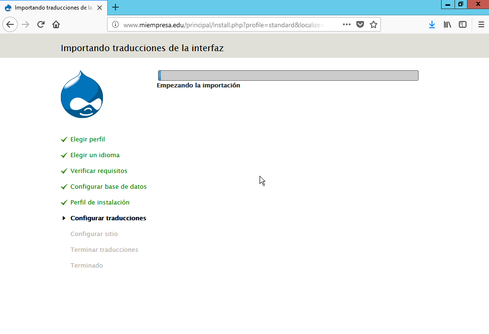

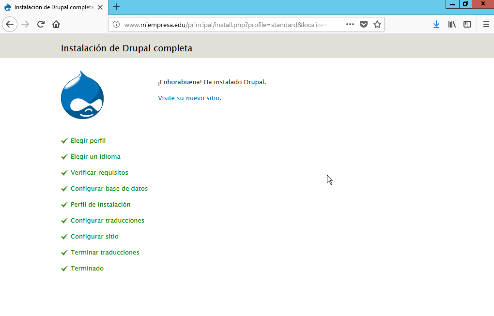

  *  Ya tenemos Drupal instalado, así que ahora lo que haremos serán unas cuantas modificaciones.

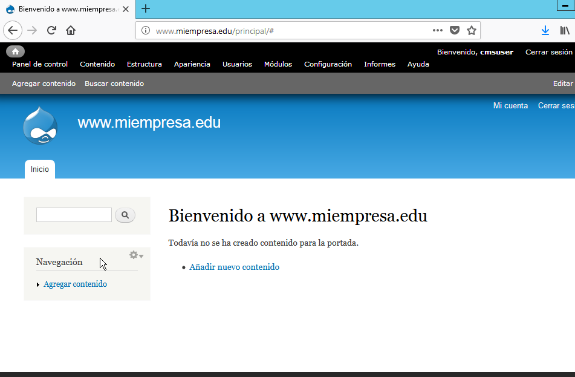

  *  Lo primero será instalar el modulo de traducción gtranslate, para ello antes debemos activar otro módulo preinstalado llamado Update Manager.

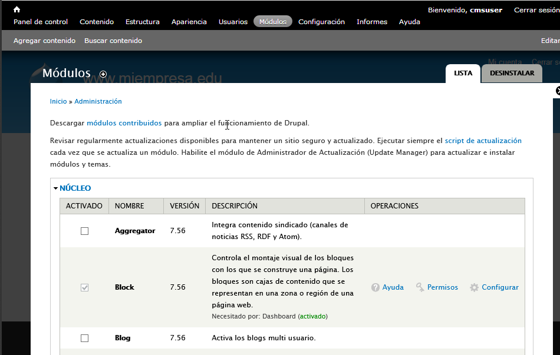

  *  Descargamos el .zip y lo subimos a Drupal.

  *  El proceso de instalación de temas también es sencillo, simplemente nos dirigimos a la pestaña apariencia y ahí nos saldrá una opción para subir el tema que deseemos. También es necesario descargar los temas desde internet.

  *  Para crear una artículos o páginas tenemos que ir a la pestaña contenido, donde elegiremos la opción que necesitemos.

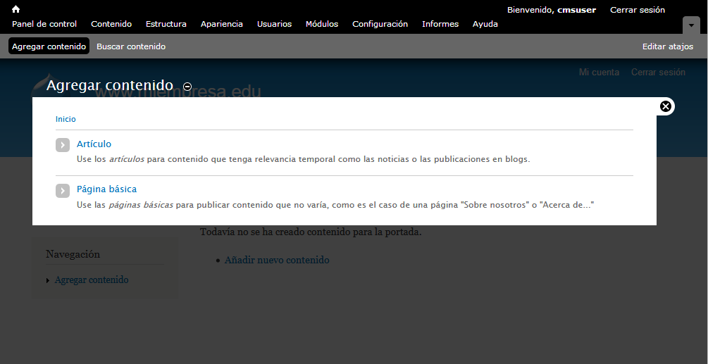

  *  Una vez creado, le damos a guardar.

  *  Para crear un menú, vamos a la pestaña estructura, donde podemos crear nuestro propio menú.

