# Internet Information Server Instalación, Configuración y Creación de Sitios Web

  * Instalación:

    * Instalar  IIS  en  Windows  2012  Server.

    > Vamos a agregar roles y característica y instalamos "**IIS**"

    

    > Agregamos el servicio

    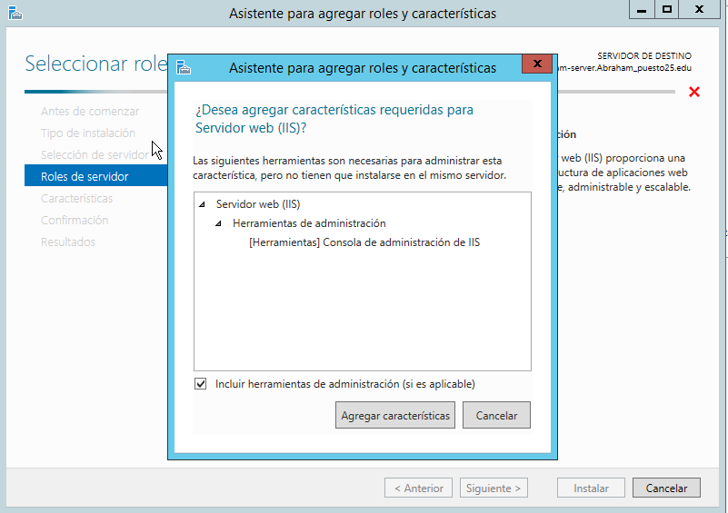

    > Le damos a siguiente y asignamos los roles de Autentifición Básica y Autentificación de Windows.

    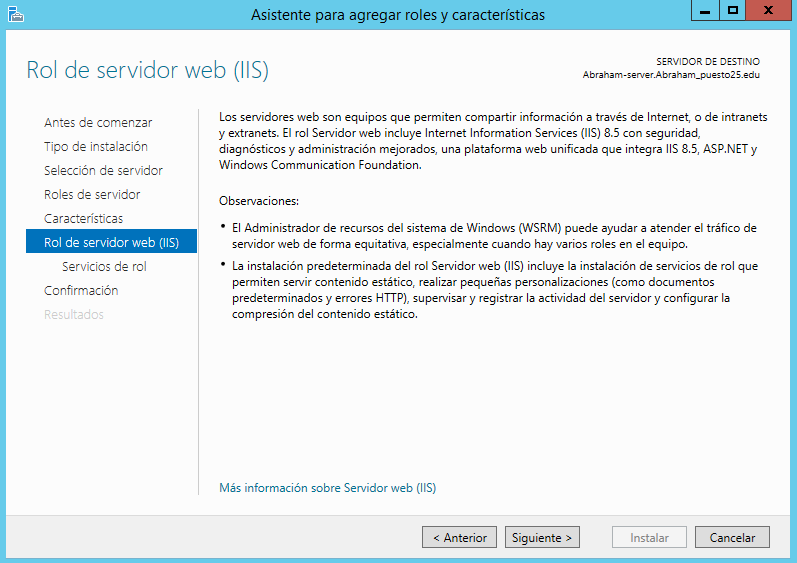

    

    > Le damos a Instalar

    

* Comprobación

  * Comprobar  acceso  a  nuestro  servidor  web  (localhost)  desde  un  navegador  web  (debe aparecer una página en construcción).

    > En nuestro servidor vamos al navegador y comprobamos que funcione.

    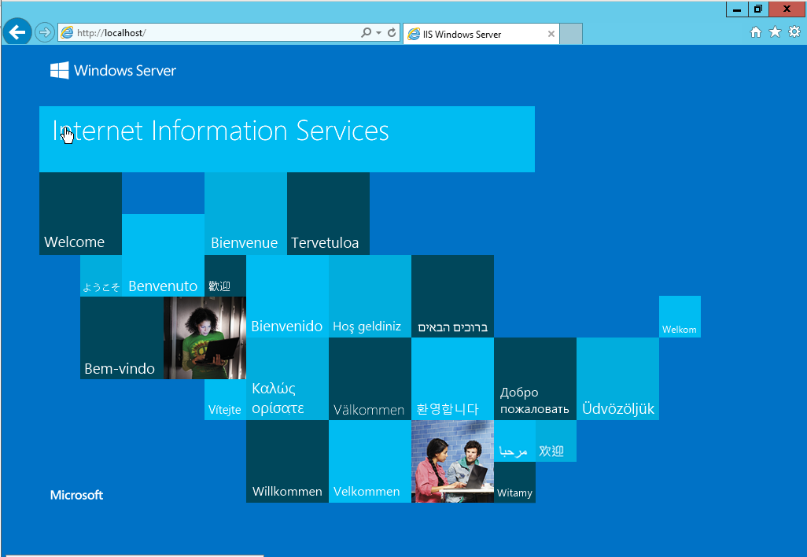

  * Entrar en cliente Windows 7 y acceder, desde un navegador web,  a la página principal del servidor a través de la IP del servidor.

    > Abrimos el navegador en el cliente y accedemos con la ip_del_servidor.

    

  * Acceder  ahora  desde  W7  a  la  misma  página  mediante  el  nombre  principal  del dominio  y  desde cualquier otro alias que haya sido definido en la configuración DNS.

    > Hacemos lo mismo paso anterior, pero entramos con el nombre de dominio.

    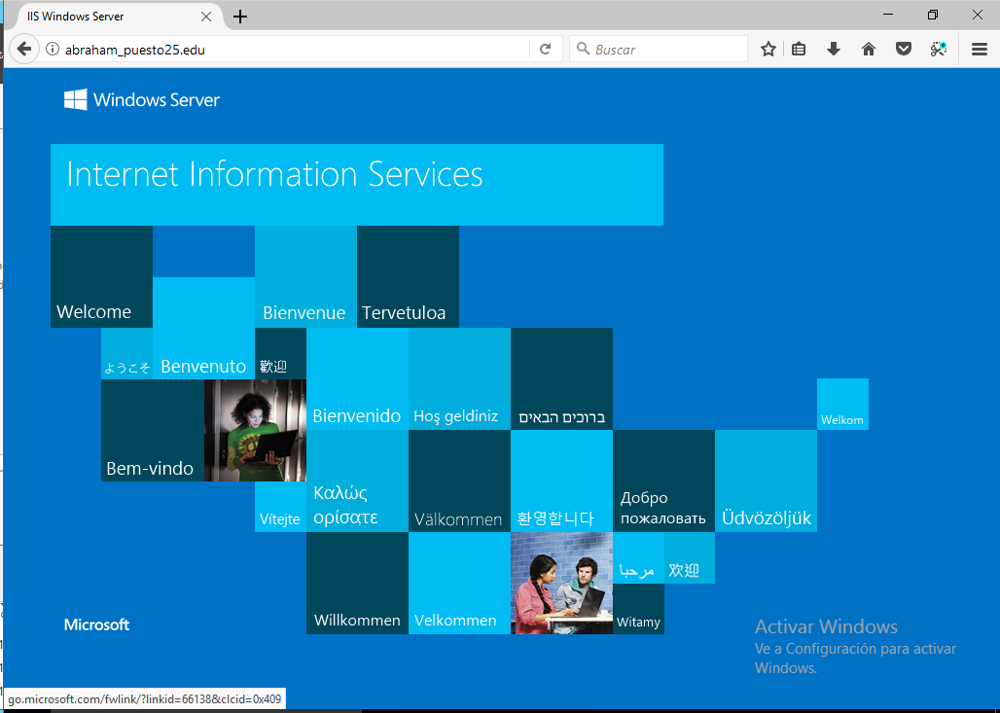

    > Entramos ahora con un alias que creamos en el dominio apuntando asi mismo.

    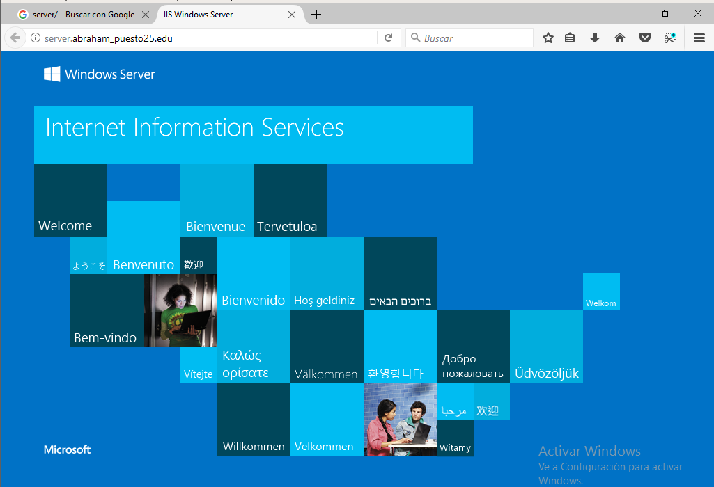

    > Para crear un alias(CNAME) tenemos que ir al servidor , panel del servidor , herrmientas , DNS , Nombre de dominio y crear el alias apuntando a el.

    

  * Tratar  de  acceder  desde  W7  al  sitio  www  del  dominio  principal.  ¿Qué  ocurre?

    > Si no tenemos creado un alias llamado "**www**", no resolvera el nombre.

    * Añade  un  alias en el servicio DNS que relacione el sitio www con el dominio principal. Intenta ahora acceder desde W7.

    > Hacemos lo mismo que el paso anterior pero le cambiamos el nombre a "**www**", recargamos el servicio y comprobamos.

    

    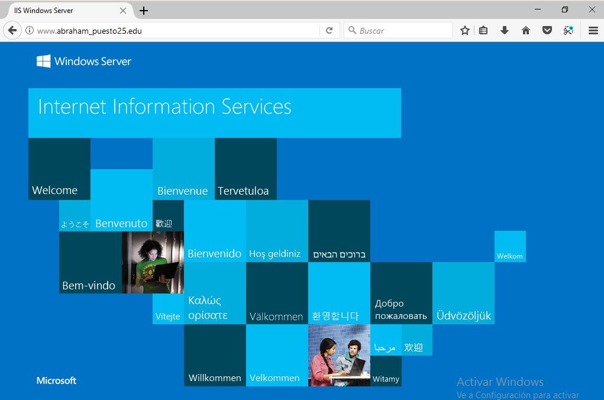

  * Crea  una  página  web  HTML  sencilla  (index.html)  como  página  principal  de  tu  dominio  y  colócala  en C:\Inetpub\wwwroot.  Comprueba  el  acceso  a  esta  página  desde  el  propio  servidor  y  desde  el  cliente,  utilizando  los  diferentes  alias  y  direcciones  configurados  en  el servicio DNS.

    > Vamos a la carpeta C:\Inetpub\wwwroot y creamos una nueva pagina principal del dominio en construcción.

    ```
    <!DOCTYPE html PUBLIC "-//W3C//DTD XHTML 1.0 Strict//EN""http://www.w3.org/TR/xhtml1/DTD/xhtml1-strict.dtd">
    <html xmlns="http://www.w3.org/1999/xhtml">
    <head>
    <meta http-equiv="Content-Type" content="text/html; charset=iso-8859-1" />
    <title>IIS Windows Server</title>
    <style type="text/css">
    <!--
    body {
	     color:#yellow;
	      background-color:#yellow;
	       margin:0;
       }

       #container {
	        margin-left:auto;
	         margin-right:auto;
	          text-align:center;
	         }

           a img {
	            border:none;
            }

      -->
</style>
</head>
<body>
          <div id="container">
          <h1>En Construcción</h1><a href="series/index.html">Series</a>
</div>
</body>
</html>
    ```

  * Comprobación

    > Accedemos desde el servidor y cliente

    * Cliente

      

      

    * Servidor

      

      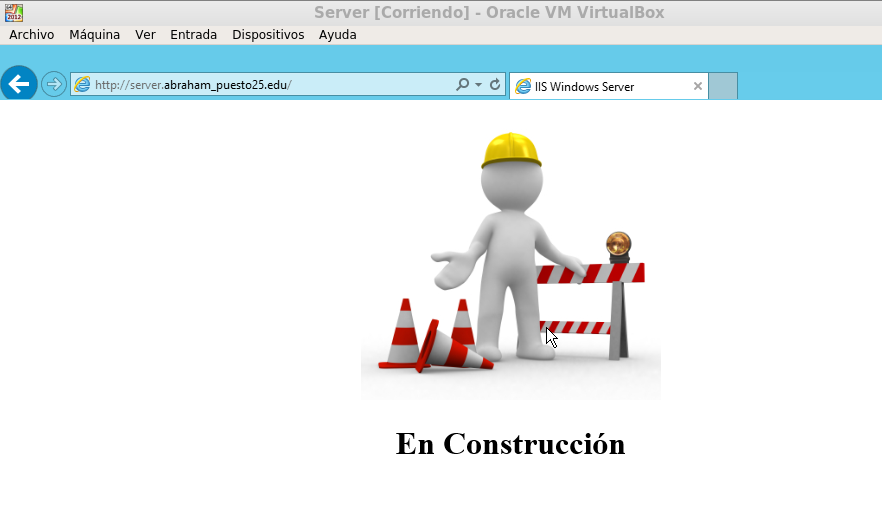

* Crea  un  pequeño  sitio  web  con  varias  páginas  e  imágenes  organizadas  en  subcarpetas  de  wwwroot.   Abre   el   Administrador   de   Internet   Information   Services   y   comprueba la  estructura del sitio creado en Sitio Web Predeterminado. Accede y navega por el sitio web tanto desde el servidor como desde el cliente W7.

    * Administrador de IIS Estructura:

      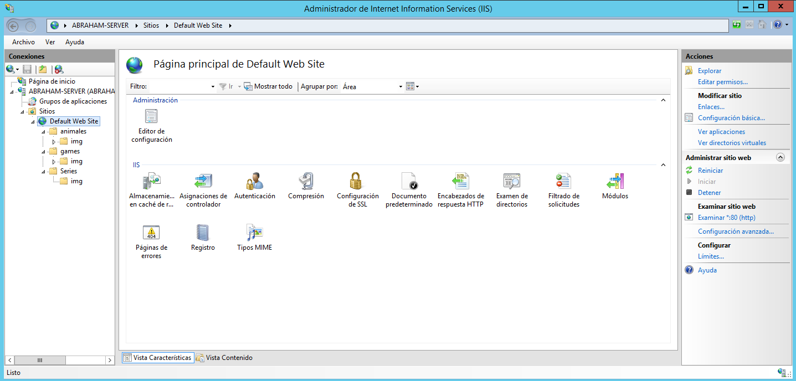

      * Series:

        * HTML

        ~~~
        <!DOCTYPE html>

        <html lang="es">

        <head>
        <title>Series Favoritas</title>
        <meta charset="utf-8" />
        <link rel="shortcut icon" href="/favicon.ico" />
        <link rel="alternate" title="Pozoler�a RSS" type="application/rss+xml" href="/feed.rss" />
        <link rel="stylesheet" href="style.css">
        </head>

        <body>
            <header>
                <table border="1">
              <h1>My Series</h1>
               <tr>
               <td>Series</td><td>Storyline</td><td>Enlace</td>
               </tr>
               <tr>
               <td></td><td>In the mythical continent of Westeros, several powerful families fight for control of the Seven Kingdoms. As conflict erupts in the kingdoms of men, an ancient enemy rises once again to threaten them all. Meanwhile, the last heirs of a recently usurped dynasty plot to take back their homeland from across the Narrow Sea. </td><td><a href="http://www.imdb.com/title/tt0944947/?ref_=nv_sr_1">Game Of Thrones</a></td>
               </tr>
               <tr>
               <td></td><td>People all over the U.S start to realize they have special abilities, like telekinesis, healing abilities, flying powers, time travel, invisibility, and the ability to absorb other's abilities. One man, known as Sylar, wants to gain all the power of these "heroes" so he can be the most powerful and evolved human of all, and stops at nothing to gruesomely kill these people. In order to protect themselves from him, these people must help one another before Sylar can destroy them all, while they each deal with problems of their own. </td><td><a href="http://www.imdb.com/title/tt0813715/?ref_=nv_sr_1">Heroes</a></td>
               </tr> <tr>
                <td></td><td>Barry Allen is a Central City police forensic scientist with a reasonably happy life, despite the childhood trauma of a mysterious red and yellow lightning killing his mother and framing his father. All that changes when a massive particle accelerator accident leads to Barry being struck by lightning in his lab. Coming out of coma nine months later, Barry and his new friends at S.T.A.R labs find that he now has the ability to move at superhuman speed. Furthermore, Barry learns that he is but one of many affected by that event, most of whom are using their powers for evil. Determined to make a difference, Barry dedicates his life to fighting such threats, as The Flash. While he gains allies he never expected, there are also secret forces determined to aid and manipulate him for their own agenda. </td><td><a href="http://www.imdb.com/title/tt3107288/?ref_=nv_sr_6">The Flash</a></td>
                </tr>
                <tr>
                <td></td><td>A television anthology series that shows the dark side of life and technology. </td><td><a href="http://www.imdb.com/title/tt2085059/?ref_=nv_sr_1">Black Mirror</a></td>
                </tr>
                <tr>
                <td></td><td>Life is laid bare as a group of plane crash survivors find themselves stranded on a remote Pacific island. The trauma of the crash soon becomes overshadowed by the island itself, where unseen creatures stalk the jungle, paranormal happenings abound and astonishing coincidences reveal themselves. In this unique environment emotions swell as the survivors battle their inner and outer demons, and strive to live together - so that they won't die alone</td><td><a href="http://www.imdb.com/title/tt0411008/?ref_=nv_sr_1">Lost</a></td>
                </tr>
             </table>
            </header>
        </body>
        </html>
        ~~~

        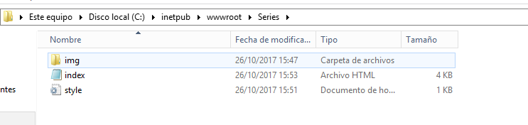

      * Games

          ~~~
          <!DOCTYPE html>

                    <html lang="es">

                    <head>
                    <title>Series Favoritas</title>
                    <meta charset="utf-8" />
                    <link rel="shortcut icon" href="/favicon.ico" />
                    <link rel="alternate" title="Pozoler�a RSS" type="application/rss+xml" href="/feed.rss" />
                    <link rel="stylesheet" href="style.css">
                    </head>

                    <body>
                        <header>
                            <table border="1">
                          <h1>Games</h1>
                           <tr>
                           <td>Series</td><td>Storyline</td><td>Enlace</td>
                           </tr>
                           <tr>
                           <td></td><td>In the mythical continent of Westeros, several powerful families fight for control of the Seven Kingdoms. As conflict erupts in the kingdoms of men, an ancient enemy rises once again to threaten them all. Meanwhile, the last heirs of a recently usurped dynasty plot to take back their homeland from across the Narrow Sea. </td><td><a href="https://www.game.es/videojuegos/accion/pc-software/assassin's-creed-origins/143088">Assasin�s</a></td>
                           </tr>
                           <tr>
                           <td></td><td>People all over the U.S start to realize they have special abilities, like telekinesis, healing abilities, flying powers, time travel, invisibility, and the ability to absorb other's abilities. One man, known as Sylar, wants to gain all the power of these "heroes" so he can be the most powerful and evolved human of all, and stops at nothing to gruesomely kill these people. In order to protect themselves from him, these people must help one another before Sylar can destroy them all, while they each deal with problems of their own. </td><td><a href="https://www.game.es/videojuegos/accion/playstation-4/call-of-duty-wwii/137556">Call_Of_Duty</a></td>
                           </tr> <tr>
                            <td></td><td>Barry Allen is a Central City police forensic scientist with a reasonably happy life, despite the childhood trauma of a mysterious red and yellow lightning killing his mother and framing his father. All that changes when a massive particle accelerator accident leads to Barry being struck by lightning in his lab. Coming out of coma nine months later, Barry and his new friends at S.T.A.R labs find that he now has the ability to move at superhuman speed. Furthermore, Barry learns that he is but one of many affected by that event, most of whom are using their powers for evil. Determined to make a difference, Barry dedicates his life to fighting such threats, as The Flash. While he gains allies he never expected, there are also secret forces determined to aid and manipulate him for their own agenda. </td><td><a href="https://www.game.es/videojuegos/estrategia/pc-software/starcraft-ii-battlechest-20/132768">Starcraft</a></td>
                            </tr>
                            <tr>
                            <td></td><td>A television anthology series that shows the dark side of life and technology. </td><td><a href="https://www.game.es/videojuegos/accion/pc-software/overwatch-goty/139760">Over</a></td>
                            </tr>
                            <tr>
                            <td></td><td>Life is laid bare as a group of plane crash survivors find themselves stranded on a remote Pacific island. The trauma of the crash soon becomes overshadowed by the island itself, where unseen creatures stalk the jungle, paranormal happenings abound and astonishing coincidences reveal themselves. In this unique environment emotions swell as the survivors battle their inner and outer demons, and strive to live together - so that they won't die alone</td><td><a href="https://www.game.es/videojuegos/accion/pc-software/destiny-2/136813">Destiny</a></td>
                            </tr>
                         </table>
                        </header>
                    </body>
                    </html>
                    ~~~

          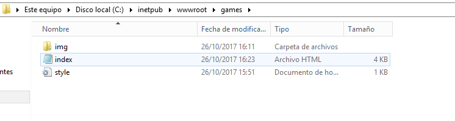

      * Animales

          ~~~
            <!DOCTYPE html>

            <html lang="es">

            <head>
            <title>Series Favoritas</title>
            <meta charset="utf-8" />
            <link rel="shortcut icon" href="/favicon.ico" />
            <link rel="alternate" title="Pozoler�a RSS" type="application/rss+xml" href="/feed.rss" />
            <link rel="stylesheet" href="style.css">
            </head>

            <body>
                <header>
                    <table border="1">
                  <h1>Animales</h1>
                   <tr>
                   <td>Series</td><td>Storyline</td><td>Enlace</td>
                   </tr>
                   <tr>
                   <td></td><td>In the mythical continent of Westeros, several powerful families fight for control of the Seven Kingdoms. As conflict erupts in the kingdoms of men, an ancient enemy rises once again to threaten them all. Meanwhile, the last heirs of a recently usurped dynasty plot to take back their homeland from across the Narrow Sea. </td><td><a href="http://www.imdb.com/title/tt0944947/?ref_=nv_sr_1">Game Of Thrones</a></td>
                   </tr>
                   <tr>
                   <td></td><td>People all over the U.S start to realize they have special abilities, like telekinesis, healing abilities, flying powers, time travel, invisibility, and the ability to absorb other's abilities. One man, known as Sylar, wants to gain all the power of these "heroes" so he can be the most powerful and evolved human of all, and stops at nothing to gruesomely kill these people. In order to protect themselves from him, these people must help one another before Sylar can destroy them all, while they each deal with problems of their own. </td><td><a href="http://www.imdb.com/title/tt0813715/?ref_=nv_sr_1">Heroes</a></td>
                   </tr> <tr>
                    <td></td><td>Barry Allen is a Central City police forensic scientist with a reasonably happy life, despite the childhood trauma of a mysterious red and yellow lightning killing his mother and framing his father. All that changes when a massive particle accelerator accident leads to Barry being struck by lightning in his lab. Coming out of coma nine months later, Barry and his new friends at S.T.A.R labs find that he now has the ability to move at superhuman speed. Furthermore, Barry learns that he is but one of many affected by that event, most of whom are using their powers for evil. Determined to make a difference, Barry dedicates his life to fighting such threats, as The Flash. While he gains allies he never expected, there are also secret forces determined to aid and manipulate him for their own agenda. </td><td><a href="http://www.imdb.com/title/tt3107288/?ref_=nv_sr_6">The Flash</a></td>
                    </tr>
                    <tr>
                    <td></td><td>A television anthology series that shows the dark side of life and technology. </td><td><a href="http://www.imdb.com/title/tt2085059/?ref_=nv_sr_1">Black Mirror</a></td>
                    </tr>
                    <tr>
                    <td></td><td>Life is laid bare as a group of plane crash survivors find themselves stranded on a remote Pacific island. The trauma of the crash soon becomes overshadowed by the island itself, where unseen creatures stalk the jungle, paranormal happenings abound and astonishing coincidences reveal themselves. In this unique environment emotions swell as the survivors battle their inner and outer demons, and strive to live together - so that they won't die alone</td><td><a href="http://www.imdb.com/title/tt0411008/?ref_=nv_sr_1">Lost</a></td>
                    </tr>
                 </table>
                </header>
            </body>
            </html>
          ~~~

        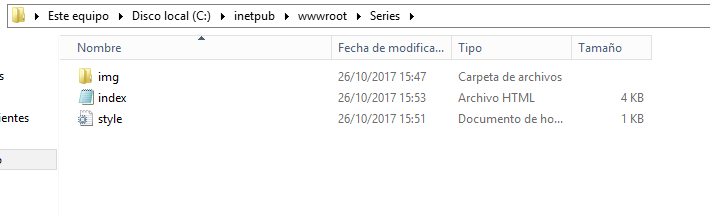


* Comprobación

  * Series

    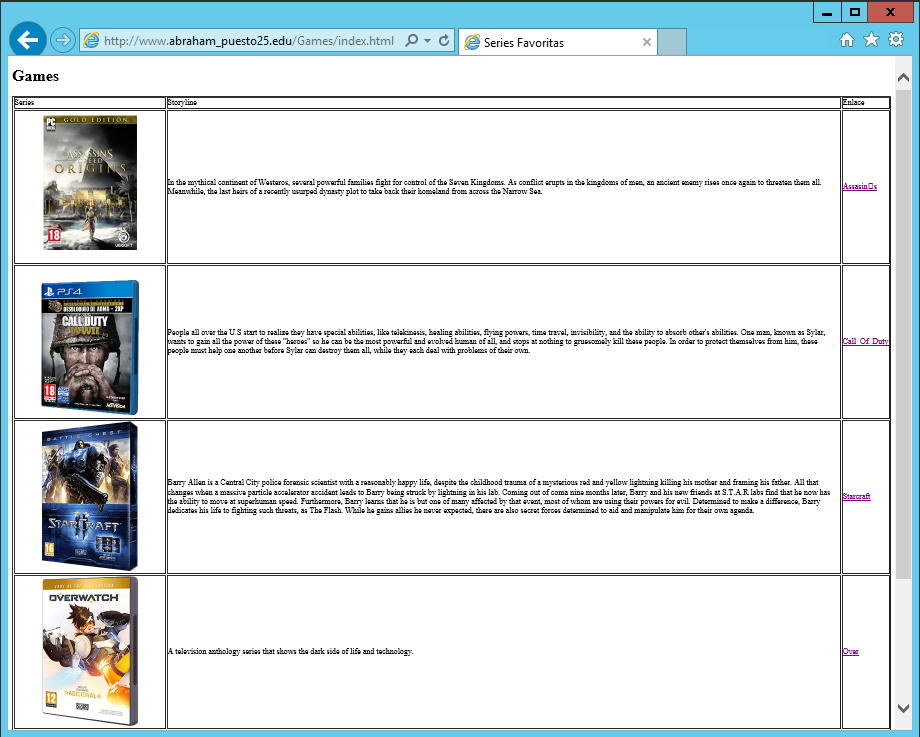

  * Games

    

  * Animales

    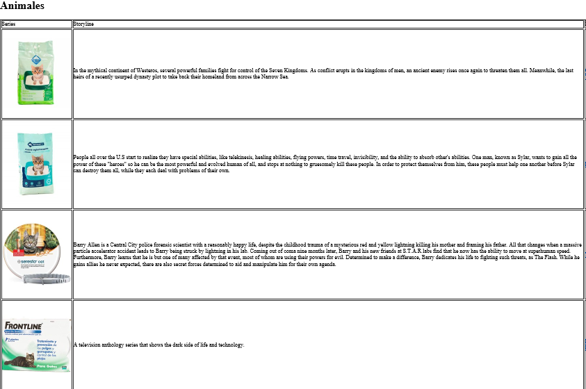

# Internet Information Server Creación de Sitios Web Independientes


* Crea dos nuevos sitios web, uno asociado al dominio principal y otro a un subdominio.

  * Creamos un nuevo dominio principal.

    

    > Vamos a herramientas DNS y pinchamos en el servidor y creamos un nuevo dominio.

  * Creamos dentro del nuevo dominio un HostA apuntando al servidor y un CNAME llamado "**www**" apuntando al HostA.

    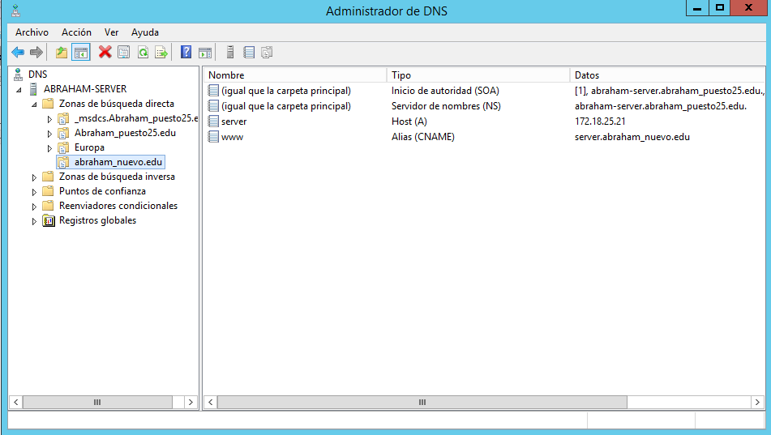

  * Creamos una carpeta para almacenar los sitios web.

    

  * Y añadimos un nuevo sitio web apuntando a la capeta del nuevo dominio.

    

    > Se apunta a la ip del servidor.

  * Reiniciamos el servicio y comprobamos que funcione.

    

  * Vamos a crear ahora el subdominio.

    

    > Dentro creamos un CNAME sin nombre apuntando al dominio nuevo.

    

  * Cramos la carpeta dentro del dominio nuevo llamado "**departemento**" .

    

  * Creamos un nuevo sitio web independiente para "**departamento**"

    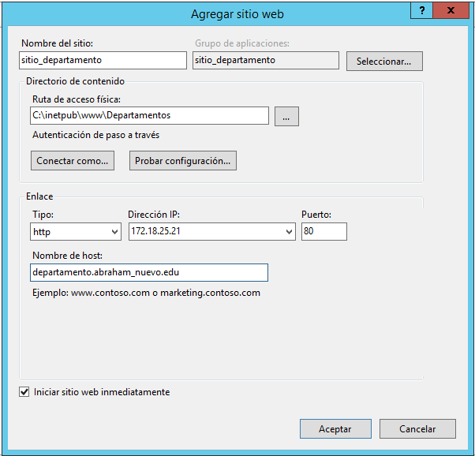

  * Reiniciamos el servicio y comprobamos.

    


# Internet Information Server  Creación de Directorios Virtuales

* Crea  un  nuevo  directorio  virtual  en  IIS  (dentro  del  citado  sitio  web)  y  
relaciónalo con la carpeta que has creado.

  * Creamos un carpeta dentro del nuevo dominio llamado "**recurso**" donde va a estar toda la información.

    

  * Vamos a panel de ISS y creamos un host virtual dentro del sitio web principal apuntando a la carpeta de recurso.

    

  * Reiniciamos y comprobamos servidor y cliente.

    * Cliente:

      

    * Servidor:

      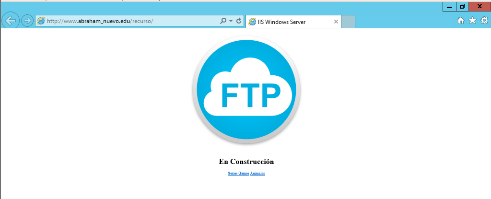

* Este   directorio   virtual   debe   contener,   al   menos,   tres   subcarpetas   con   páginas html diferentes  para  comprobar  el  buen  funcionamiento  del  sitio.

  * Creamos dentro de la carpeta recurso, tres subcarpetas llamadas "**r.humanos**","**depar**","**info**".

  > En cada recurso nuevo alojamos HTML distintos para comprobar que funciona cada elemento.

    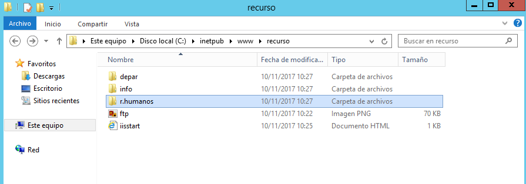

  * Reiniciamos el servicio y comprobamos desde cliente y servidor.

    * cliente;

      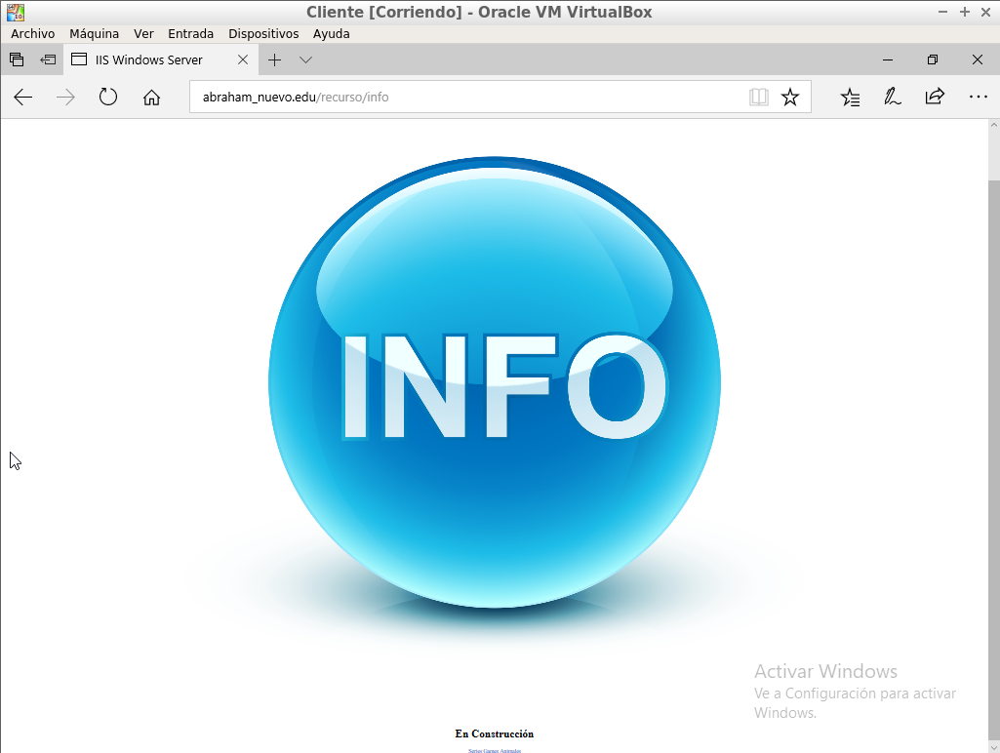

      

      

    * Servidor:

      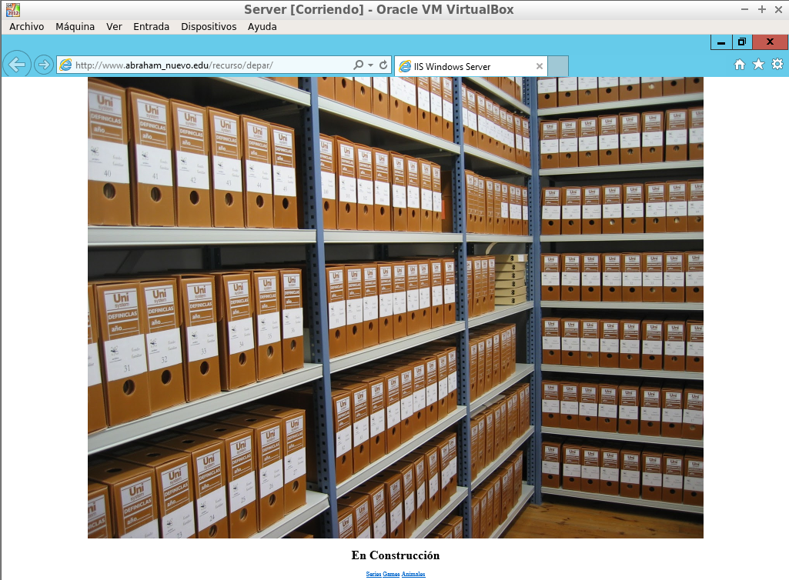

      

      
