# Práctica Servidor Web Apache - Linux - Pasos e indicaciones

## Objetivos

  * Dominio principal: miempresa.com (o similar)

  * Alias página principal: www.miempresa.com

  * Sitio seguro (https): pagos.miempresa.com (o miempresa.com/pagos)

  * Carpetas privadas protegidas: empleados.miempresa.com (o miempresa.com/empleados)

  * Instalación PHP, MySQL, phpMyAdmin

  * Gestión bases de datos: phpmyadmin.miempresa.com (o miempresa.com/phpmyadmin)

  * Instalación y configuración plataforma Drupal, Joomla, Moodle, Gallery, osCommerce, etc. en página principal

## Preparación de la maquina

  *  Configurar MV Ubuntu o similar en adaptador Puente (acceso a Internet)

      

  * Configuración de Red

      

## Instalación Apache:

  * Instalar Apache: `sudo apt-get install apache2`

    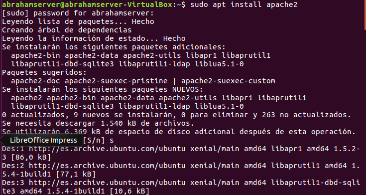

  * Comprobar carpeta raíz sitio web: `/var/www`

    

  * Comprobar acceso a localhost //It works!

    

  * Añadir línea www.miempresa.com asociada a IP servidor en `/etc/hosts` o servidor DNS.

    

  * Comprobar acceso con la ip asociada.

    

  * Reiniciar apache: `sudo /etc/init.d/apache2` restart ó reload.

    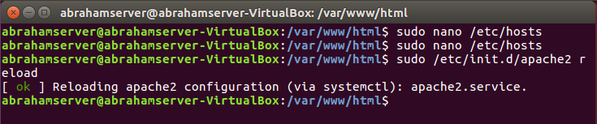

  * Error + Access logs: /var/log/apache2


## Instalación PHP

  * Instalar php: sudo apt-get install php5

    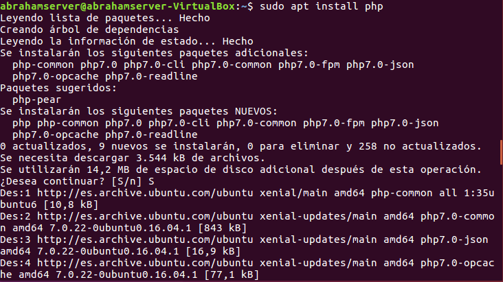

  * Comprobar acceso a index.php -<?php phpinfo(); ?>-

    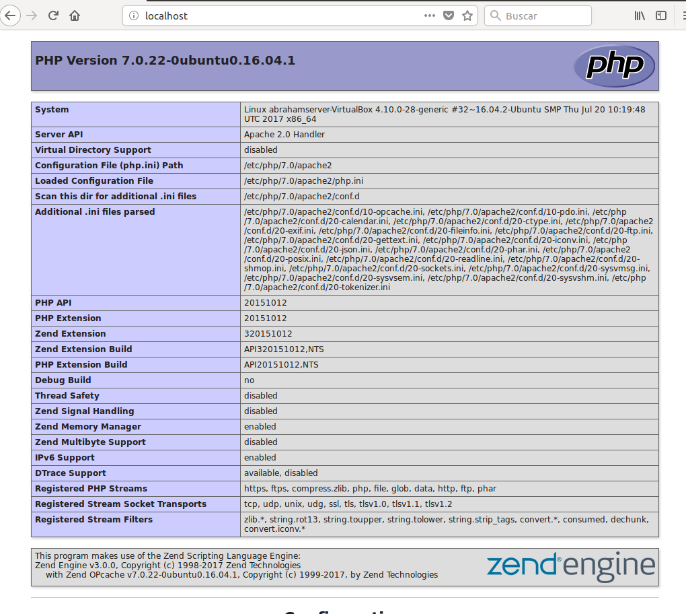

### Crear Hosts Virtuales en Apache.

  * Ejemplo:
    ```
    <VirtualHost *:80>

    ServerAdmin webmaster@miempresa.com

    ServerName empleados.miempresa.com //Añadir también a hosts o serviodor DNS

    DocumentRoot /var/www/empleados

    <Directory /var/www/empleados> // No es necesario para VirtualHost sencillos

    Opciones típicas...

    </Directory>

    </VirtualHost>
    ```

  * Crear la carpeta de los Hosts Virtuales.

    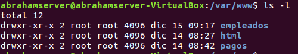

  * Asociar carpetas con sitios web (ej: empleados.miempresa.com --> /var/www/empleados) y establecer configuración (`/etc/apache2/sites-available/000-default.conf`)

    

  * Añade en /etc/hosts la web de empleados.

    

    > Ya que no tenemos un DNS propio usamos este archivo para que resuelva los nombres de dominio.

  * Reinicia el servidcio de apache para cargar la nueva configuración.

  `sudo systemctl restart apache2.service`

  * Comprobación

    


###  Configurar sitio web seguro pagos:

  * Al instalar Apache, se instala también SSL.
  *  Generar certificado autofirmado:

  *  § openssl genrsa -des3 -out server.key 1024.

  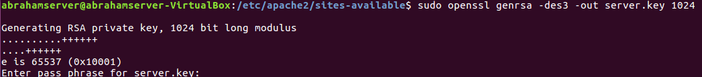


  > Nos pide una contraseña poner una contraseña para el certificado.


  *  § openssl rsa -in server.key -out server.pem.

  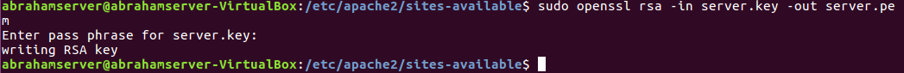

  *  § openssl req -new -key server.key -out server.csr.

  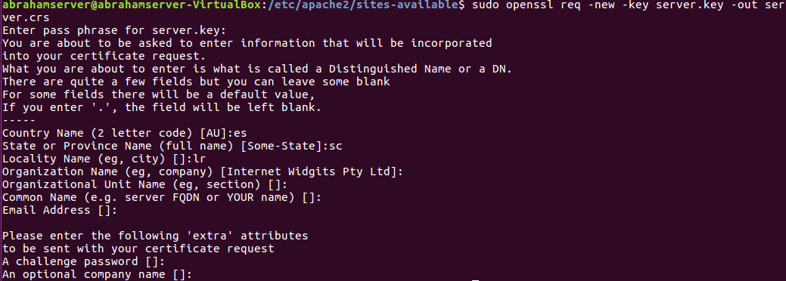


  > Datos de empresa.


  *  § openssl x509 -req -days 360 -in server.csr -signkey server.key -out server.crt.

  


  > Una vez terminados los certificados copiarlos a la carpeta de apache2


  


  * Modificar /etc/apache2/sites-available/000-default.conf.

    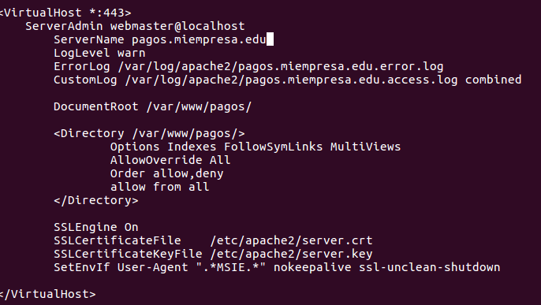

  *  Habilitar módulo SSL apache: sudo a2enmod ssl

    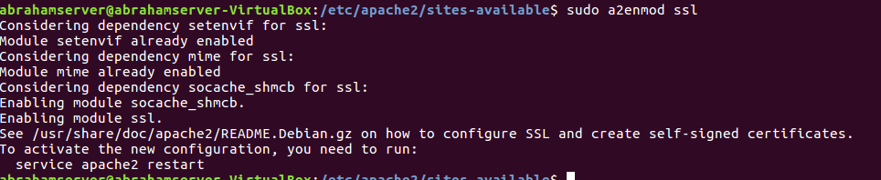

  * Reinicia el servicio de apache.

    `sudo systemctl restart apache2.service`

  * Comprobacion

    

###  Acceso a carpetas privadas

  *  Autenticación mediante .htaccess:

    

  *  Estructura: empleados.miemepresa.com (acceso a todos los empleados pero no anónimos) y subcarpetas personales de empleados (dos o tres, con acceso limitado al usuario).

  * Carpetas de empleados.

    

  > Dentro de cada carpeta de empleados tenemos que tener el .htaccess.

  * Crea la carpeta para alamcenar las claves de los empleados.

    

    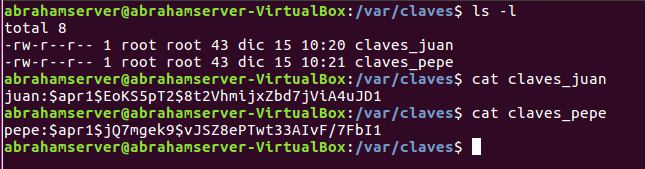

  * Comprobación de el acceso con empleados.

    * Juan

    

    

    * Pepe

    

    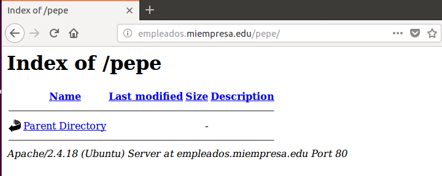

### Instalación de MySQL

  * Instalamos el servicio `MySQL` mediante el siguiente comando:

    ```console

    sudo apt-get install mysql-server

    ```

    

  * Comprobamos la versión instalada (útil para prevenir posibles problemas de compatibilidad con otros programas futuros)

    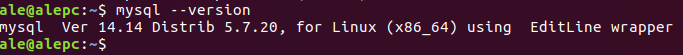

  * Instalamos además el soporte para PHP de MySQL con el siguiente comando:

    ```console

    sudo apt-get install php-mysql

    ```
    

### Instalación de phpMyAdmin

  * Descargamos la última versión de phpMyAdmin que se encuentre en la pag oficial `www.phpmyadmin.net`, y lo descargamos en formato tar.gz

    

  * Acto seguido, lo movemos hasta `/var/www`

    

  * Y le cambiamos el nombre a uno más simple como `phpMyAdmin`

    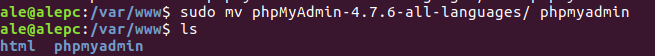

  * Una vez hecho esto, y previamente habiendo reiniciado el servicio de apache, accedemos mediante la web a `phpMyAdmin`

    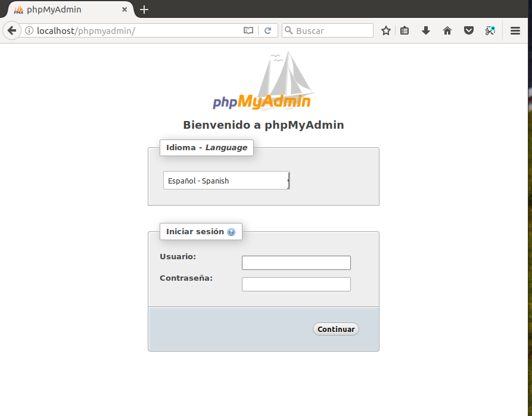

    

  * Ahora creamos la base de datos cms.

    

  * Y también al usuario `cmuser`, que será el que controle la base de datos `cms`

    

    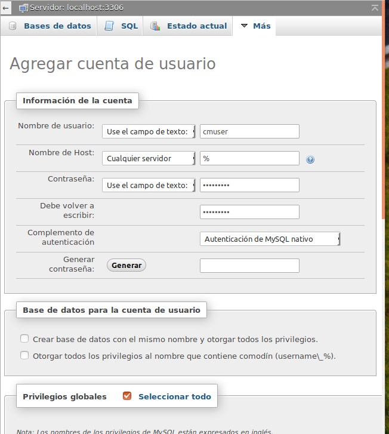

### Instalación y configuración de cms Drupal

  * Descargamos la versión 7.56 de Drupal.

    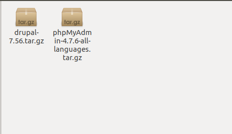

  * Descomprimimos el contenido de la del archivo comprimido y (en nuestro caso) lo metemos dentro de `/var/www/html`

    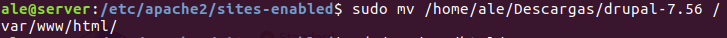

  * Y le cambiamos el nombre a algo más simple.

    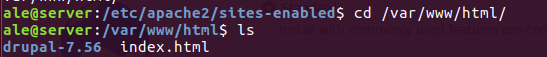

    

  * También tenemos que modificar el fichero de configuración del virtual host en `/etc/apache2/sites-enabled`, incluyendo la línea que define al directorio `principal`

    

  * Despues de reiniciar el servicio de apache de nuevo, comprobamos el acceso al directorio `/principal`, en donde se encuentra `Drupal`

    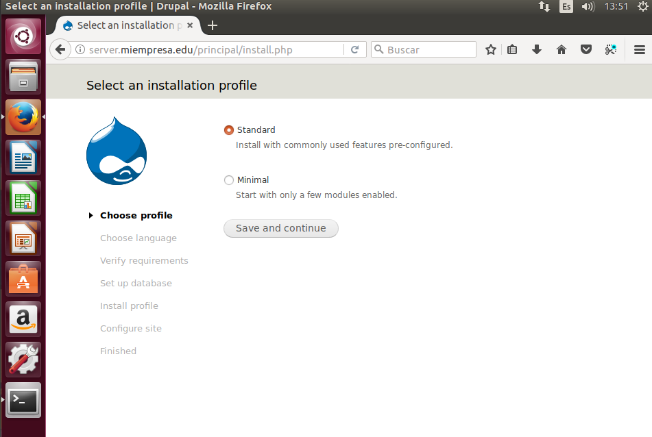

  * Configuramos el idioma para que se instale en español. Para ello tenemos que ir a la web de Drupal e instalar el paquete del lenguaje español.

    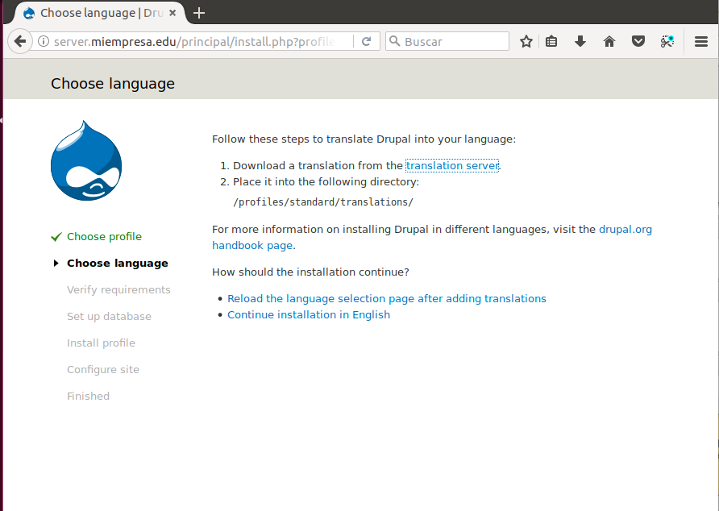

    

    

  * Configuramos la base de datos

    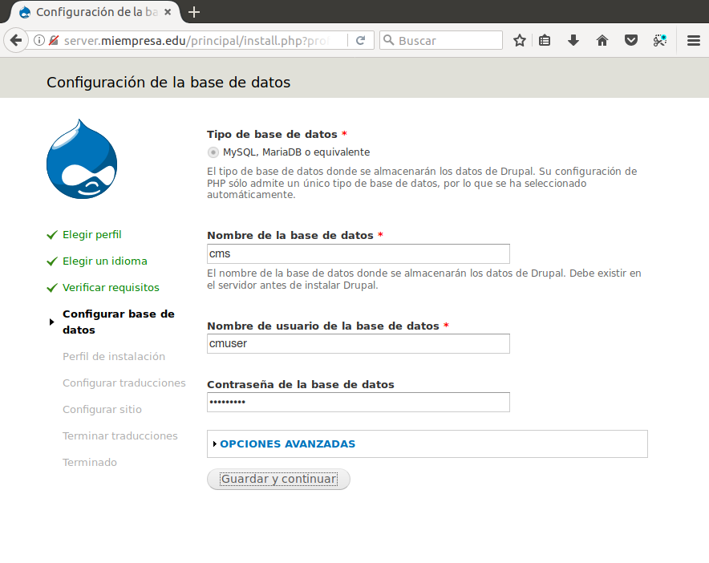

  * El programa realiza algunas instalaciónes como la carga del idioma seleccionado.

    

  * Ahora configuramos los datos del sitio web, como el usuario que accederá o el nombre del sitio.

    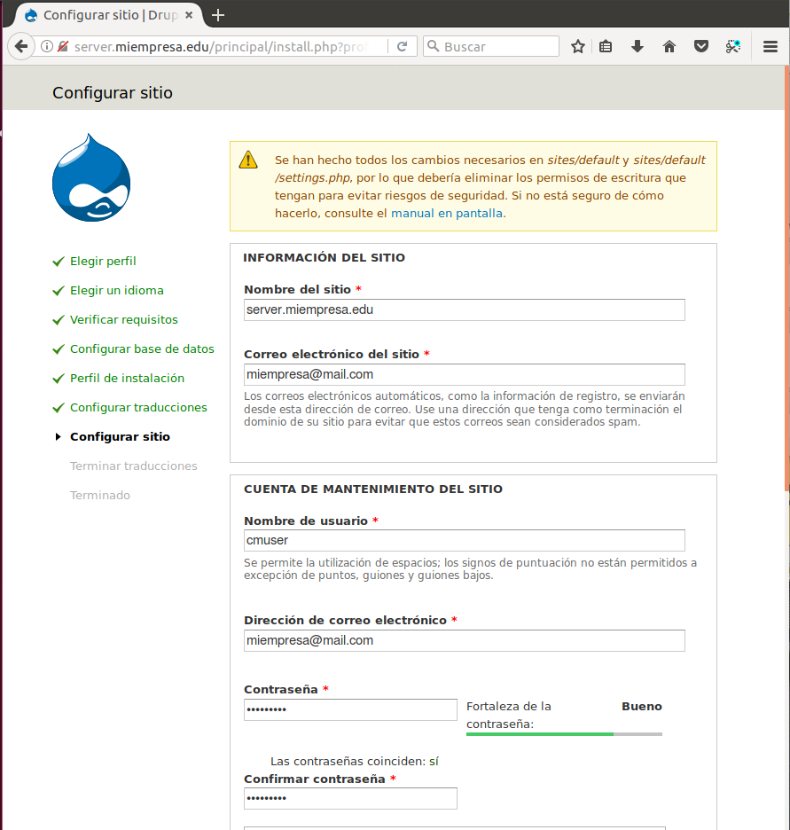

  * Y completamos la instalación.

    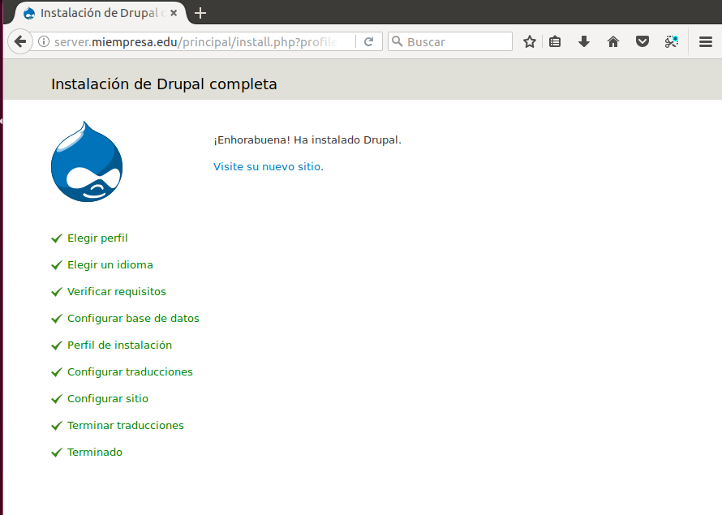

  * Una vez entramos podemos configurar algunos módulos tales como `GTranslate`, que se encarga de buscar traducciones automáticas para el sitio que creemos. Para ello descargamos el paquete desde la web de `Drupal` y luego lo instalamos.

    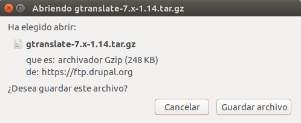

    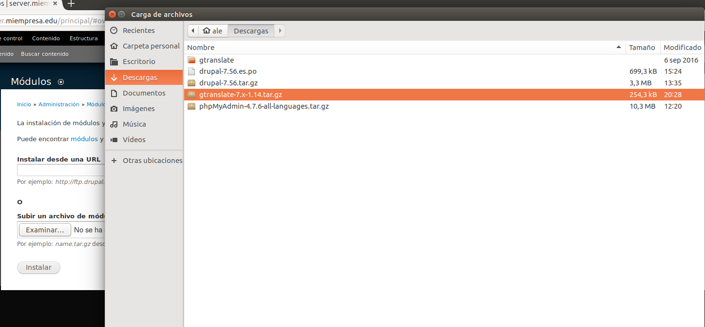

  * También podemos aplicar otros temas para cambiar la apariencia de la web a nuestro antojo. En este caso vamos a activar el tema `Garland 7.56` previamente descargado.

    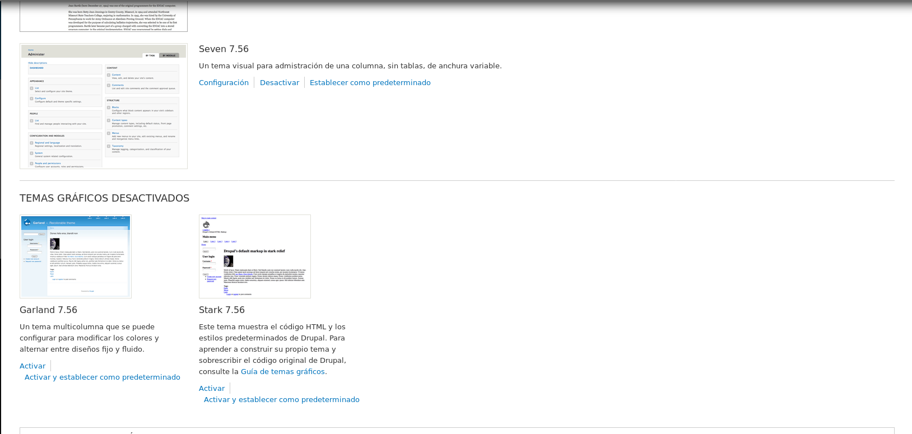

    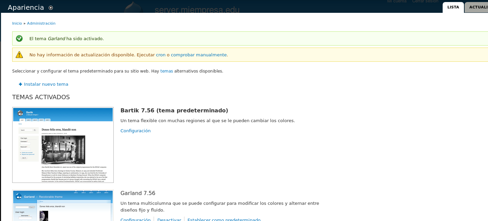

  * Por último también podemos realizar artículos y temas para nuestra web, para llenarla de contenido.

    

    
