# Instalación y Configuración del Servicio FTP en Windows 2012 Server.

### 1.Instalar Servicio FTP en Windows 2012 Server, a través de Agregar roles y características (IIS).

  * Vamos a Agregar roles y características , elegimos el servidor.

  

  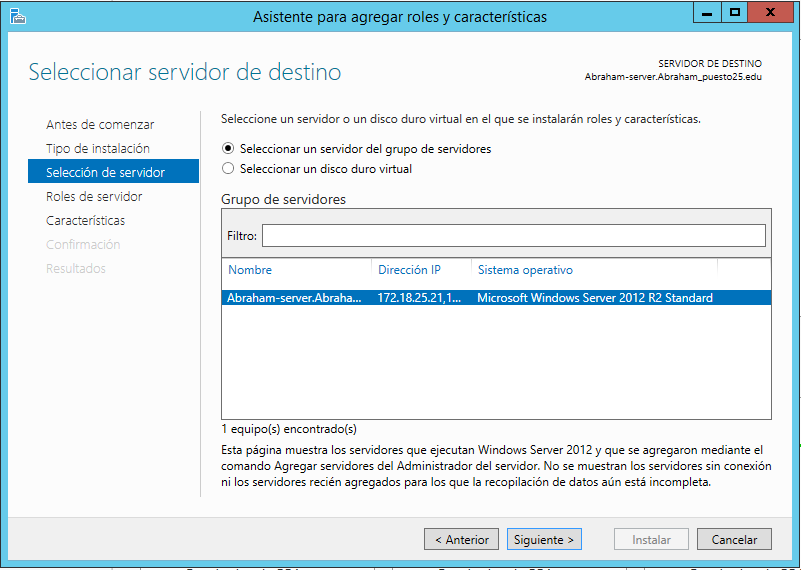

  * Despliega el Servidor ISS y selecciona "**Servidor FTP**".

  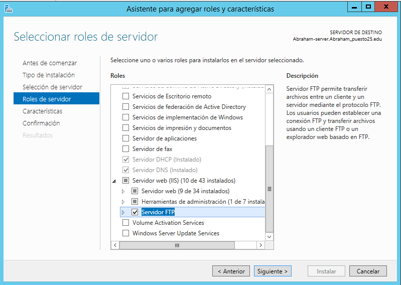

  * Instala el servicio ftp.

  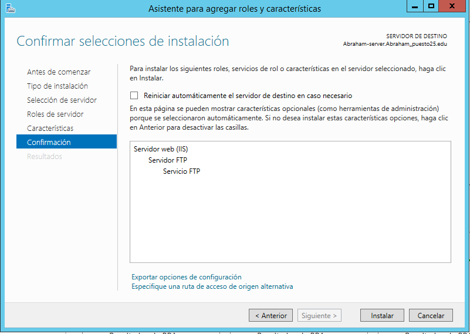

### 2 Acceder a la creación y configuración de Sitios FTP por medio de la Administración de IIS.

  * Vamos al herramientas => Servidor ISS => Agregar sitio web FTP.

  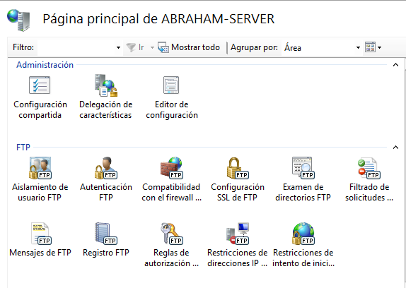

### 2.1 Crear tres nuevos sitios FTP (en todos ellos se debe poder acceder a través de las IPs del servidor.

  * Primer sitio web FTP:

    * Creamos uno que acceda al contenido de raiz C:

      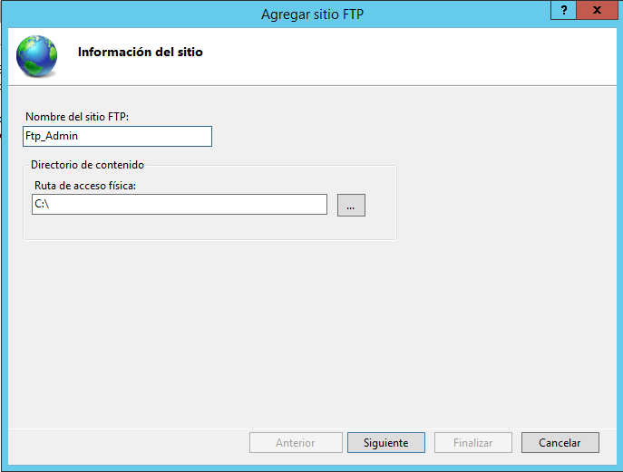

    * Selecciona  "Sin SSL" este sitio no va a tener certificado.

      

    * Autentificación Basica activada y solo puedo acceder el administrador.

      

    * El administrador tendra permisos de lectura y escritura.

      

  * Segundo sitio web FTP:

    * Solo accede a una de las carpeta de raiz: "``C:\inetpub\wwwroot``"

      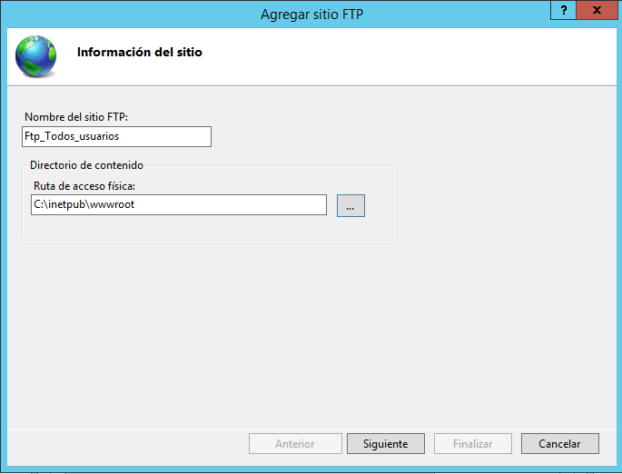

    * Selecciona Permiter SSL y el certificado que vamos a usar ssl.

      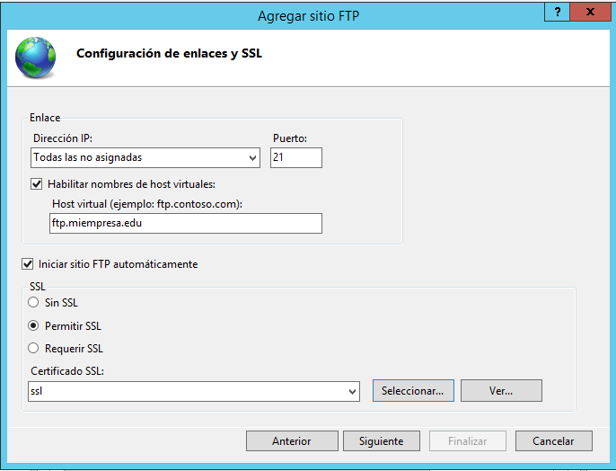

      > El puerto es el 2121 en la imagen no se reflejo.

    * Autentificación Basica activada y pueden acceder todos los usuarios.

      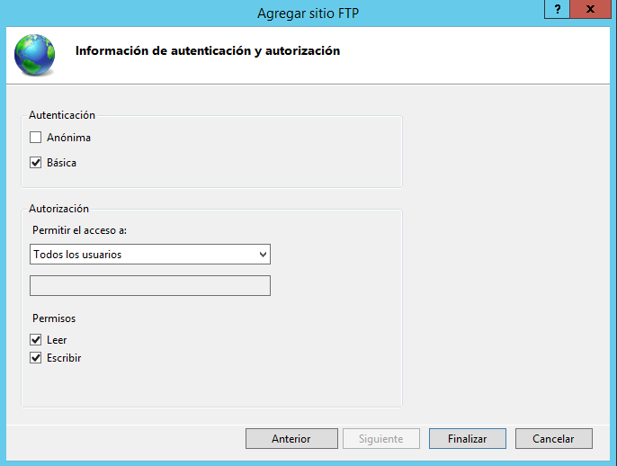

    > Permisos de lectura y escritura.

  * Tercer sitio web FTP:

    * Solo accede a la carpeta de raiz ``C:\Publico``

      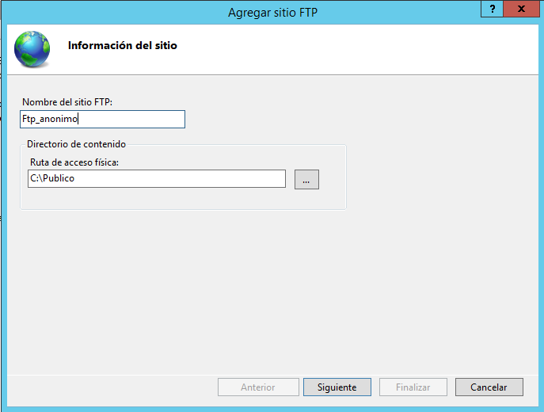

    * El puerto que vamos a usar es el "**2122**" y sin certificado.

      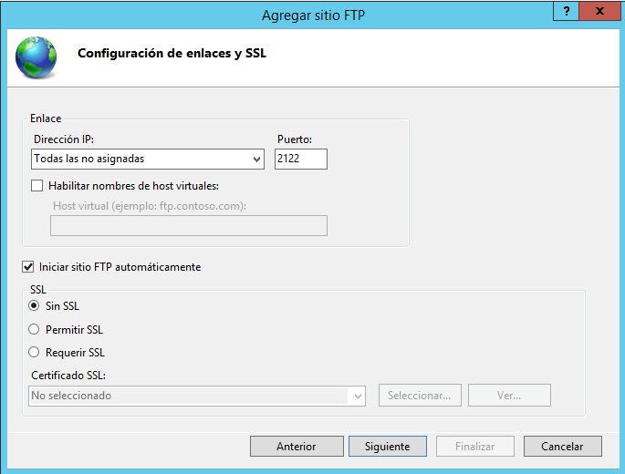

    * La Autentificación Basica desactivada y la anonima activa.

      

    > En este caso entra los usuarios anonimos.

### 3.Comprobación de sitios web con WinSCP desde cliente y Instalación de WinSCP.

#### 3.2 Instalación WinSCP.

  * Descargamos la aplicación de la pagina oficial.

      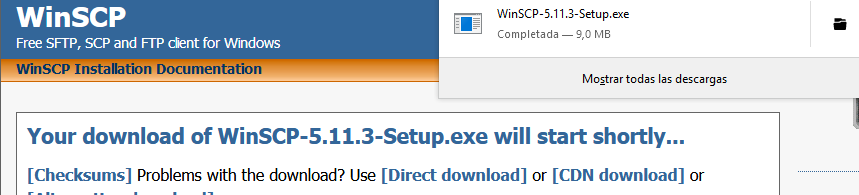

  * Hacemos una Instalación Basica.

      
      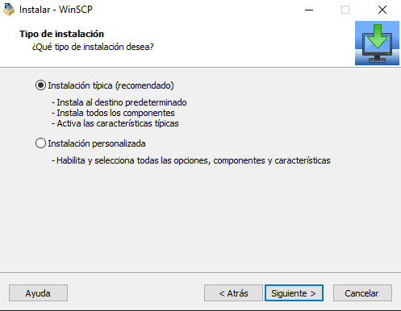
      
      

  > Es una herramienta para acceder desde un cliente a nuestro servidor FTP, usa protocolos SFTP/SCP/FTP.

####  3.3 Acceder con WinSCP.

* Primer sitio web FTP:

  * Abrimos la aplicación, iniciamos seción con nuestro administrador y el puerto "**:21**" de nuestra web.

    

  * Vemos que accedemos con nuestro admin a sitio web FTP y tiene acceso a raiz **C:\**.

    

* Segundo sitio web FTP:

  * Accedemos con cualquier usuario de Active Directory, como este sitio web tiene certificado elegimos el **cifrado explicito** y el puerto elegimos **2121** de nuestro sitio web.

    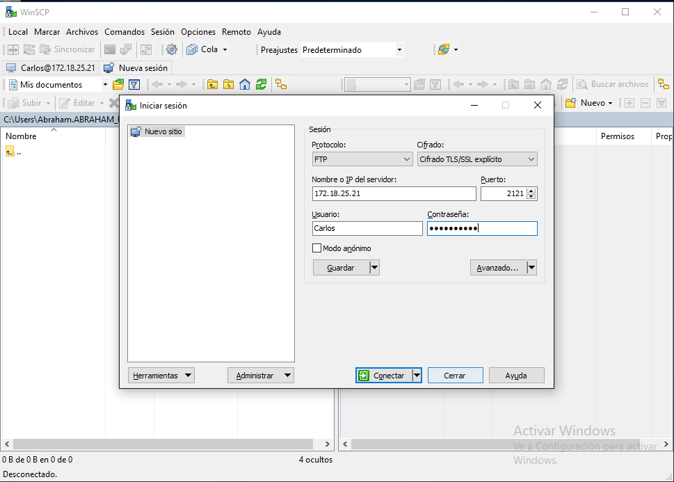

  * Comprobamos que podemos acceder con el usuario y vemos que solo tiene acceso a la carpeta **C:\inetpub\wwwroot**.

    

* Tercer sitio web FTP:

  * En este caso seleccionamos Modo anónimo para acceder con el usurio el puerto **2122**

    

  * Tenemos acceso con el usuario anónimo y vemos que el acceso a la carpeta es **C:\Publico**

    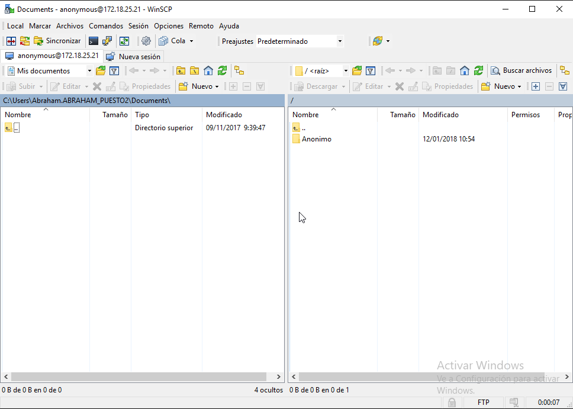
