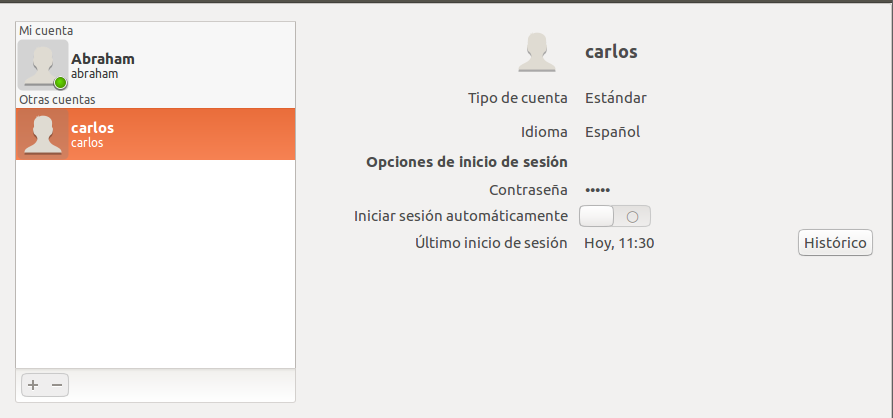
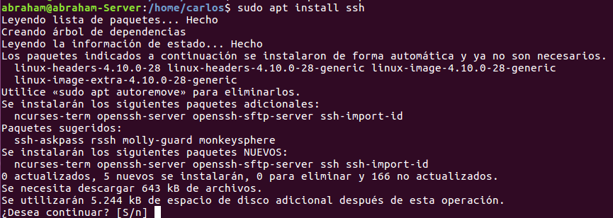
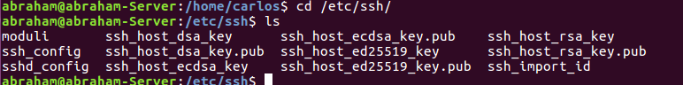
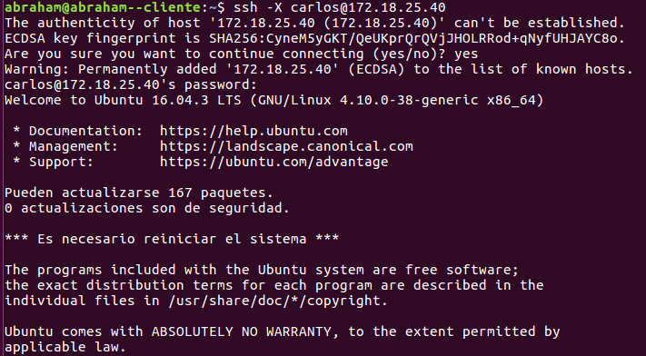
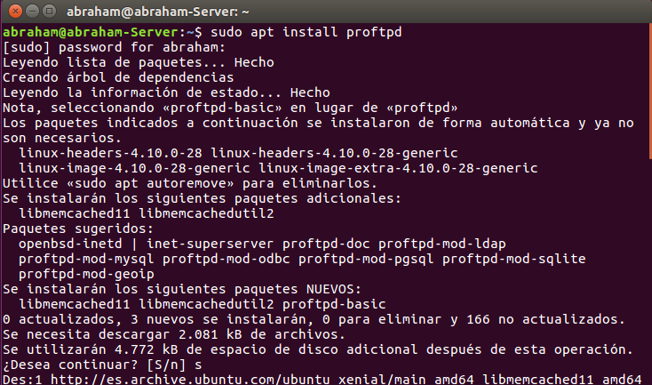
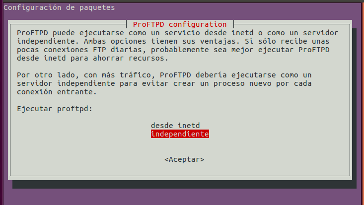
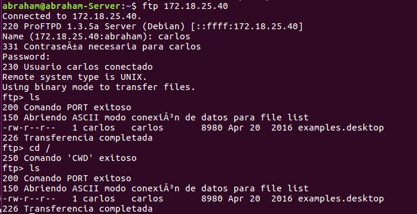

# Instalación y Configuración del Servicio FTP en Linux

### 1. Crear dos usuarios en el sistema, con diferentes privilegios y niveles de acceso al filesystem.

* Abrimos el terminal y creamos los dos usuarios.

  

* Vamos al panel de usuarios y otorgamos privilegios.

  * Abraham => Administrador.

    

  * Carlos => Estándar

    

### 2. Instalar Servicio SSH en el servidor Linux.

  * Abrimos el terminal ejecutamos el comando para instalar **SSH**

    ``sudo apt install ssh``

    

#### 2.1 Configurar el archivo "sshd_config" para ejecutar programas.

  * Vamos a la ruta del archivo ``cd /etc/ssh``

  

  * Tenemos que modificar la linea X11Forwarding por defecto viene activado.

  

#### 2.2 Comprobar, desde una máquina cliente, acceso de los usuarios mediante ssh.

  * Conexion con Carlos.

  
  

### 3. Instalar el paquete proftpd (Servicio FTP).

  * Vamos al terminal ejecutamos el comandp para instalar.

  ``sudo apt install proftpd``

  

  * Elegimos idependiente

  

  * Abrimos el terminal y comprobamos que podemos acceder.

  

#### 3.1 Editar el fichero de configuración /etc/proftpd/proftpd.conf buscando información en Internet.

  > Modificamos el archivos y incluimos a los usuarios para dar privilegios en el servicio ftp.

  * Abraham puede acceder a raiz **/** y carlos solo puede acceder a su home **/homr/carlos**

    

### 4. Conectar al servicio ftp gestionado por proftpd tanto desde el servidor como desde un cliente.

#### 4.1 Servidor protocolo ftp.

  * Conexión Usuario Abraham.

    

    > Vemos que tenemos acceso a la carpeta raiz.

  * Conexión Usuario Carlos.

    

    > Intentamos acceder a raiz pero aunque el comando funcione solo mostrara su /home/.

  * Subimos y descargamos archivos.

    

#### 4.2 Cliente protocolo sftp.

  * Conexión Usuario Abraham.

    

  * Subimos y descargamos archivos.

    

  * Conexión Usuario Carlos y Subimos , descargamos archivos.

    
