# hMailServer

### 1. Desinstalar Servicio SMTP

* En primer lugar, hay que desinstalar el servicio SMTP de Windows 2012 Server.

  * Pulsamos quitar caracteristica

    

  * Y pulsamos quitar para que se desinstale el servicio.

    

  * Una vez hecho esto tenemos que reiniciar el equipo.

    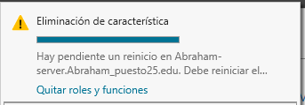

### 2. Instalación de hMailServer

* Debes descargar e instalar en el servidor Windows 2012 server el servidor de correo hMailServer.

  

* Ejecutamos el archivo descargado para comenzar la instalación.

  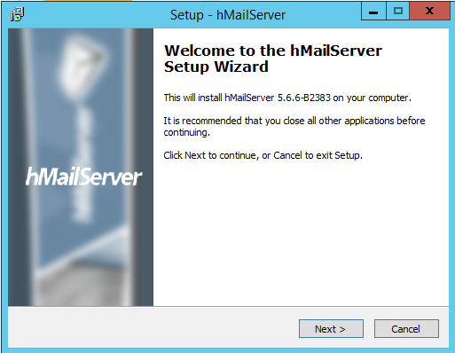

* Lo dejamos por defecto.

  

* Elegimos la primera opcion.

  

* Ingresamos una contraseña.

  

* Finalizamos la instalación.

  

### 3. Configuración de hMailServer.

* 3.1 Accedemos al panel de hMailServer

  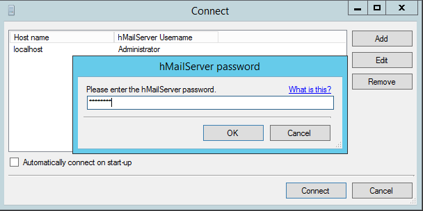

* 3.1 Crea dos dominios denominados srd.edu y asir.edu.

  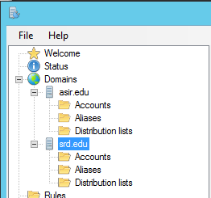

  > Vamos al apartado de dominios y ahi los creamos.

  

  

* Ejecuta los diagnósticos para ambos dominios y soluciona el error de backup asignando una carpeta para tal fin. Establece copia de seguridad de los mensajes.

  * Dominio asir.

    

  * Dominio srd.

    

* Para solucionar el error de backup , vamos al panel de hMailServer, backup y elegimos una ruta para la copias de seguridad, elegimos todas las opciones del backup y guardamos.

  

* Solucionar el error de MX , vamos a nuestro DNS, creamos los dominio asir.edu , srd.edu y creamos un alias llamado **mail."dominio.edu"** apuntando al servidor.

  * Dominio asir.edu

    * MX

      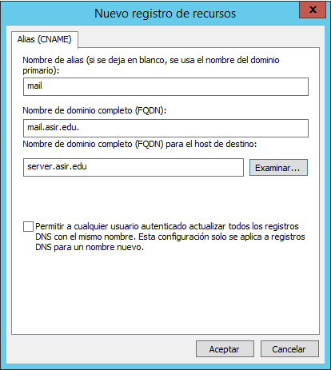

  * Dominio srd.edu

    * MX

      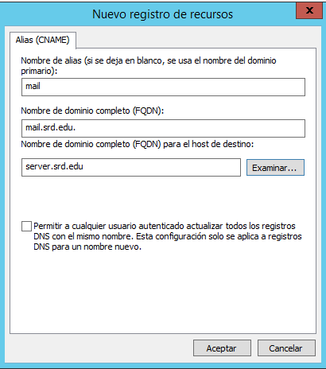

> A la hora de ejecutar el diagnósticos de nuevo puede tardar en funcionar.

### Creaciñon de usuarios.

* Crea dos cuentas para dos usuarios ficticios en cada uno de los dos dominios.

  * Abraham:

    

  * Suso

    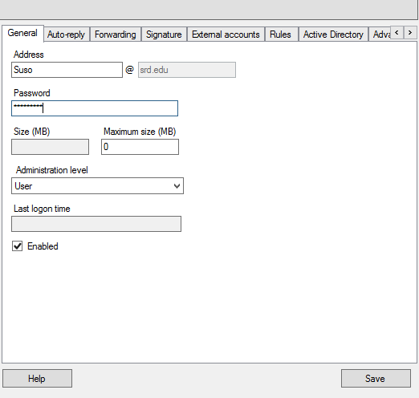

  * Visto desde el panel de hMailServer

    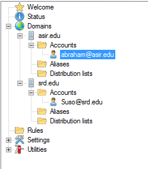

* Investiga y configura las cuentas con diferentes opciones (cuota de disco, auto-reply, forwarding, signature, etc.)

  * Autoreply.

    

  * Le mandamos a ususrio Abraham un correo a ver si funciona el Autoreply.

    

  * Comprobamos que nos llega el mensaje de abraham automaticamente.

    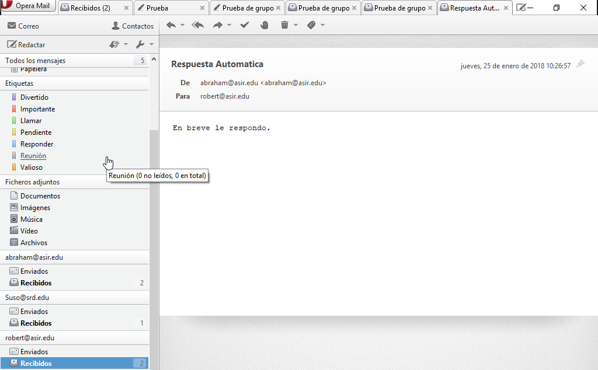

  * Forwarding

    

  * Le mandamos un mesaje abraham para ver si lo recibe robert.

    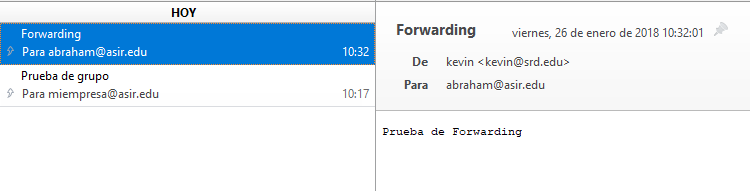

### Configuración SMTP, POP3, IMAP.

* Realiza todas las opciones de configuración que consideres necesarias y/o convenientes. Consulta para ello los tutoriales cuyos enlaces se proporcionan (opciones de protocolos SMTP, POP e IMAP, rangos de IP, bloqueo de correo entrante, nombre de host, reenvío dominios remotos, blacklists, opciones de logging, etc.)

  * SMTP.

    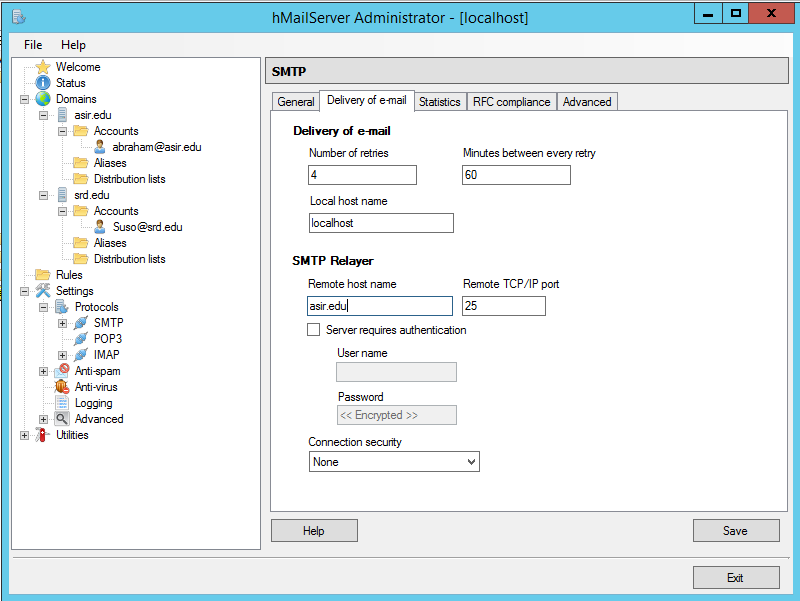

  * Mensaje de salida y Maxima Conexiones.

    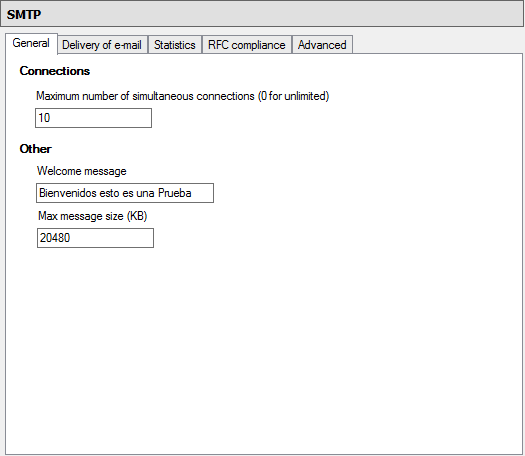

  * POP3

    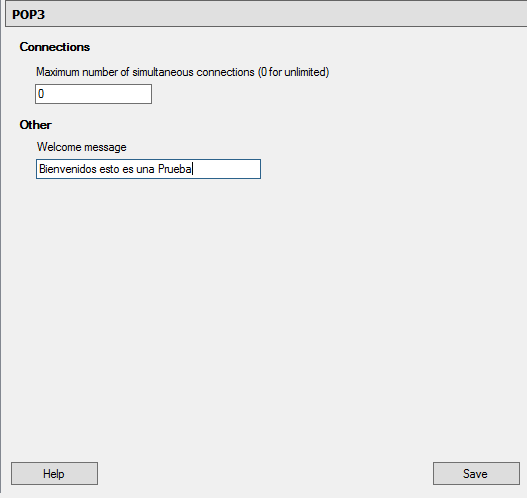

  * IMAP

    

* Instalamos el Cliente Telnet para comprobar cada servidcio.

  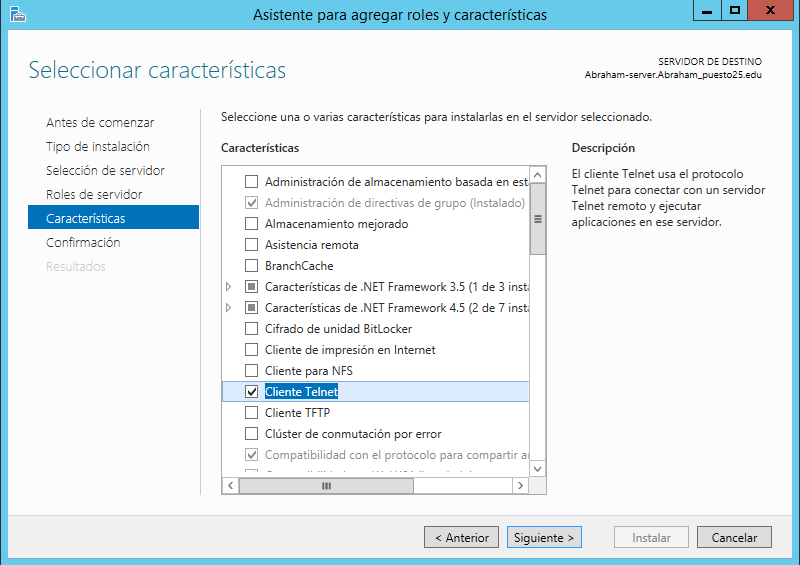

* Los puerto de cada servicio.

  

* Comprobamos SMTP con el puero 25.

  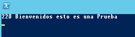

* Comprobamos POP3 con el puerto 110

  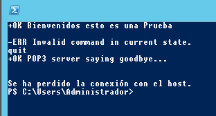

* Comprobamos IMAP con el puerto 143

  

### Configuracion de Correo.

* Comprobamos desde el cliente que tenemos acceso a nuestro servidor.

  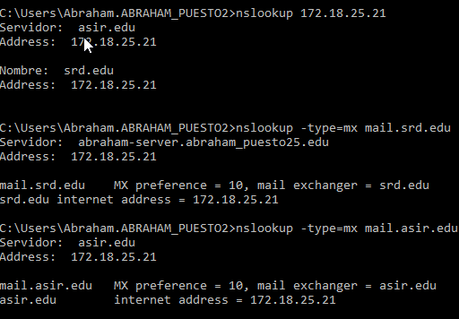

* Configura en el cliente W7 un cliente de correo como thunderbird o Live Mail (en los ordenadores clientes) para acceder al servidor de correo instalado en Windows 2012.

  * Abraham:

    

    

  * Suso

    

    

* Realiza prueba de envío y recepción de correos entre los diferentes usuarios, comprobando, además de envío y recepción correctas, el efecto de las opciones configuradas en las cuentas.

  * Enviamos un correo con Abraham a Suso.

    

  * Ahora desde Suso a Abraham

    

* Crea una lista de distribución empleados asociada al dominio y añade a los dos usuarios de miempresa.com a ella.

  

  

> Para esta parte creamos mas usuarios ficticios.

* Realiza prueba de envío y recepción de correos por medio de la lista de distribución.

  * Enviamos un correo a miempresa.

  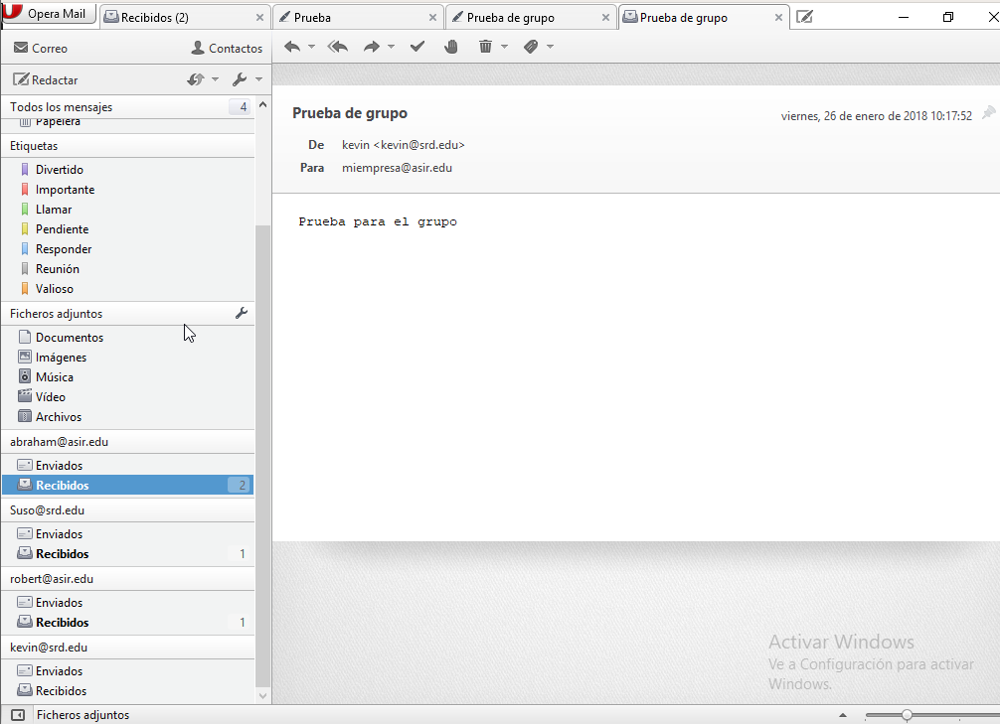

  * Vemos con le llega a robert que esta dentro de la distrubucion.

  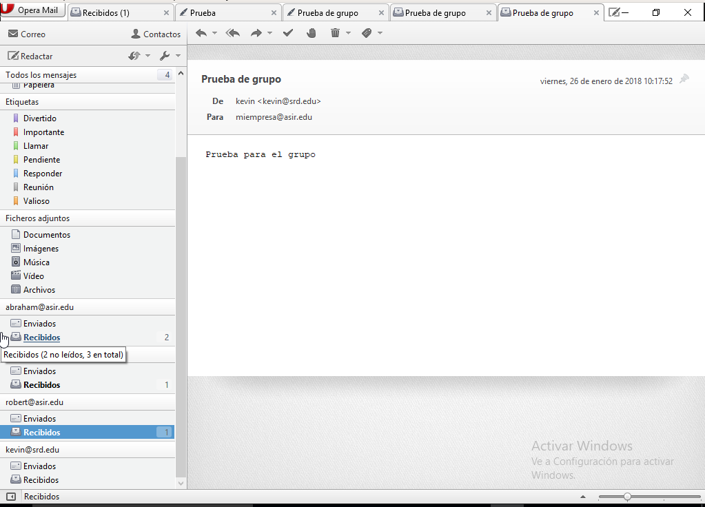
