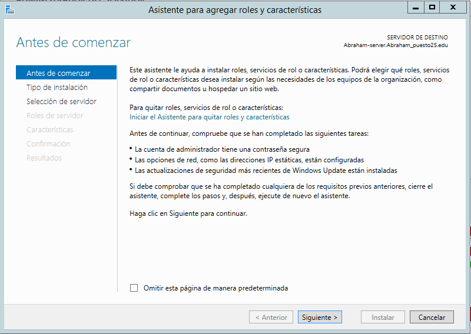
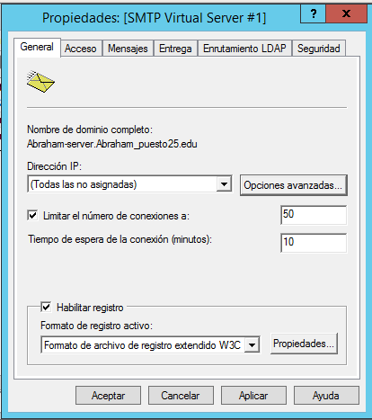
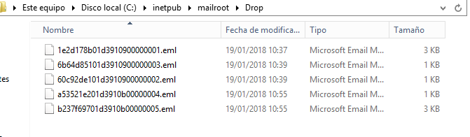
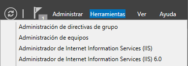
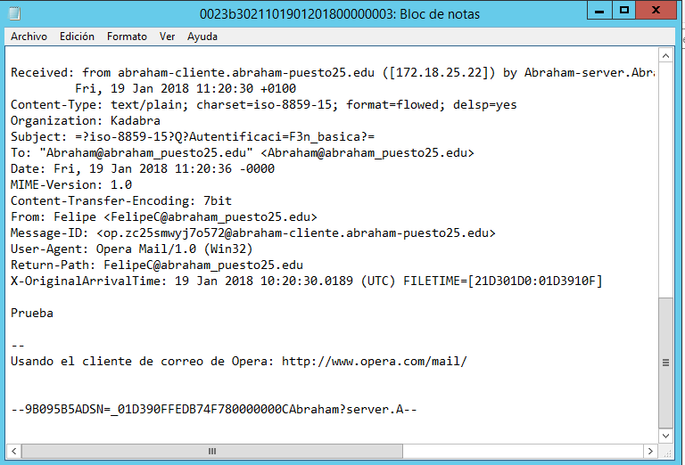

# Servicio SMTP Windows 2012 Server

### 1. Instalar Servicio SMTP en Windows 2012 Server

Vamos al panel de agregar roles y caracteristicas y buscamos  el Servicio SMTP.

  

Seleccionamos Servidor SMTP  

  

Pulsamos Instalar

  

### 2. Configuración de servicio SMTP a través del administrador de aplicaciones (IIS) 6.0. Realizar las siguientes acciones de configuración:

  * Establecer como IP todas las asignadas , Limitar el número de conexiones a 50 y Habilitar el registro en formato W3C, diario y en una carpeta determinada.

    

  * Configurar envío de mensajes dentro de nuestra red local: Aceptar la conexión al servidor y la retransmisión de mensajes a todos los equipos menos los que aparecen en la lista (incluir una IP cualquiera en la lista
  para impedir su acceso y retransmisión)

    

  * Establecer autenticación anónima

    

  * Comprobar la existencia del dominio AD predeterminado. Crea un dominio de tipo alias para disponer de cuentas en otro dominio.

    

  * Comprueba carpetas de correo creados en
  ``C:\Inetpub\mailroot.``

    

### 3. Autenticación Anonima.

  * En el cliente Windows:

  * Configurar el cliente de correo Live mail agregando dos cuentas de correo. cualesquiera (usuarios AD -dominio- y no AD). Se deberá especificar: usuario / buzón, contraseña,  servidor SMTP.

      

  > Usamos el correo de Opera.

  * Iniciamos sesion.

      

  * Colocamos nuestro servidor.

      

  * Y ya tenemos un usuario listo para comprobar que funciona nuestro servicio SMTP.

      

  > Creamos otro usuario y comprobamos el envio de mensajes.

  * Enviar varios correos desde / hacia las diferentes cuentas y comprobar envío (real o ficticio) y carpetas mailroot. Las carpetas existentes en mailroot alojan mensajes en cola (Queue), mensajes para destinatarios desconocidos (Badmail) y mensajes entregados (Drop).

    

  * Entramos en las carpeta Drop para ver los mensajes que se enviaron.

    

### Autenticación Basica.

  * Nueva configuración de servicio SMTP a través del administrador de aplicaciones (IIS) 6.0. Establecer autenticación básica de Windows. Probar diferentes configuraciones de dominio predeterminado, cifrado TLS, etc.

    

  * Quitamos la autenticación anonima y seleccionamos la autenticación basica.

    

  > Esto cogera los ususarios que tenemos en nuestro Directorio Activo.

  * Activamos cifrado TLS en nuestro servidor.

    

  > Usara un certificado que ya tengamos en nuestro servidor.

  * Creamos las cuentas de mail para nuestro usuarios de Directorio Activo.

    * Abraham:

      

    * FelipeC

      

  *  Enviar varios correos desde / hacia las diferentes cuentas y comprobar envío y carpetas mailroot. En este caso sólo tendrán acceso al servidor SMTP cuentas del dominio y correspondientes a usuarios de AD.

  * Enviamos un mensaje desde Abraham a FelipeC

    

  * Un error de seguridad por el certificado ya que no esta registrado.

    

  * Vamos a las carpeta donde se almacenan los correos.

    

  * Y vamos que llego correctamente al destinatario.

    
