# Servidor de correo Linux

## Instalación del servicio SMTP

* Iniciamos la instalación del servicio `Postfix` mediante el comando:

```
apt-get install Postfix
```

* En madio de la instalación nos saldrá esta especie de asistente.


* Escoger instalación como Sitio de Internet


* Creamos dominio miempresa.edu

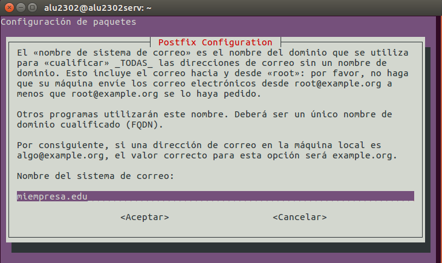

* Una vez terminada la instalación, comprobamos servicio (y puerto) SMTP activo y a la escucha con `netstat– utap`

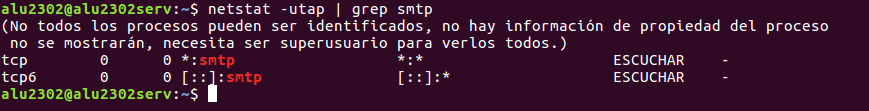

* Realizar  una  prueba  de  envío  de  mensaje  entre  dos  usuarios  del  sistema  mediante
telnet.


* Comprobamos que ahora ya nos han asignado un puerto para la conexión.


* Completamos el mensaje y comprobamos que está dentro de la carpeta de `/var/mail/` del usuario.


* Instalamos un cliente de correo electrónico en un cliente.

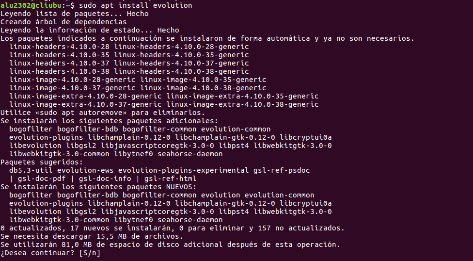

* Crear  dos  nuevas  entradas  en  /etc/hosts:  smtp.miempresa.edu  y  pop.miempresa.edu
asociadas a la IP del servidor.

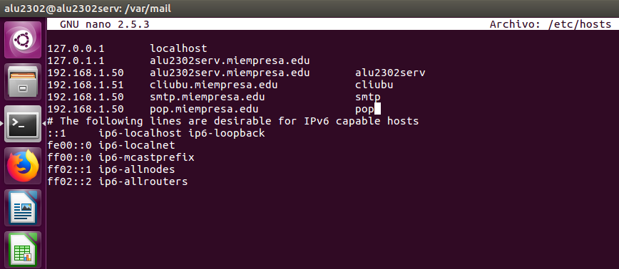

* Crear al menos dos cuentas asociadas a usuarios existentes en el servidor y asociadas al
dominio creado en Postfix.


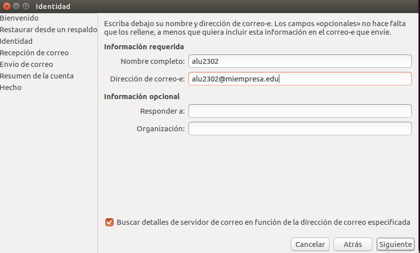


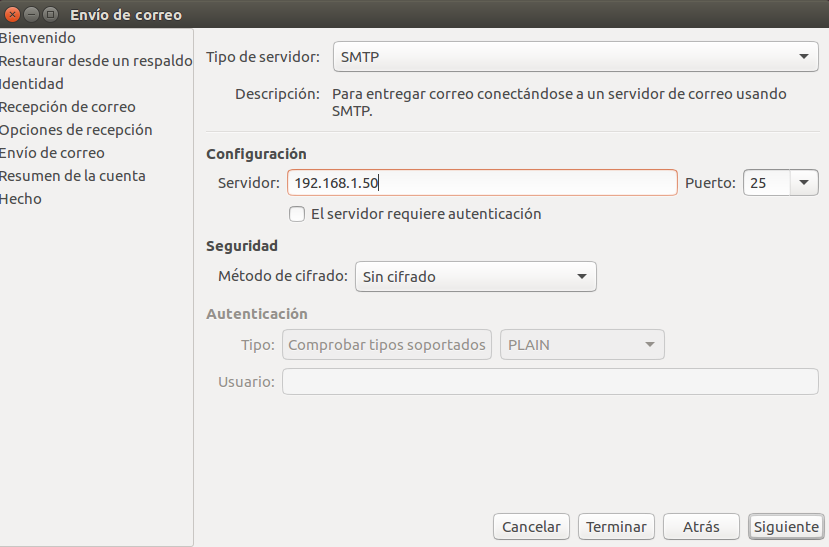

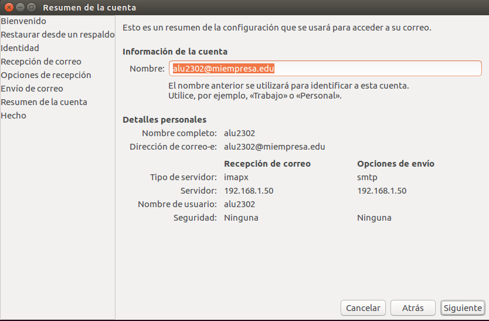

* Enviamos un mensaje de un usuario a otro.


* Comprobamos que el mensaje se encuentra en el directorio del usuario.


## Instalación del servicio IMAP

* Instalar servicio IMAP con:

```console

apt-get install dovecot-imapd

```


* Comprobar servicio (y puerto) IMAP activo y a la escucha con `netstat –utap`


* Instalar aplicación correo web SquirrelMail.


* Carpeta de configuración en /etc/squirrelmail


* Acceder desde una máquina cliente, vía HTTP, al gestor de correo SquirrelMail instalado.


* Enviar  y  recibir  correos  entre  las  dos  cuentas  creadas  desde  el  cliente  y  utilizando  el gestor de correo web SquirrelMail

  * Maquina Cliente.

  * Accedemos con el ususario suso previamente creado en el servidor.

    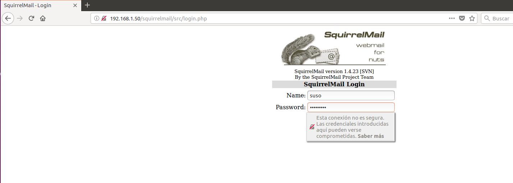

  * Enviamos un correo al usuario alu2302.

    

  * Accedemos al segundo ususario **alu2302** y comprobamos que tenemos el mensaje del ususario suso.

    

  * Le mandamos un correo al ususrio suso y comprobamos que lo recibe.

    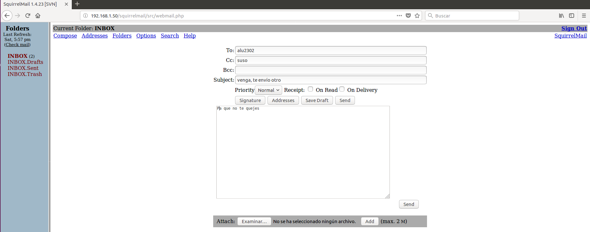

    

* Comprobar que los mensajes enviados desde ambas cuentas se siguen encontrando en
los respectivos buzones de los usuarios en /var/mail.

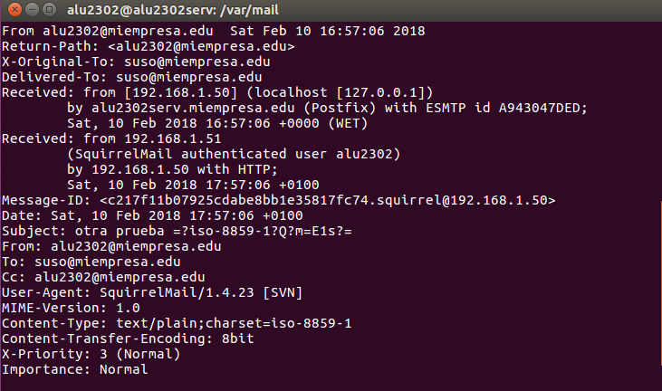


### Instalar servicio POP3:

* Instalar servicio POP3 con apt-get install dovecot-pop3d


* Comprobar servicio (y puerto) POP3 activo y a la escucha con netstat –utap.

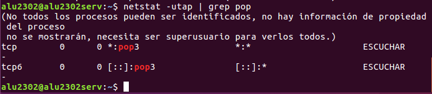

* Configurar  MUA  (gestor  de  correo  cliente  Evolution  o  similar)  en  máquina  cliente  para que  acceda  a  la  recepción  de  correo  a  través  del  protocolo  POP3  instalado  en  el servidor.

* Usaremos el Cliente Evolution , creamos el primer usuario.

  * alu2302
    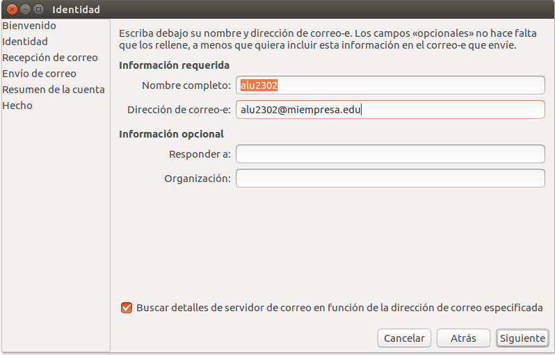

  * Elegimos el tipo de servidor de recepción, la ip del servidor y el ususario.

    

  * Elegimos el tipo de servidor de envio, la ip del servidor y el usuario.

    

    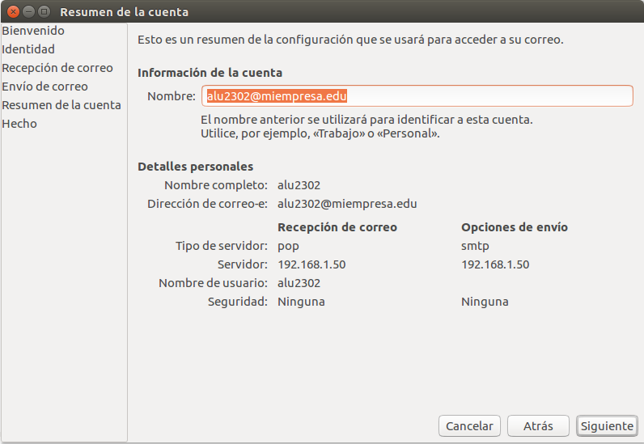

  * Seguimos los mismos paso con el siguiente ususario.

    
* Enviar y  recibir  correos  entre  las  dos  cuentas  creadas  desde  el  cliente  y  utilizando  el gestor de correo del cliente

  * Enviamos un correo a suso con el cliente alu2302.

    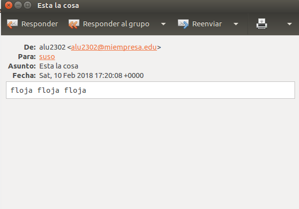

  * Enviamos un correo de respuesta a alu2302 con el usuario suso.

    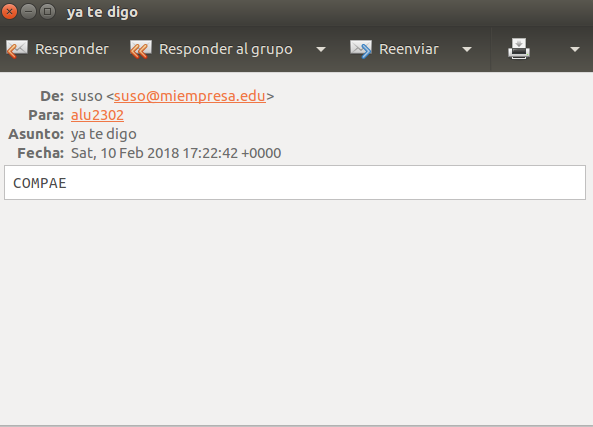

  > Dejamos el resultados de envio en la parte de comprobación de /var/mail.

* Comprobar  que  los  correos  enviados  y  recibidos  han  desaparecido  (han  sido  extraídos
por POP3) de los buzones respectivos de los usuarios en /var
/mail.

  * Primer mensaje alu2302

    

  * Segundo mensaje suso

    
