# Instalación y Configuración de un Servidor de Mensajería Instantánea

### 1. Descarga e instalación del servidor de mensajería instantánea OpenFire para Windows

* Curiosamente nos pide encarecidamente la instalación de `Java`, así que lo instalamos para el correcto funcionamiento del servidor.

* Ahora ejecutamos de nuevo el instalador y seguimos el proceso.

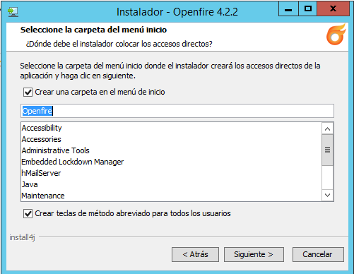

### 2. Crear una base de datos en blanco en MySqQL a través de phpMyAdmin

* Entramos como administradores a `phpmyadmin` y creamos una base de datos vacía a la que llamaremos en nuestro caso `correo`

* Creamos un usuario llamado `user_correo` y le damos todos los privilegios para manipular la base de datos correo.

### 3. Ejecutar el script de instalación de Openfire desde un navegador web del servidor, mediante la url `http://127.0.0.1:9090` y seguir la instalación

* Seleccionamos el idioma Español.

* Ponemos el nombre y dominio del servidor.

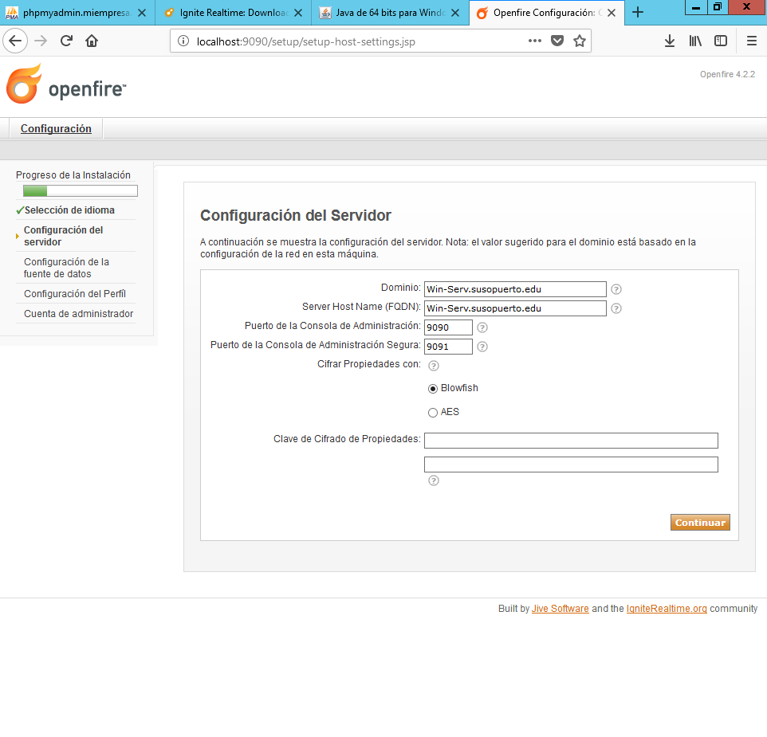

* Elegimos conexión Estándard

* Sustituimos la máscara por defecto en la casilla `URL de la base de datos` colocando los datos correspondientes y ponemos nombre de usuario y contraseña.

* Configuramos la cuenta del administrador del servidor.

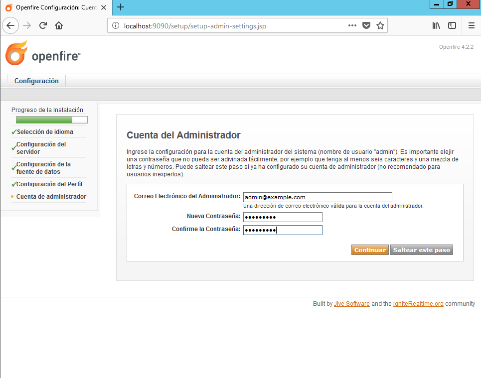

* Se ha terminado el proceso, ahora toca loguearse.

* La primera vez no nos deja, pero después de un reinicio todo funciona.

### 4. Una vez instalado el servidor OpenFire, vamos a descargar e instalar un cliente de Mensajería

* Descargamos e instalamos el cliente de mensajería Spark en el servidor y cliente.

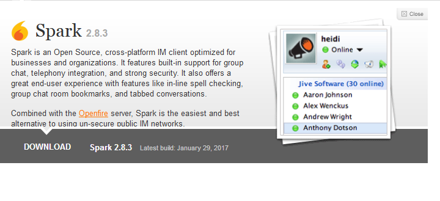

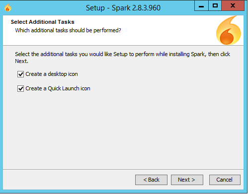

### 5. Creamos dos usuarios en OpenFire para establecer una conversación

### 6. Iniciamos la conversación a través de Spark

* Antes que nada, tenemos que acceder a la pestaña `avanzado` y marcar estas dos opciones.

* Y ya nos podemos loguear tranquilamente.

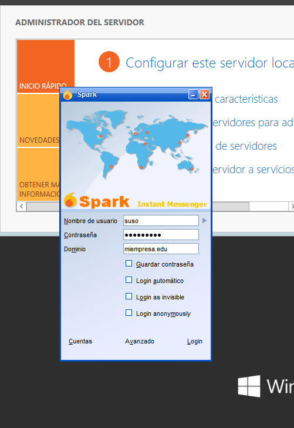

* Ahora con el usuario "mamel" en el cliente

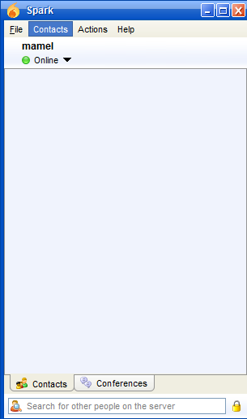

* Ahora desde el servidor con "suso" le mandamos una solicitud de amistad a "mamel", que aceptará desde el cliente

* Agregado el contacto, ya pueden enviarse mensajes entre ellos.

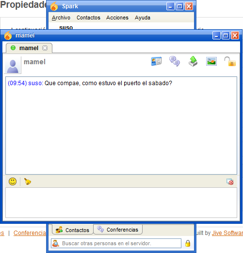

* Ahora vamos a crear una sala de conferencias, para ello volvemos a OpenFire y hacemos click en la pestaña `Conferencias`

* Rellenamos los datos que sean necesarios y la creamos.

* Ahora desde los usuarios en el cliente Spark buscamos la conferencia creada y nos agregamos a ella.

* Le toca a "mamel"

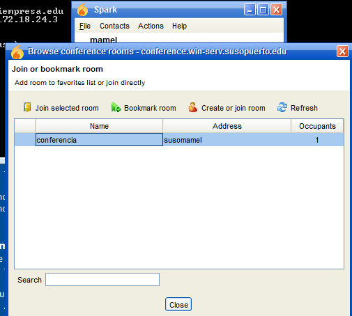

* Y claro, desde aquí también se pueden mensajear.

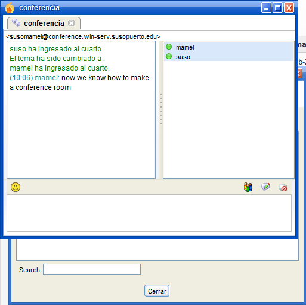

* También se pueden tranferir ficheros entre usuarios desde Spark, haciendo click en el elemento señalado.

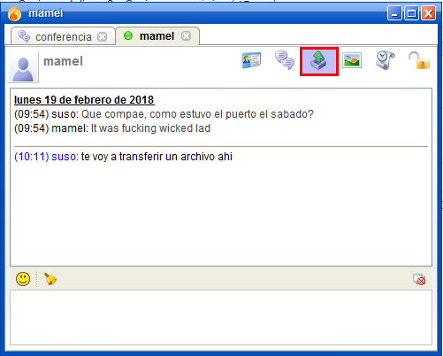

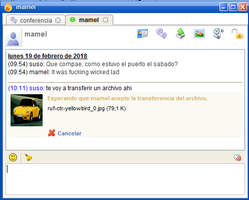

* Desde el terminal de "mamel" se ve como recibe la petición de envío de fichero, la cual debe aceptar para recibirlo.

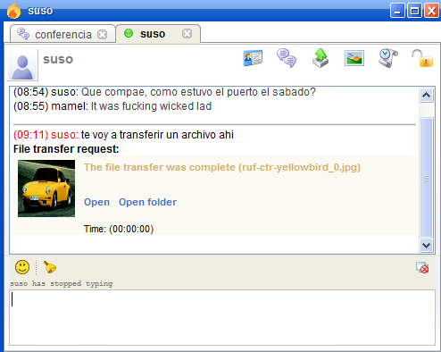

* También se pueden enviar capturas de pantallas entre ambos usuarios ...

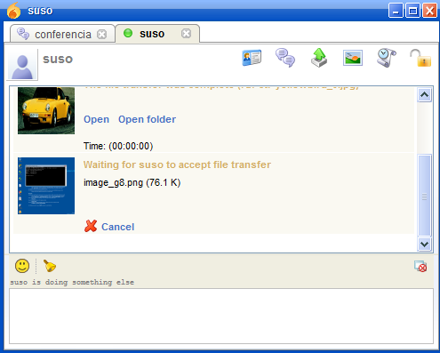

* Y como antes, el otro usuario debe aceptar la petición.

