# Instalación y Configuración del Servicio VoIP en Linux

## 1. Máquinas a utilizar:

* Servidor con SO `Asterisk` para la correcta implementación del servicio.

* Cliente con SO Ubuntu, en el cual instalaremos un cliente SIP llamado `Ekiga`.

## 2. Instalación del servidor Asterisk

* Para descargar el servidor Asterisk tenemos que acceder a la web https://www.asterisk.org/downloads, desde donde descargaremos la última versión a ser posible.

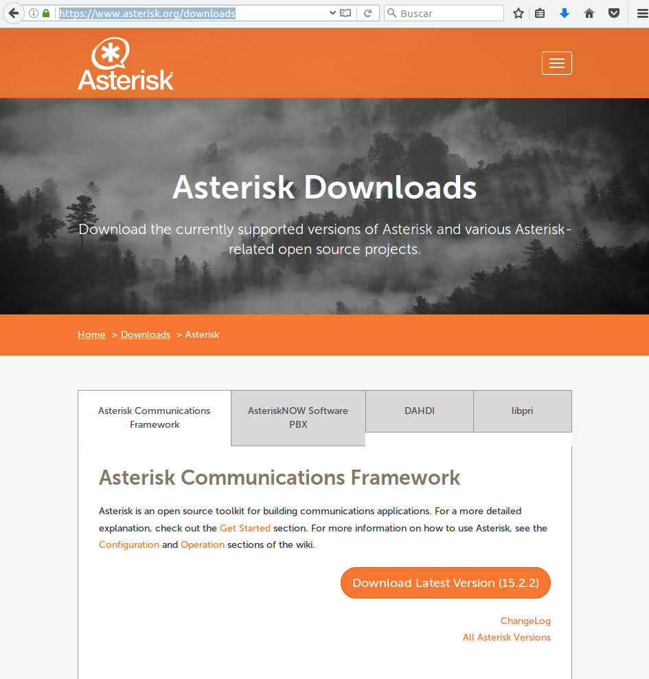

* Una vez realizada la propia instalación del SO, nos toca montar el servidor y su configuración. Para ello, lo primero que nos piden es que nos registremos en su web para así tener acceso a la instalación del servicio de VoIP.

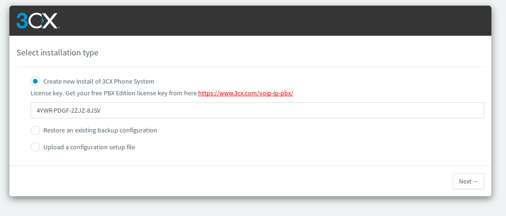

* Una vez tengamos la constraseña y nos validemos, ya empezaremos la instalación del servicio, empezando por definir un usuario.

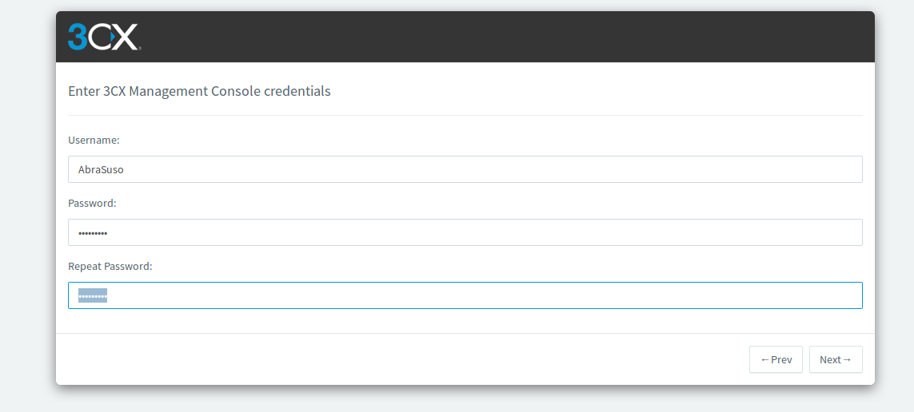

* Ahora nos piden si queremos usar una IP pública o una privada, así que como nosotros lo queremos para una red interna, pillamos la opción de IP privada.

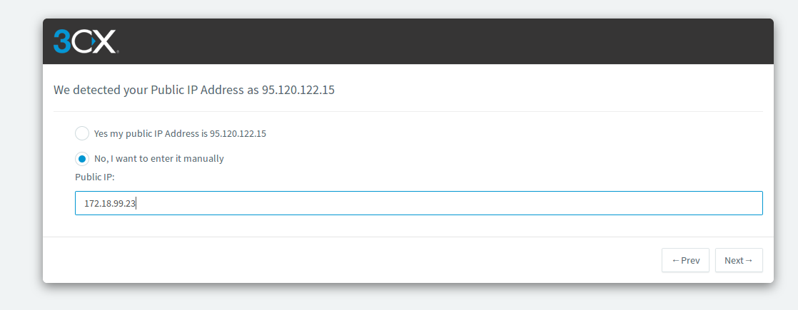

* Le indicamos que sea privada.

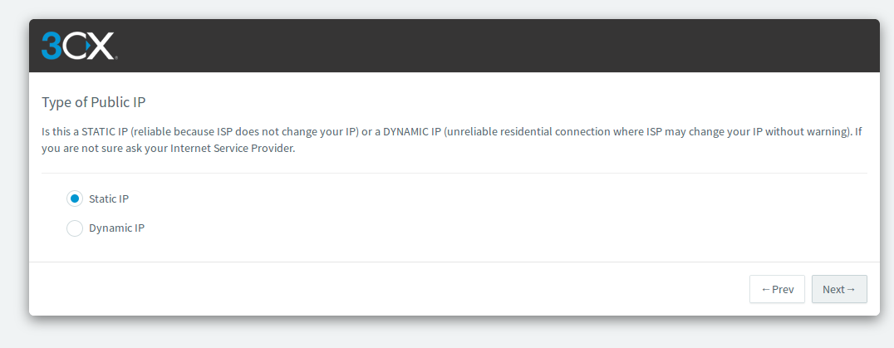

* Definimos el nombre y dominio.

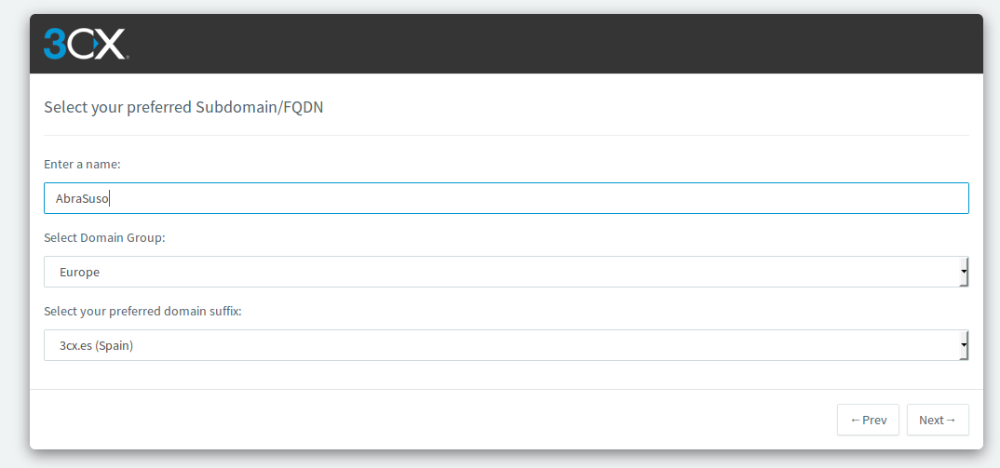

* Los puertos los dejamos como están.

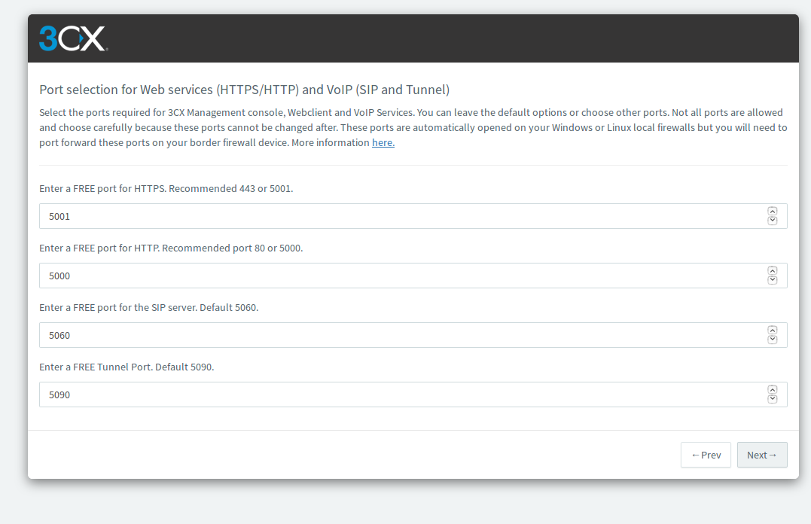

* Elegimos el adaptador de red.

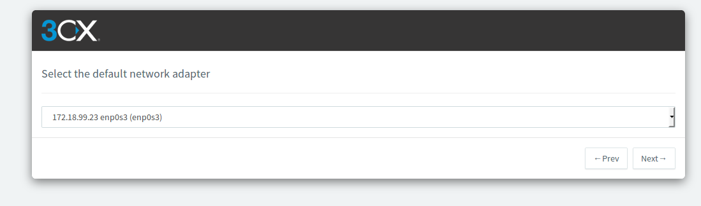

* Elegimos la extensión para los números, en nuestro caso va a ser la más simple.

* Seleccionamos la zona horaria.

* Definimos la extensión del operador.

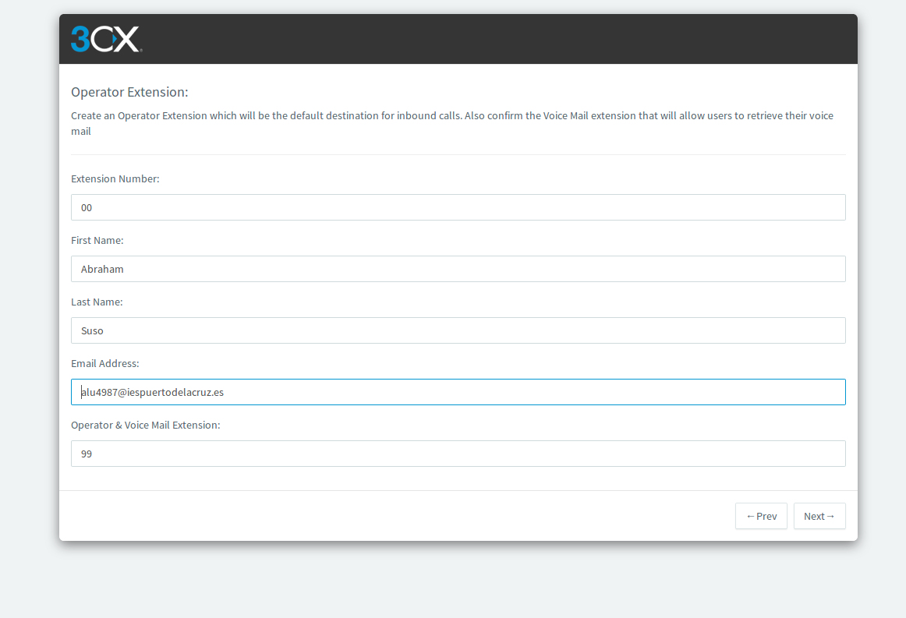

* Definimos los datos de registro.

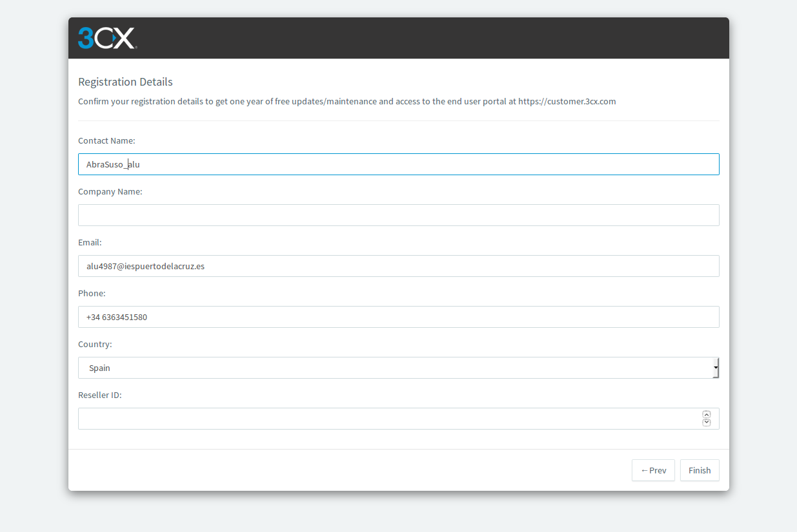

* Ya estaría instalado.

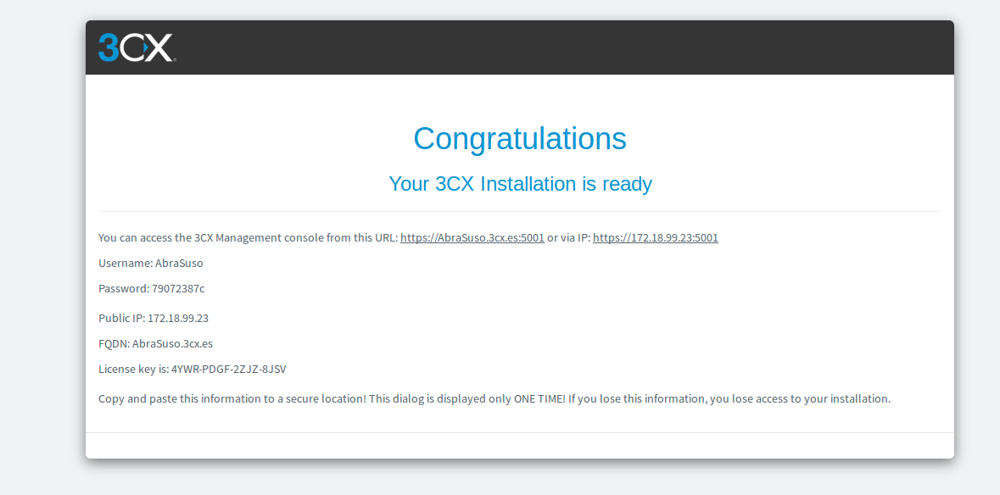

* Este es el panel de control del servidor.

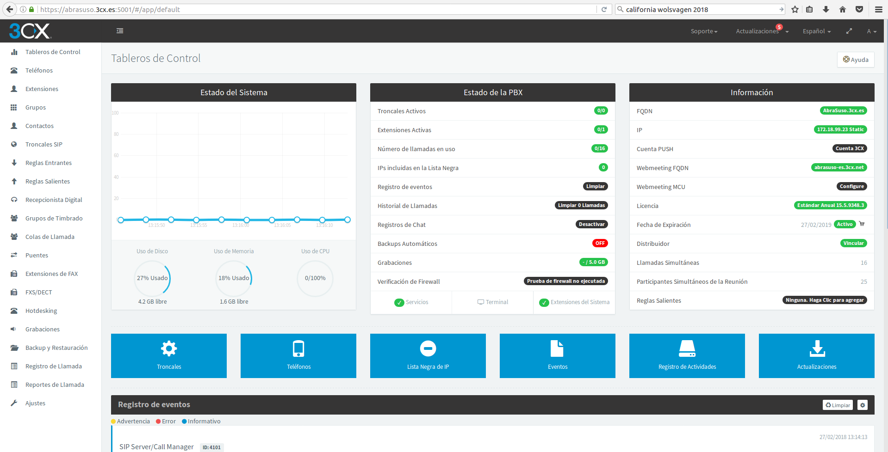

## 3. Cliente SIP softphone Ekiga

* Instalamos el paquete de la instalación de Ekiga.

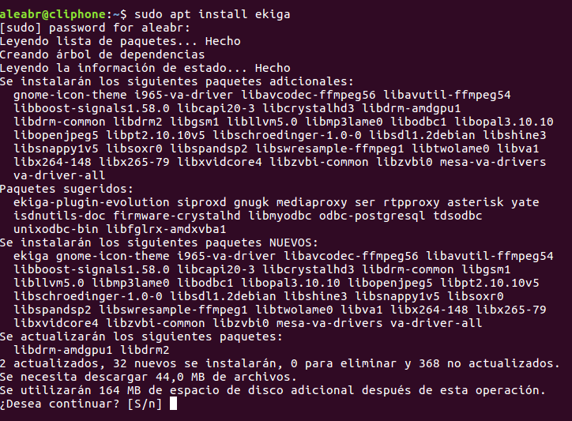

* Una vez instalado, accedemos al cliente de forma gráfica.

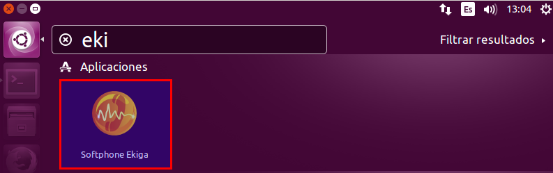

* Nada más entrar nos sale la pantalla de configuración del programa.

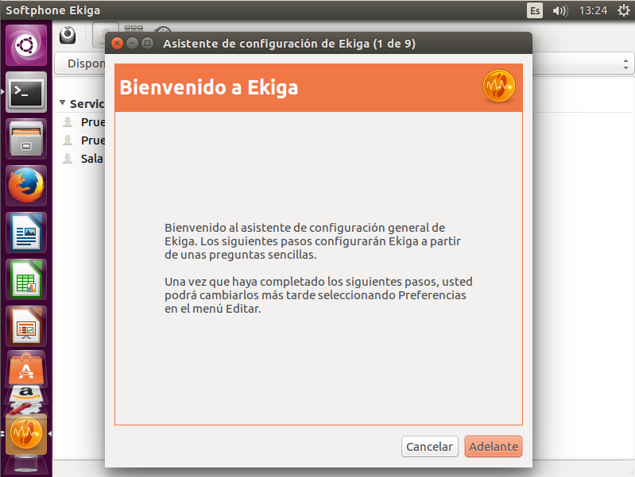

* Introducimos nombre de usuario.

* Ahora nos avisa de que las dos siguientes páginas son para darnos de alta en el servicio propio de ekiga, pero como vamos a utilizar Asterisk no lo necesitamos.

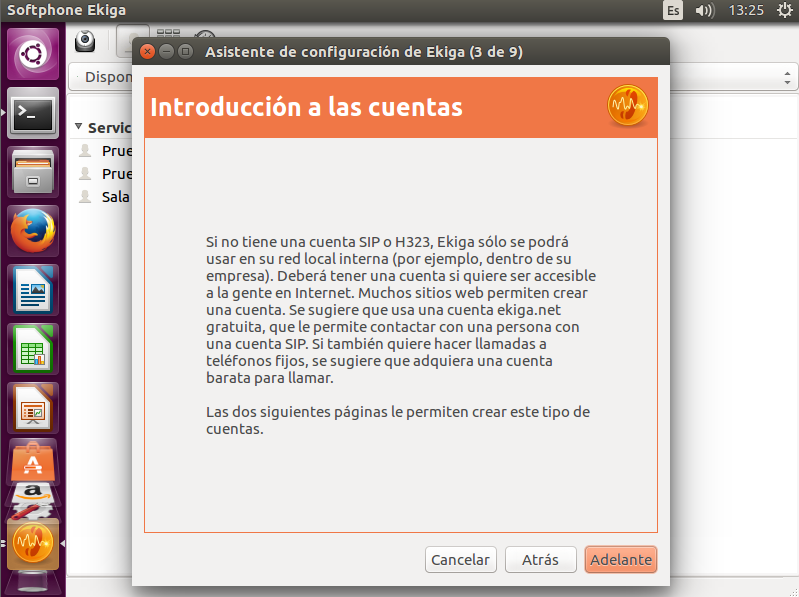

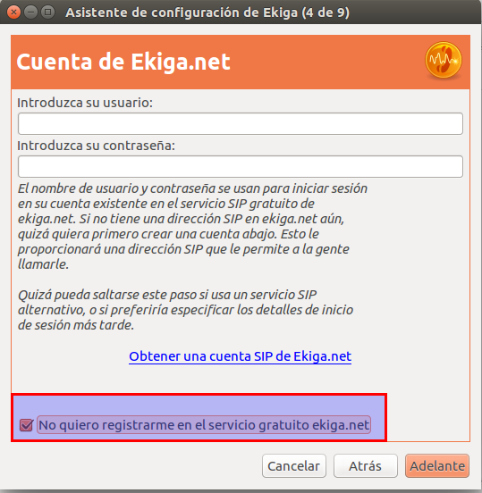

* Aquí determinamos el tipo de conexión que queremos, en este caso, red de área local.

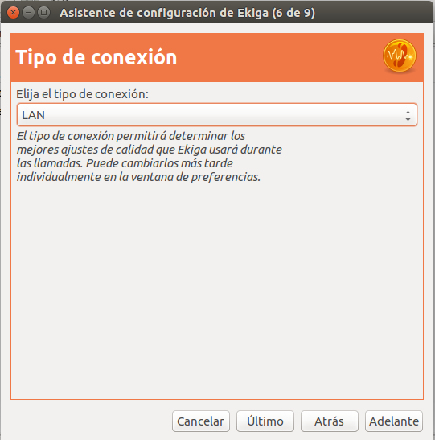

* Esta parte la dejamos tal y como está.

* Esta parte tampoco nos interesa tocarla ya que no pretendemos hacer transmisiones de videos.

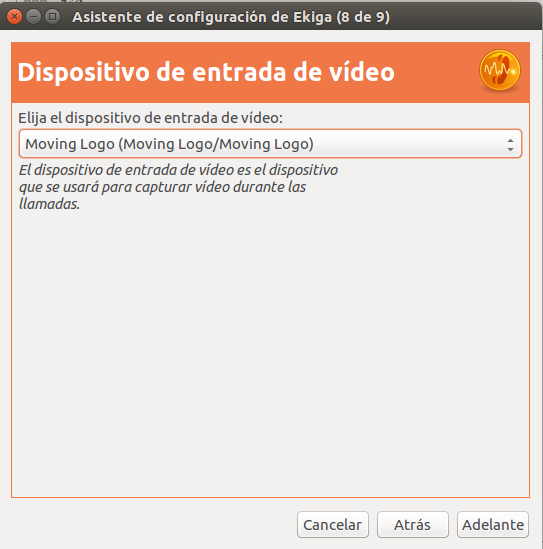

* Aquí por último nos aparece un resumen de la configuración.

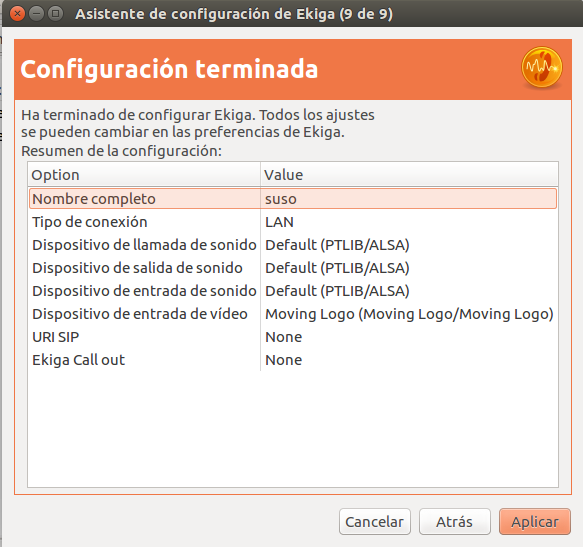

* Una vez realizada la configuración, entramos a `Editar` y luego elegimos la opción `cuentas`.

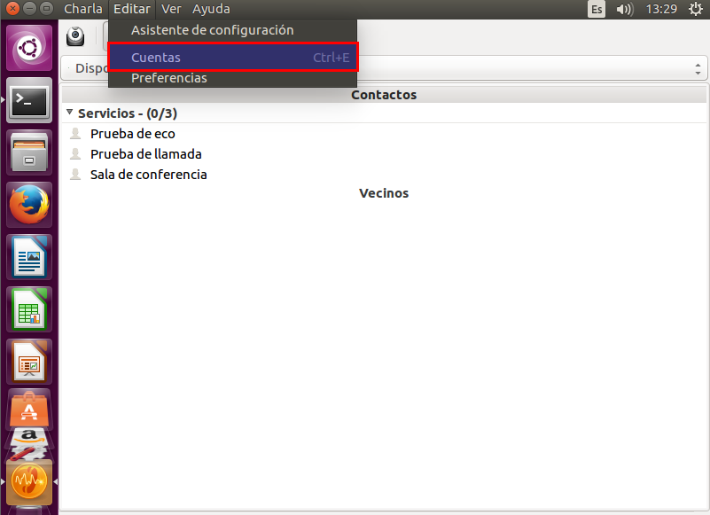

* Elegimos la opción `Añadir una cuenta SIP`

* Añadimos los datos del usuario que con anterioridad creamos en Asterisk.

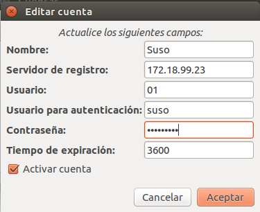

* Y ya tenemos la cuenta preparada para ser utilizada.

