# Servidor de Impresión en Windows
## 1. Impresora compartida

* Rol impresión

  * Vamos al servidor, instalar rol/función de servidor de impresión. Incluir impresión por Internet.

    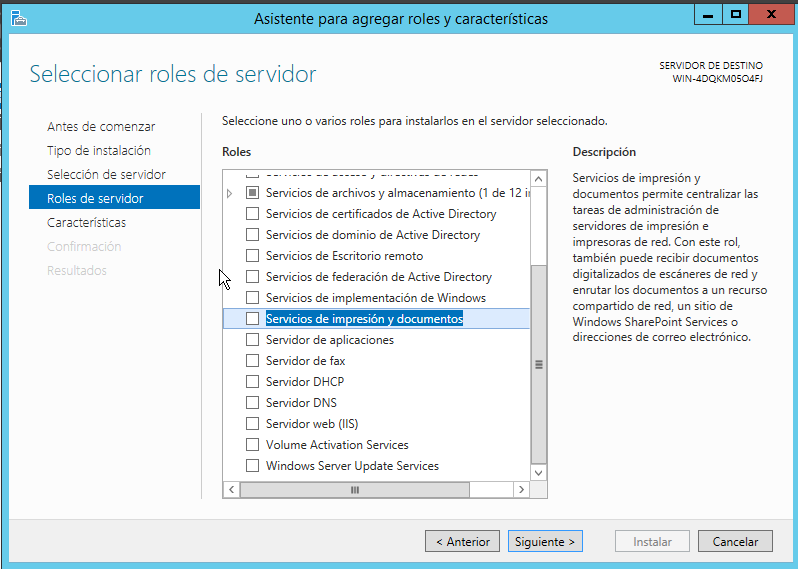

  * Agregamos la característica.

    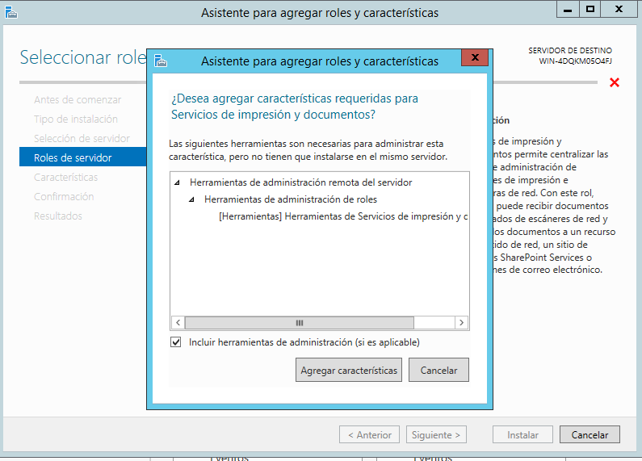

  *  Ya esta seleccionada.

    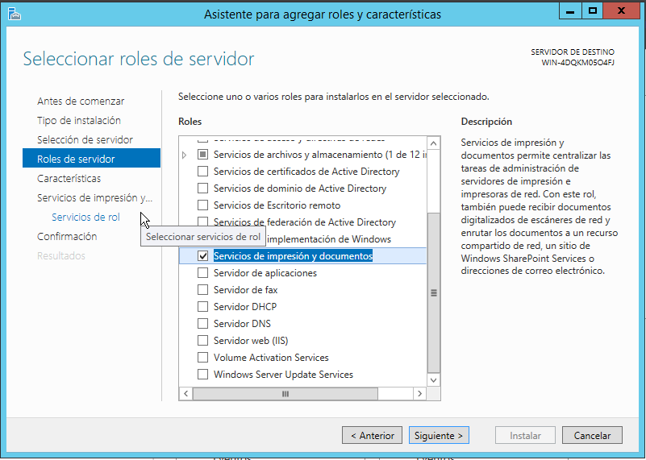

  * Seleccionamos "**Servidor de Impresion y Impresión en Internet**".

    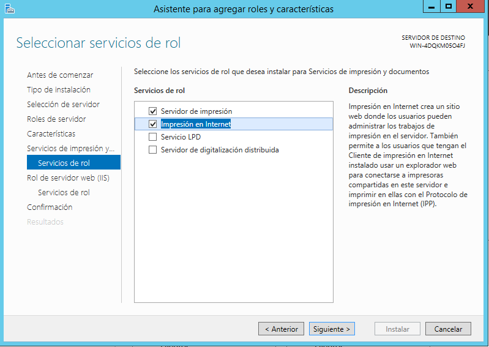

  * Le damos a instalar.

    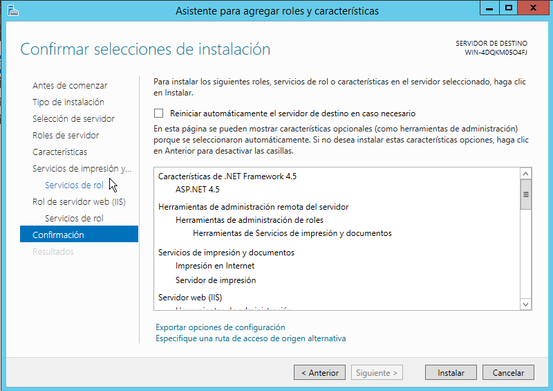

  * Una vez terminado el proceso le damos a cerrar.

    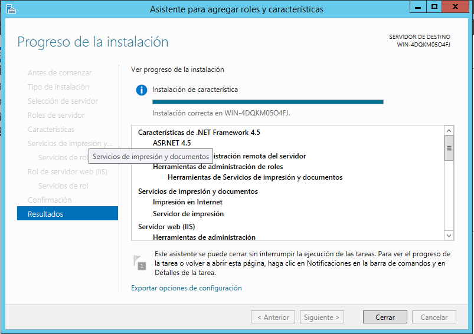

## 1.2 Instalar impresora PDF

 * Vamos a conectar e instalar localmente una impresora al servidor Windows Server, de modo que estén disponibles para ser accedidas por los clientes del dominio.

 * En nuestro caso, dado que es posible de que no tengan una impresora física en casa y no es de mucho interés forzar la instalación de una impresora que no se tiene, vamos a instalar un programa que simule una impresora de PDF, como "**PDFCreator**".

 *  Descargar PDFCreator (URL recomendada www.pdfforge.org/pdfcreator/download) e instalar.

    * En modo experto y le damos a siguiente.

      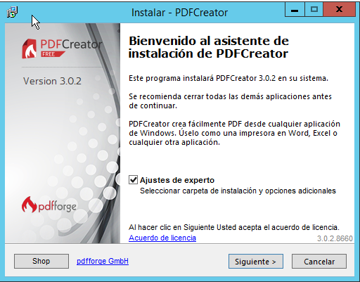

    * Le damos el nombre a la impresora.

      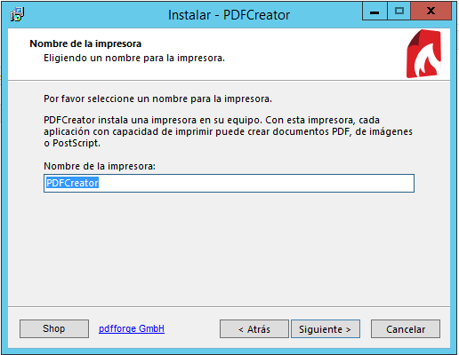

    * La Ruta donde se van almacenar la Impresion.

      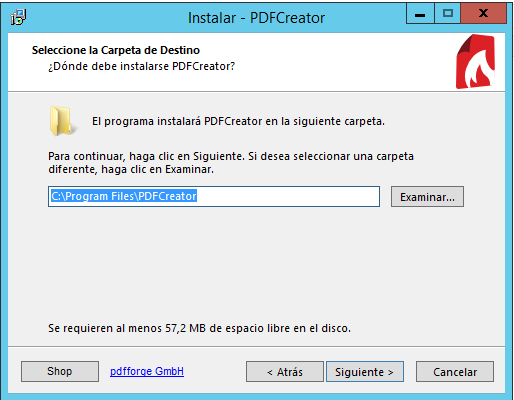

    * Dejamos por defecto.

      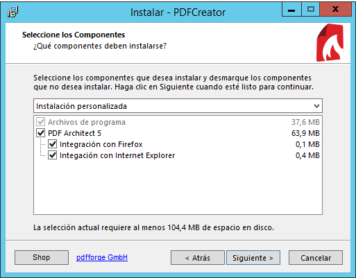

    * Le damos a siguiente.

      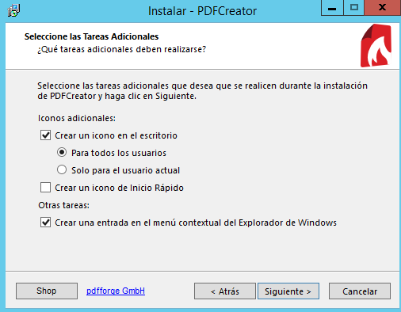

    * Instalamos

      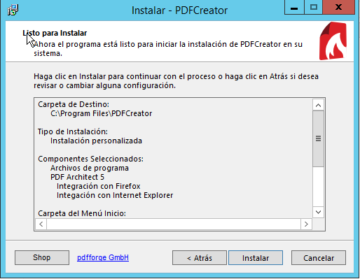

    > En la configuración automatica cambiamos la ruta que da por defecto el programa.

  *  En PDFCreator, configurar en perfiles -> Guardar -> Automático. Ahí configuramos carpeta destino.

      

    > NOTA: PDFCreator puede requerir NET FrameWork v4.

## 1.3 Probar la impresora en local

  * Para crear un archivo PDF no hará falta que cambies la aplicación que estés usando, simplemente ve a la opción de "imprimir" y selecciona "Impresora PDF", en segundos tendrás creado tu archivo PDF.

    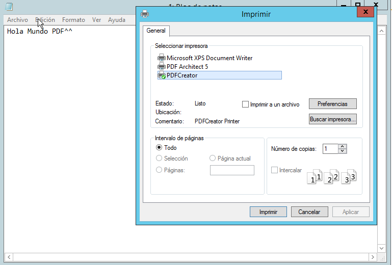

 * Puedes probar la nueva impresora abriendo el Bloc de notas y creando un fichero luego selecciona imprimir. Cuando finalice el proceso se abrirá un fichero PDF con el resultado de la impresión.

    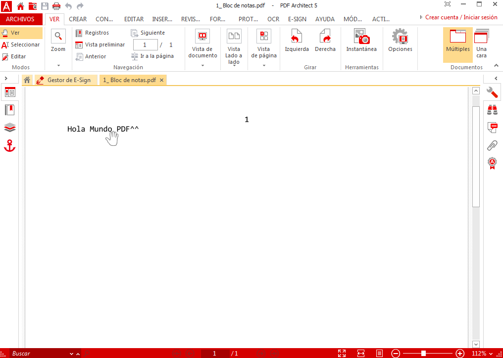

## 1.4 Compartir por red

 * Vamos al servidor -> herramientas -> Administración de impresión -> Servidor de Impresion -> Impresoras -> PDFCreator.

 * Botón derecho -> Propiedades -> Compartir
    Como nombre del recurso compartido utilizar PDFnombrealumnoXX.

    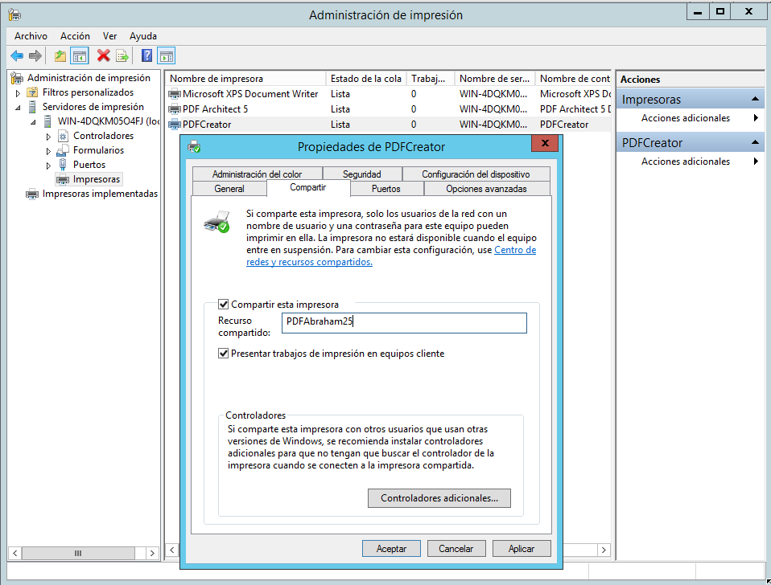

* La siguiente imagen muestra los recursos compartidos en el servidor incluido la impresora:

    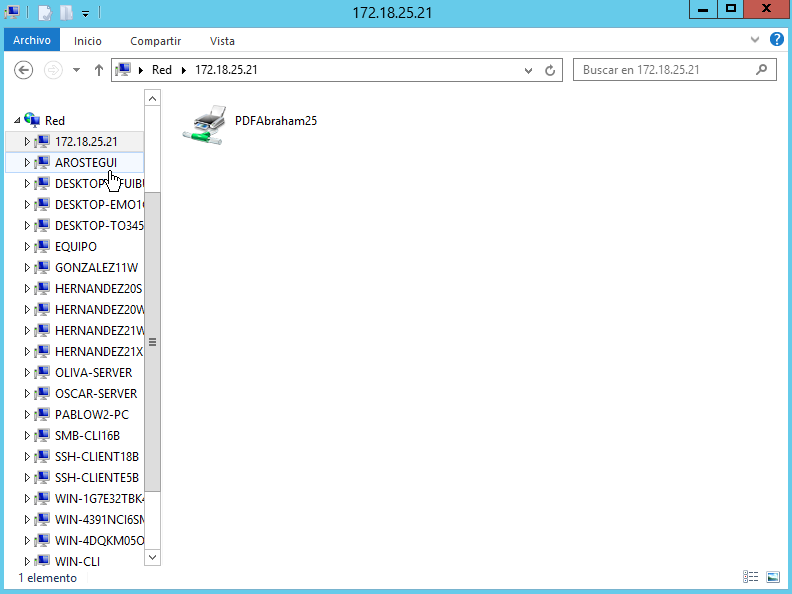

* Vamos al cliente:

    * Buscar recursos de red del servidor. Si tarda en aparecer ponemos \\ip-del-servidor en la barra de navegación.

      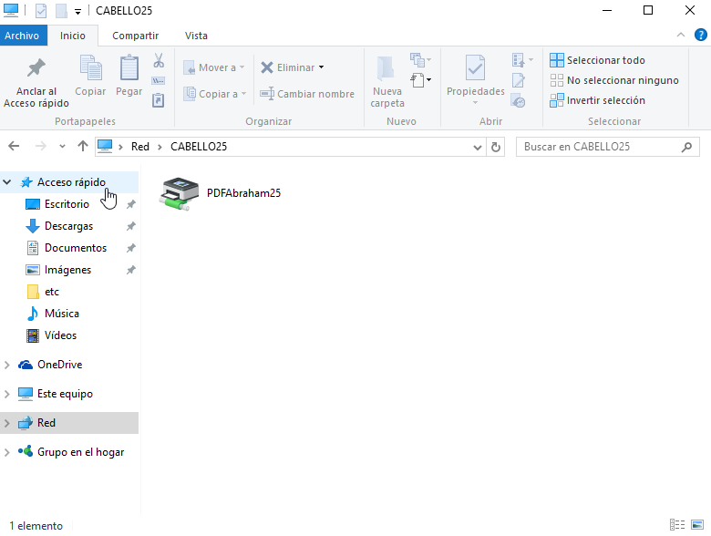

    Seleccionar impresora -> botón derecho -> conectar.

      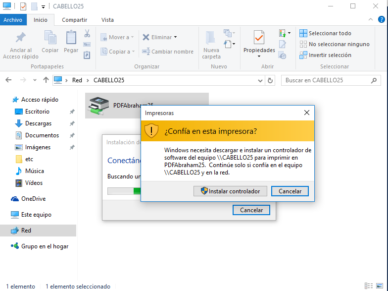

    * Ponemos usuario/clave del Windows Server.
    Ya tenemos la impresora remota configurada en el cliente.

    * Probar la impresora remota.

      

    * Carpeta donde se almacena las impresión

      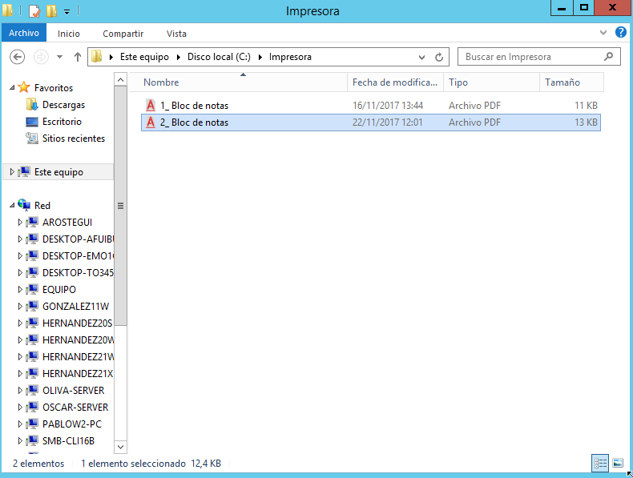

## 2. Acceso Web

 * Realizaremos una configuración para habilitar el acceso web a las impresoras del dominio.

## 2.1 Instalar característica impresión WEB

  * Vamos al servidor.
  * Nos aseguramos de tener instalado e servicio "Impresión de Internet".

  >Esto ya lo hicimos en primer paso de la practica.

## 2.1 Configurar impresión WEB

  *  Vamos al cliente.
  *  Abrimos un navegador Web.
  *  Ponemos URL http://<ip-del-servidor>/printers (o http://<nombre-del-servidor>/printers) para que aparezca en nuestro navegador un entorno que permite gestionar las impresoras de dicho equipo, previa autenticación como uno de los usuarios del habilitados para dicho fin (por ejemplo el "Administrador").

  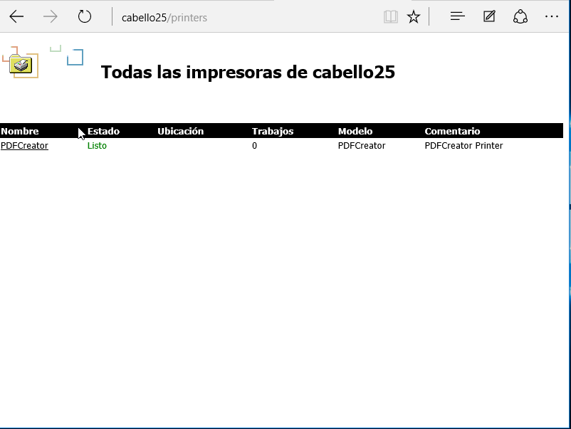

  * Pincha en la opción propiedades y se muestra la siguiente pantalla:

  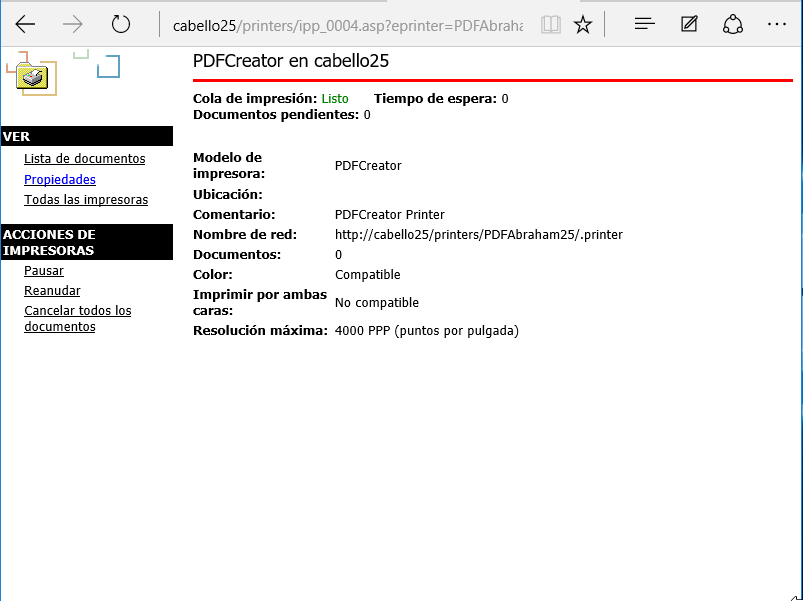

  *  Agregamos la impresora en el cliente utilizando la URL, como se muestra en la siguiente pantalla:

  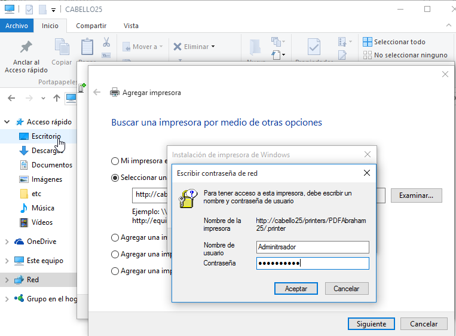

## 2.3 Comprobar desde el navegador

* Vamos a realizar seguidamente una prueba sencilla en tu impresora de red:

* A través del navegador pausa todos los trabajos en la impresora.

  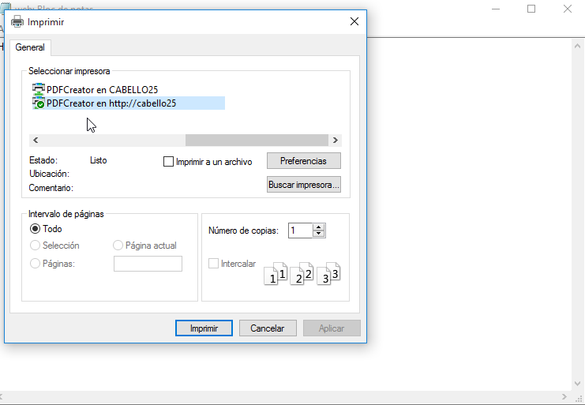

*  Envía a imprimir en tu impresora compartida un documento del Bloc de notas. La siguiente pantalla muestra que la impresora esta en pausa y con el trabajo en cola de impresión.

  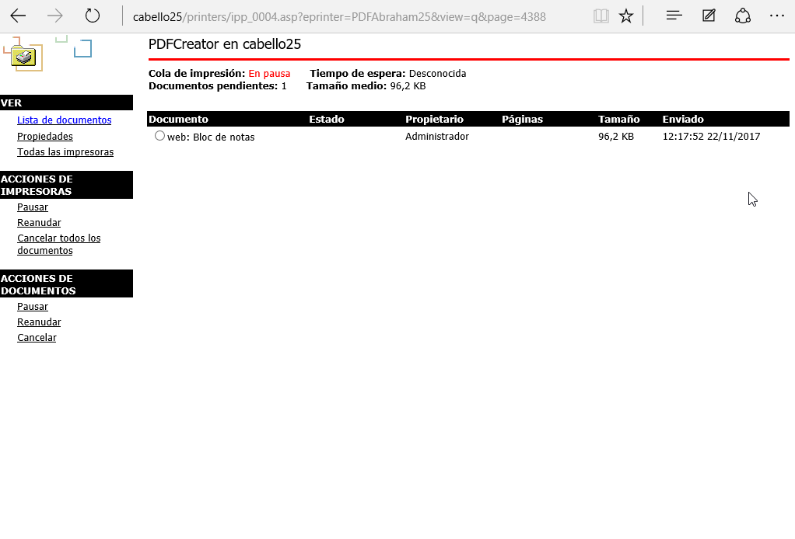

*  Finalmente pulsa en reanudar el trabajo para que tu documento se convierta a PDF. Comprobar que se puede imprimir desde un cliente Windows.

  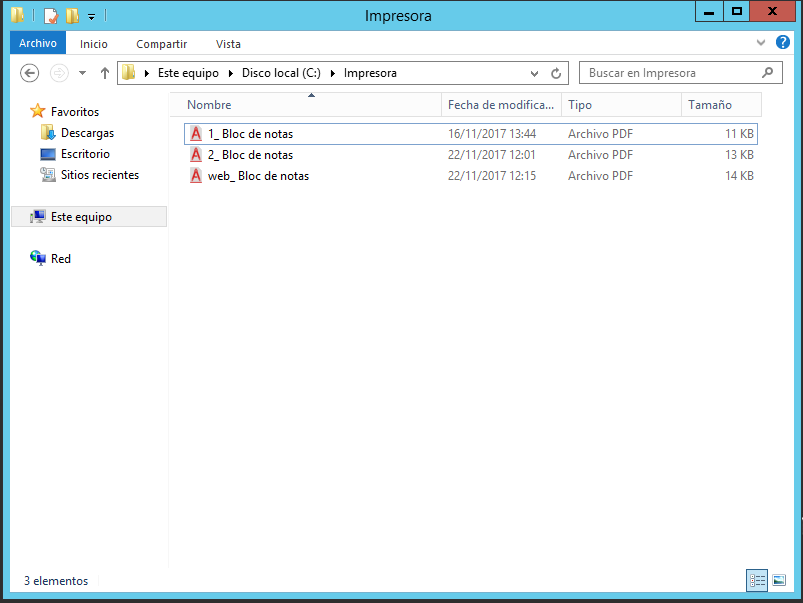

  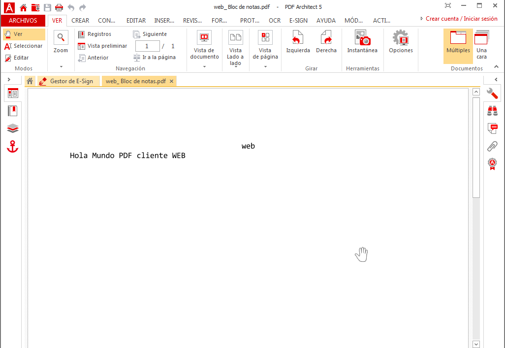
