# Tareas programadas

### 1. Windows - Tarea diferida.

Vamos a hacer una tarea diferida con Windows. Una tarea diferida se define para ejecutarse una sola vez en una fecha futura.

*  En Windows 10 para abrir el programador de tareas hacemos Panel de control -> Herramientas administrativas -> Programador de tareas.

  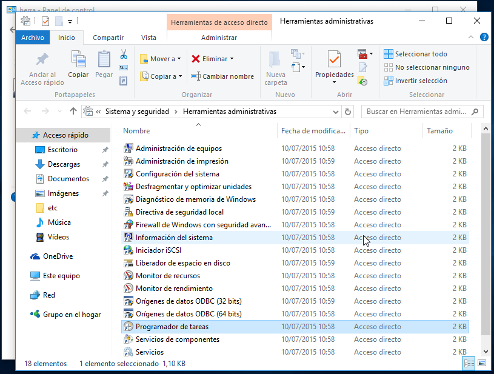

*  Vamos a programar una tarea diferida.

  *  Abrir un fichero de texto en pantalla.

  * Abrimos el Programador de tareas y creamos una nueva tarea.

    

  * Elegimos que se ejecute una vez.

    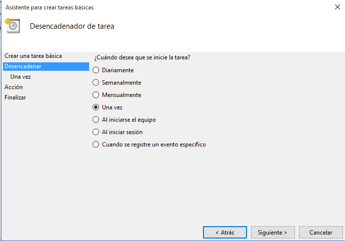

  * Elegimos fecha/hora en la que se ejecutara la tarea.

    

  * Seleccionamos Iniciar un programa.

    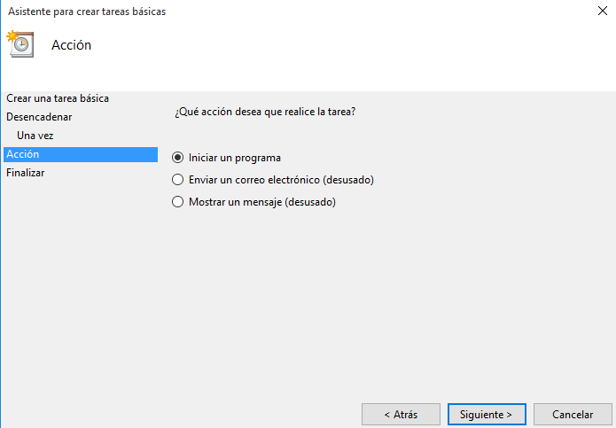

  * Buscamos el programa o script

    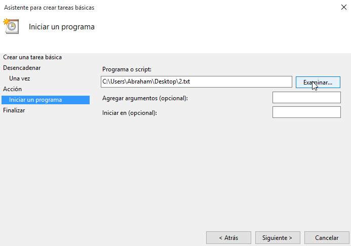

  * Finalizamos la tarea.

    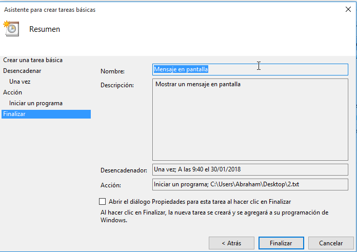

  * Comprobación

    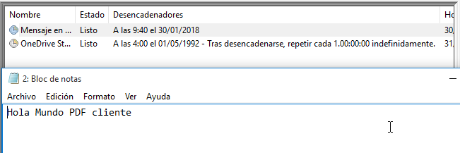

*  Iniciar un programa determinado (Explorer).

  * Hacemos los mismos pasos.

    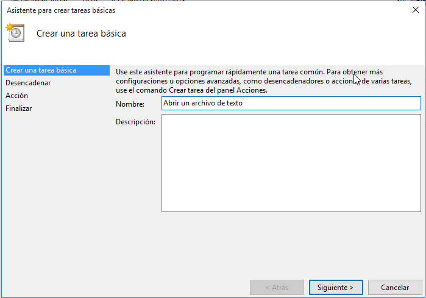

  * Elegimos la fecha/hora

    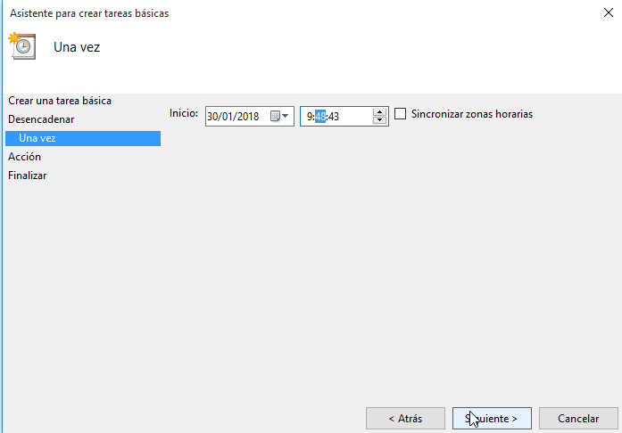

  * Seleccionamos el script o programa

    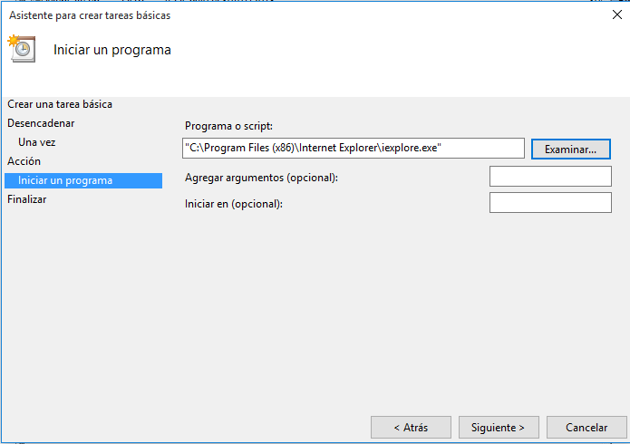

  * Le damos a finalizar

    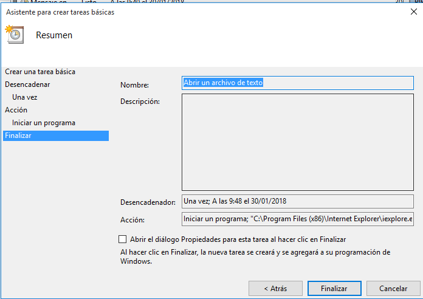

  * Vemos que tenemos la tarea en proceso.

    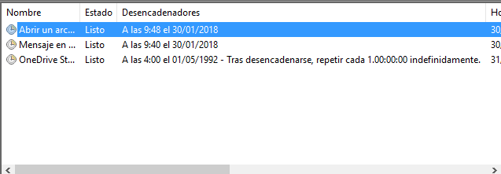

  * Y una vez ejecutada

    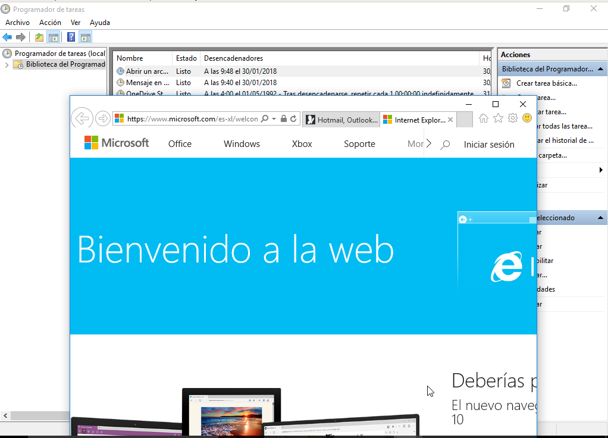

### 2. Windows - Tarea periódica

La tarea programada se define para ejecutarse periódicamente cada intervalo de tiempo.

  *  Vamos a programar una tarea periódica para apagar el equipo.

  * Hacemos los mismos pasos.

    

  * Fecha/hora

    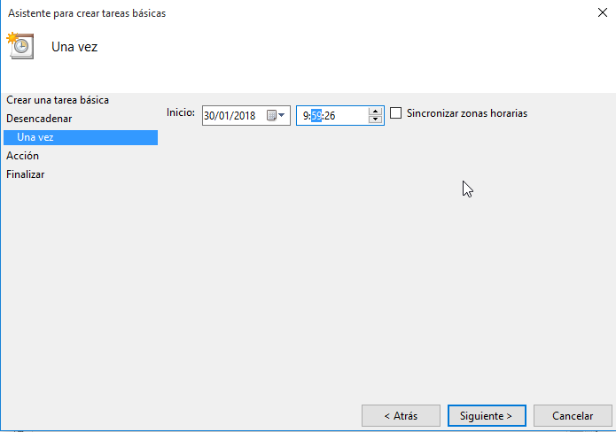

  * Aqui elegimos Diariamente

    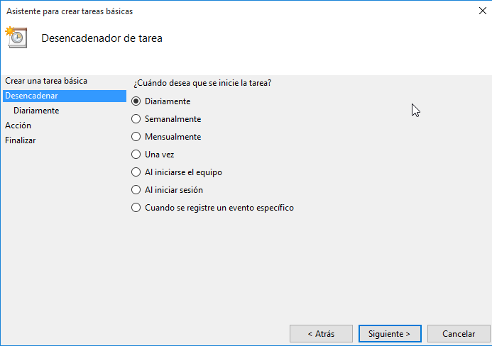

  * Seleccionamos el script

    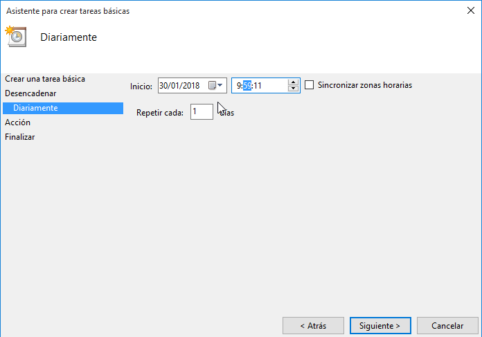

    > Este es el script


``Shutdown.exe -s -t 45 -c "El equipo se apaga en 45 segundo."``


  * Le damos a finalizar.

  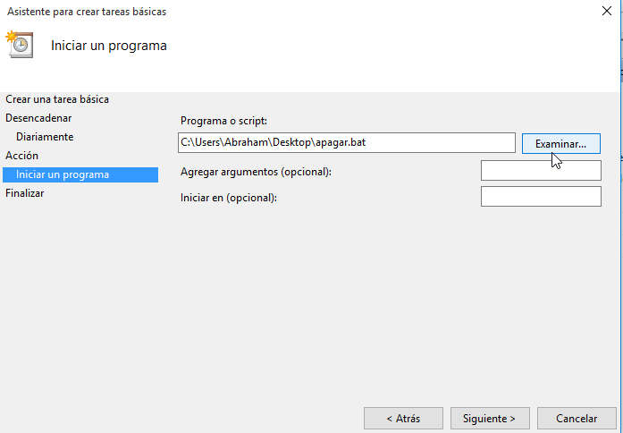

    > Una vez que se ejecuta apaga el euipo automanticamente.

### 3. SO GNU/Linux - Tarea diferida

Vamos a hacer una tarea diferida con GNU/Linux.

* El servicio atd es el responsable de la ejecución de los comandos at. Comprobar que esté en ejecución:

  * Abrimos el terminal y ejecutamos la siguiente linea.

> Este comando es para comprobar el estado.
  `systemctl status apt`

> Este comando para iniciar el programa.
  `systemctl start apt`

  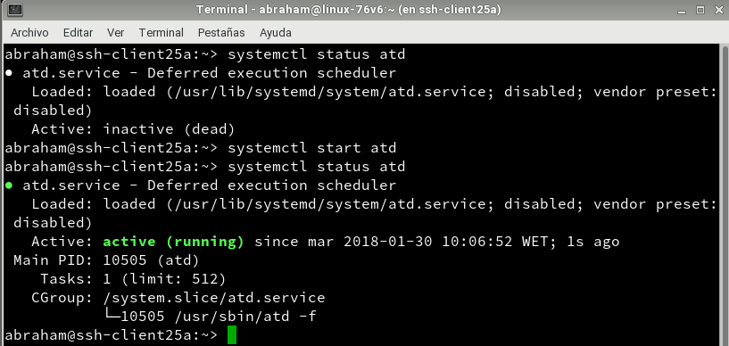


  * Ahora vamos a **Yast** => Sevicios, buscamos atd y lo habilitamos.

  

  >  Ejemplos de comandos:

  >  at, crea una tarea diferida.
  >  atq, muestra los trabajos en cola.
  >  at -c 1, muestra la configuración del trabajo ID=1.
  > atrm 1, elimina el trabajo con ID=1.

Ejemplo de script que muestra un mensaje de aviso:

````
#!/bin/sh
# Mostrar mensaje en pantalla
DISPLAY=:0
export DISPLAY
zenity --info --text="¡Hola Abraham!"
````

* Hacemos un cat del script.  

  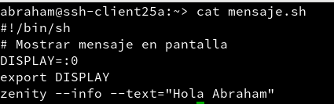

* Instalamos el programa zenity

  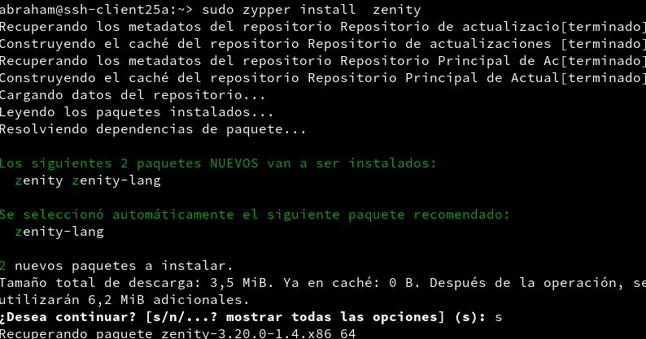

  > zenity es un programa para general dialogos simples en pantalla.

* Utilizamos el comando **at** para programar un tarea.

  

* Una vez que llega a la fecha/hora indicada se ejecuta y muestra el mensaje de el script.

  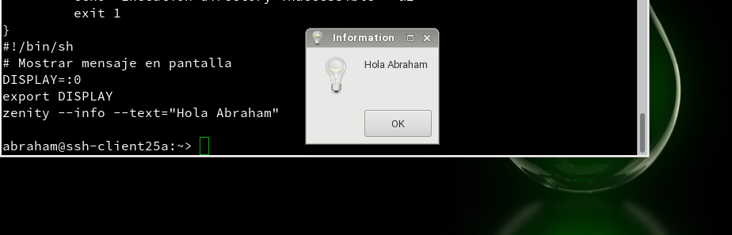


### 4. GNU/Linux - Tarea periódica

  *  Para programar una tarea periódica tenemos dos formas:

      *  Los usuarios normales usan el comando crontab para programar sus tareas periódicas.

      *  El usuario root, además puede usar el fichero /etc/crontab para programar las tareas del sistema.

      > Nosotros no vamos a usar root

      * Vamos a crear el script, por defect viene con el editor de texto **vim**

      * Script de ejemplo:

  ```
          #!/bin/bash
          # Añade la fecha/hora a un fichero cron.log
          date >> /home/usuario/cron.log
  ```

  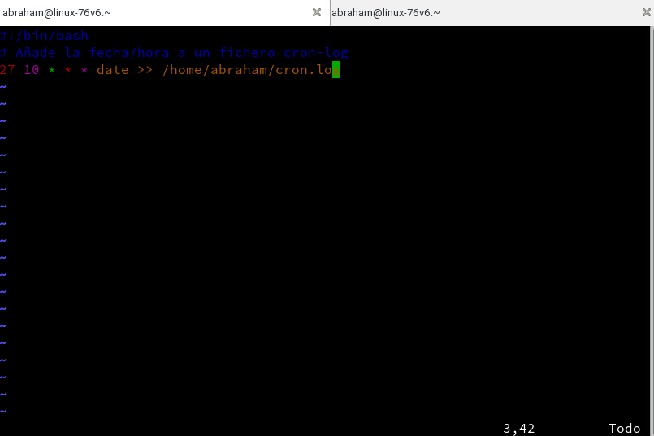

  *  crontab -l, para consultamos las tareas programadas.

  

  * Una vez que se ejecuta nos crea el fichero cron.log con la fecha y ejecutamos crontab -l para ver que no tenemos ninguna tarea programada.

  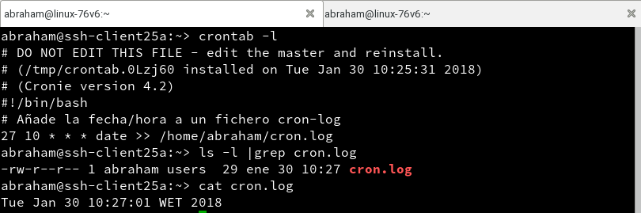
